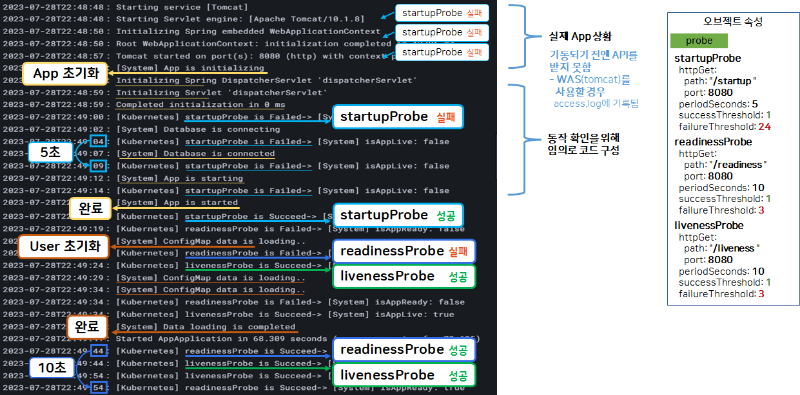
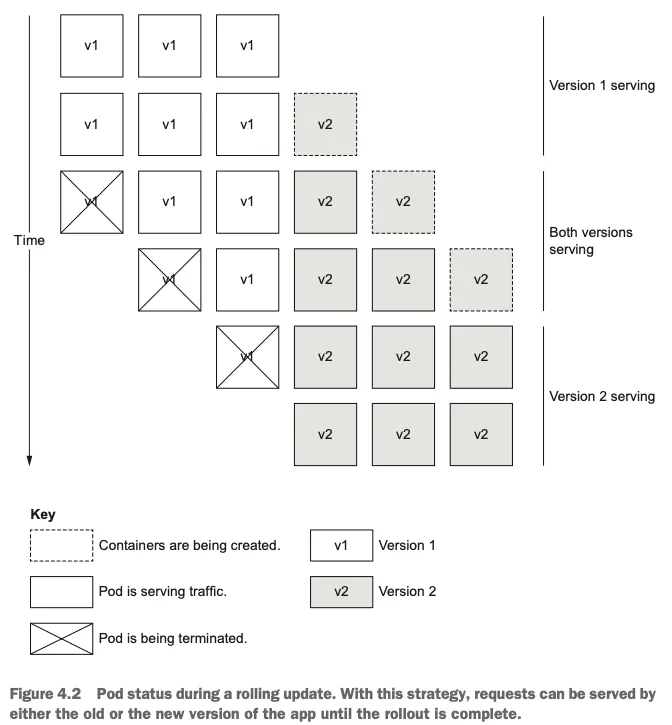
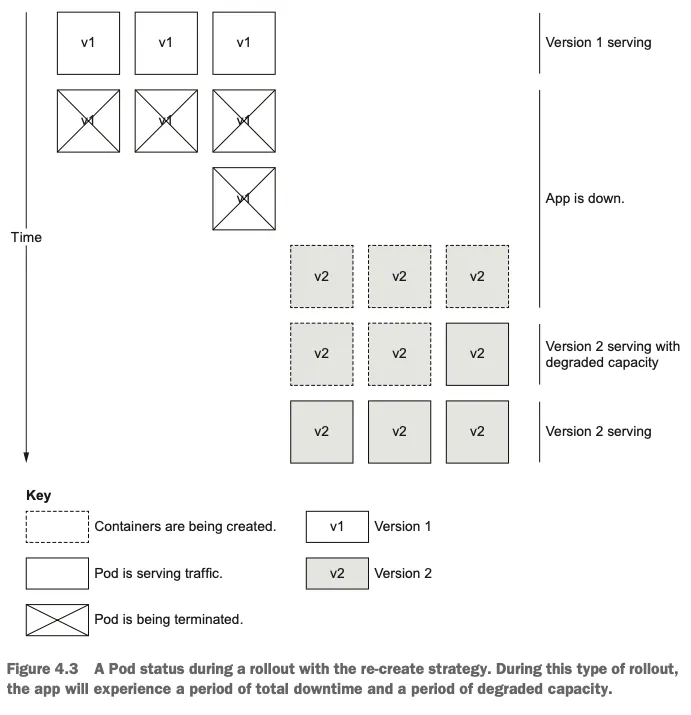
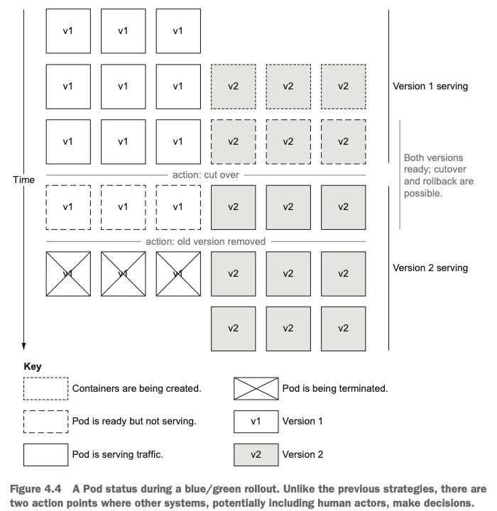
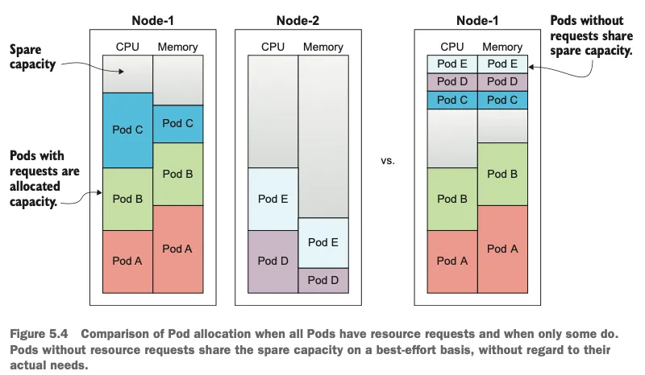
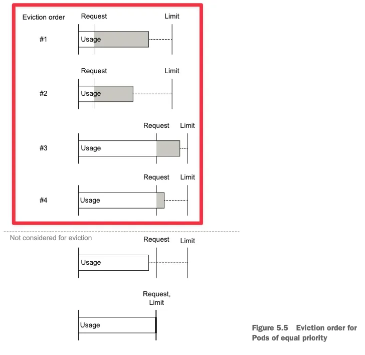
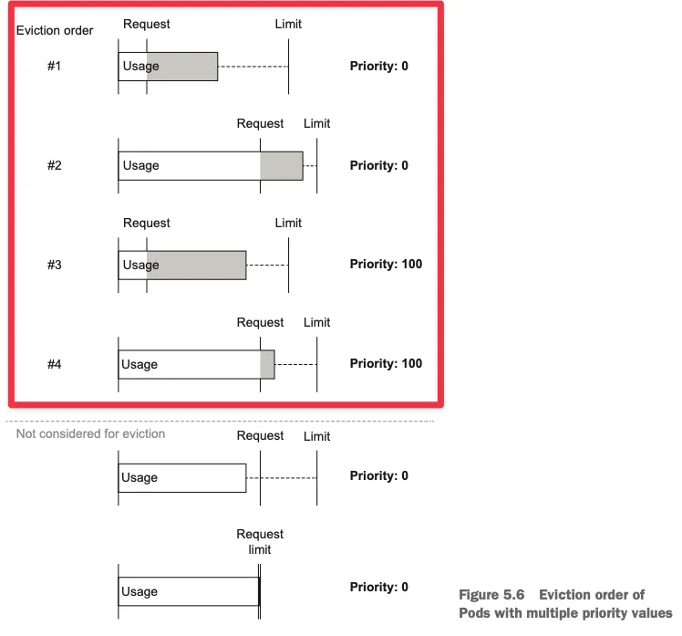
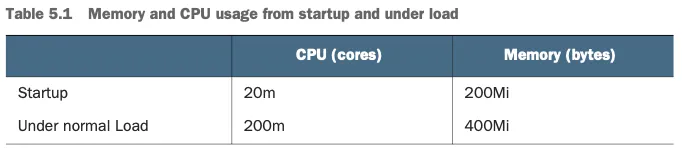
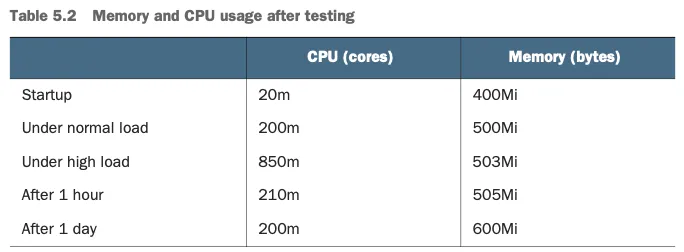
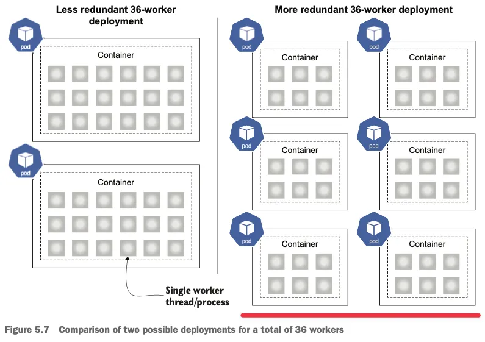

## Adding a readiness probe
```bash
# Chapter03/3.2 ‘deploy/service’ 코드 내용 배포 : kind 실습 환경에 맞게 일부 수정
cat <<EOF | kubectl apply -f -
apiVersion: apps/v1
kind: Deployment
metadata:
  name: timeserver
spec:
  replicas: 3
  selector:
    matchLabels:
      pod: timeserver-pod
  template:
    metadata:
      labels:
        pod: timeserver-pod
    spec:
      containers:
      - name: timeserver-container
        image: docker.io/wdenniss/timeserver:1
---
apiVersion: v1
kind: Service
metadata:
  name: timeserver
spec:
  selector:
    pod: timeserver-pod
  ports:
  - port: 80
    targetPort: 80
    protocol: TCP
    nodePort: 30000
  type: NodePort
EOF

# 배포 정보 확인
kubectl get deploy,svc,ep timeserver -o wide

# 파드 정보 라벨 필터링
kubectl get pods -l pod=timeserver-pod -owide

# 접속 시도
curl http://localhost:30000
curl http://localhost:30000

# 로그 확인
kubectl logs deploy/timeserver
kubectl logs -f deploy/timeserver

# (신규 터미널) 반복 접속 시도
while true; do curl -s --connect-timeout 1 http://127.0.0.1:30000 ; sleep 0.5 ; done
while true; do curl -s --connect-timeout 1 http://127.0.0.1:30000 ; sleep 1   ; done
혹은
watch -n 0.25 -d curl -s --connect-timeout 1 "http://127.0.0.1:30000"
watch -n 1    -d curl -s --connect-timeout 1 "http://127.0.0.1:30000"
```


# Probe types

```bash
## HttpGet
apiVersion: v1
kind: Pod
metadata:
  labels:
    test: liveness
  name: liveness-http
spec:
  containers:
  - name: liveness
    image: registry.k8s.io/e2e-test-images/agnhost:2.40
    args:
    - liveness
    livenessProbe:
      httpGet:
        path: /healthz
        port: 8080
        httpHeaders:
        - name: Custom-Header
          value: Awesome
      initialDelaySeconds: 3
      periodSeconds: 3

## TcpSocket : tcp 사용 서비스에 적용 권장 - Docs
apiVersion: v1
kind: Pod
metadata:
  name: goproxy
  labels:
    app: goproxy
spec:
  containers:
  - name: goproxy
    image: registry.k8s.io/goproxy:0.1
    ports:
    - containerPort: 8080
    readinessProbe:
      tcpSocket:
        port: 8080
      initialDelaySeconds: 15
      periodSeconds: 10
    livenessProbe:
      tcpSocket:
        port: 8080
      initialDelaySeconds: 15
      periodSeconds: 10

## gRPC - Docs
apiVersion: v1
kind: Pod
metadata:
  name: etcd-with-grpc
spec:
  containers:
  - name: etcd
    image: registry.k8s.io/etcd:3.5.1-0
    command: [ "/usr/local/bin/etcd", "--data-dir",  "/var/lib/etcd", "--listen-client-urls", "http://0.0.0.0:2379", "--advertise-client-urls", "http://127.0.0.1:2379", "--log-level", "debug"]
    ports:
    - containerPort: 2379
    livenessProbe:
      grpc:
        port: 2379
      initialDelaySeconds: 10

## Exec(Command , Bash Script) - Docs
apiVersion: v1
kind: Pod
metadata:
  labels:
    test: liveness
  name: liveness-exec
spec:
  containers:
  - name: liveness
    image: registry.k8s.io/busybox
	    args:
    - /bin/sh
    - -c
    - touch /tmp/healthy; sleep 30; rm -f /tmp/healthy; sleep 600
    livenessProbe:
      exec:
        command:
        - cat
        - /tmp/healthy
      initialDelaySeconds: 5
      periodSeconds: 5
```


```bash
1. [System] App is initializing : *App 초기화*
2. [Kubernetes] startupProbe is Failed → [System] isAppLive: false *⇒ startupProbe 시작 → 실패*
3. [System] Database is connecting *⇒ DB 연결 시도*
4. [System] Database is connected *⇒ DB 연결 성공*
5. [System] App is starting *⇒ App 시작, 이때까지 startupProbe 실패*
6. [Kubernetes] startupProbe is Succeed → [System] isAppLive: true ***⇒  App Live 동작, startupProbe 성공!***
7. [Kubernetes] readinessProbe is Failed → [System] isAppReady: false *⇒ 외부의존성fail, readinessProbe 시작 → 실패*
8. [Kubernetes] livenessProbe is Succeed→ [System] isAppLive: true ***⇒ livenessProbe 시작 → 성공!***
9. [System] ConfigMap data is loading.. *⇒ 컨피그맵 데이터 로딩 시도 : 외부의존성 연결 및 인증 정보*
10. [System] Data loading is completed *⇒ 컨피그맵 데이터 로딩 완료*
11. [Kubernetes] readinessProbe is Failed → [System] isAppReady: false *⇒ 외부의존성fail, readinessProbe 실패*
12. Started AppApplication in 62.631 seconds (process running for 66.206) *⇒ 외부의존성ok → App 모든 동작 수행 가능 상태*
13. [Kubernetes] readinessProbe is Succeed → [System] isAppReady: true ***⇒ 외부의존성ok, readinessProbe 성공***
```


## Probe 권장 설정
- **일시적 장애 상황** : **livenessProbe의 실패 시간을 길게 설정**해서 파드가 쉽게 재기동 되는 걸 **방지**      
    - ⇒ **readiness** 는 해당 파드가 EP제외되도 타파드 처리가 가능하니 **민감**하게 체크하고,
    - ⇒ **liveness**는 파드 재기동 시 기존 호출 처리 유실이나 시간이 지나 자연 해소 상태의 기회를 빼앗고 오히려 무한 재기동 될수 있으니 **널널**하게 체크!

- **권장 설정** : 일시적 장애 상황(App 내부 부하 증가)가 시작 된 후, 30초 뒤에 트래픽이 중단되고, 3분 뒤에는 App이 재기동 되도록 설정해 보세요.
    - (아래 API를 날리면 readinessProbe와 livenessProbe가 동시에 실패하게 됩니다)
    - livenessProbe에 periodSeconds나 failureThreshold를 늘리면 됩니다
```bash
# 부하 증가 API - (App 내부 isAppReady와 isAppLive를 False로 바꿈)
curl http://localhost:30000/server-load-on ; echo

# Deployment 에 livenessProbe에 periodSeconds나 failureThreshold를 늘리면 됩니다.
kubectl edit deployments.apps -n anotherclass-123 api-tester-1231
...
startupProbe:
  httpGet:
    path: "/startup"
    port: 8080
  periodSeconds: 5
  failureThreshold: 10
readinessProbe:
  httpGet:
    path: "/readiness"
    port: 8080
  periodSeconds: 10 # 민감하게
  failureThreshold: 3
livenessProbe:
  httpGet:
    path: "/liveness"
    port: 8080
  periodSeconds: 60 # 널널하게
  failureThreshold: 3
...
```


# Updating live applications : 업데이트 전략 3가지
**[1] Rolling update strategy**

- 기본 전략은 롤링 업데이트 : The default zero-downtime update strategy offered by Kubernetes is a **rolling update**.

- **롤링 업데이트 전략 목표**
    - 지속적인 서비스 제공 : Providing continuous uptime during the rollout
    - 업데이트 중 최소한의 (서버)컴퓨팅 리소스 사용 : Using as few extra resources as possible during the update
- 롤링 업데이트는 새 버전 파드먼저 생성(사이즈 수정 가능) 하고 정상 시 이전 파드를 종료를 반복 : In a rolling update, Pods with the new version are created in groups (the size of which is tunable). Kubernetes waits for the new group of Pods to become available and then terminates the same number of Pods running the old version, repeating this until all Pods are running the new version (figure 4.2).
- 과정 중 두 버전이 공존 : Importantly, with this strategy, the two versions of your application (old and new) need to be able to coexist as they will both be running for a time.
- 백엔드 및 기타 종속성에서 두 버전 처리할 수 있어야 하며, 사용자는 다른 버전의 요청을 받을 수 있음 : That is, your backend or any other dependencies must be able to handle these two different versions, and users may get alternating versions when they make different requests. Imagine reloading the page and seeing the new version and then reloading it and seeing the old version again.
- 복제본이 많을 경우 시간이 걸릴 수 있음, 물론 롤백 시에도 : Depending on how many replicas you have, a rolling update can take a while to complete (and, therefore, any rollback can also take a while).

- **maxSurge** 와 **maxUnavailable** 로 롤아웃 속도 조절 가능 : Let’s configure our Deployment to use the rolling update strategy in the following listing. The options maxSurge and maxUnavailable can be used to govern how quickly the rollout happens.

**MaxSurge**

- 롤링 기간 추가로 생성 할 수 있는 파드 갯수 : maxSurge governs how many additional Pods you’re willing to create during the rollout.
- For example, if you set a replica count of 5, and a maxSurge of 2, then it may be possible to have seven Pods (of different versions) scheduled.
- 높을 수록 업데이트 도중 리소스를 좀 더 사용됨 : The tradeoff is that the higher this number is, the faster the rollout will complete, but the more resources it will (temporarily) use.
- If you’re highly optimizing your costs, you could set maxSurge to 0.
- 대규모 경우 롤링 업데이트에 여러 서버들로 업데이트 후 완료 되면 서버들을 축소도 가능 : Alternatively, for a large deployment, you could temporarily increase the resources available in your cluster during the rollout by adding nodes and removing them when the rollout is complete.

**MaxUnavailable**

- 업데이트 도중 사용할 수 없는 최대 파드 수 : maxUnavailable sets the maximum number of Pods that can be unavailable during updates (percentage values are also accepted and are rounded down to the nearest integer).
- If you’ve tuned your replica count to handle your expected traffic, you may not want to set this value much higher than 0, as your service quality could degrade during updates.
- The tradeoff here is that the higher the value, the more Pods can be replaced at once and the faster the rollout completes, while temporarily reducing the number of ready Pods that are able to process traffic.
- A rollout could coincide with another event that lowers availability, like a node failure.
- 상용 환경에서는 0을 권장 : Thus, for production workloads, I recommend setting maxUnavailable to 0.
- 0 설정 시 스케줄 가능 노드가 없으면, 롤아웃 중단되고 파드는 보류 상태가 됨에 주의 : The caveat is that if you set it to 0 and your cluster has no schedulable resources, the rollout will get stuck, and you will see Pods in the Pending state until resources become available.
- When maxUnavailable is 0, maxSurge cannot also be 0 because, to preserve the full availability, the system needs to temporarily increase the replica count to allow time for the new Pods to become ready.

**Recommendation**

- A rolling update is a good go-to strategy for most services.
- **상용 환경에서는 maxUnavailable 0을 권장** :  For production services, maxUnavailable is best set to 0.
- **여유 노드 자원이 있고 빠른 롤링 속도를 위해서 maxSurge는 1 이상**이어야 됨 : maxSurge should be at least 1, or higher if you have enough spare capacity and want faster rollouts.
    
    

**Deploying Changes with a Rolliing Update**

- Once your Deployment is configured to use a rolling update, deploying your changes is as simple as updating the Deployment manifest (e.g., with a new container version) and applying the changes with kubectl apply.
- Most changes made to the Deployment, including readiness and liveness checks, are also versioned and will be rolled out just like a new container image version.
- 필요 시 강제 롤아웃 실행 가능 : If you ever need, you can also force a rollout without changing anything in the Deployment object with kubectl rollout restart deploy $DEPLOYMENT_NAME.

**[2] Re-create strategy**

- **기본 버전 삭제하고 신규 버전 배포** : Another approach—some might say, the old-fashion approach—is to cut the application over directly, deleting all Pods of the old version and scheduling replacements of the new version.
- 재생성 중 서비스 장애 발생 : Unlike the other strategies discussed here, this approach is not a zerodowntime one. It will almost certainly result in some unavailability (figure 4.3).
- With the right readiness checks in place, this downtime could be as short as the time to boot the first Pod, assuming it can handle the client traffic at that moment in time.
- 장점은 추가 컴퓨팅 리소스 불필요, 이전 버전과 호환성 준비 불필요 : The benefit of this strategy is that it does not require compatibility between the new version and the old version (since the two versions won’t be running at the same time), and it doesn’t require any additional compute capacity (since it’s a direct replacement).
- 보통 개발/스테이징 환경에서 사용 : This strategy may be useful for development and staging environments to avoid needing to overprovision compute capacity to handle rolling updates, and to increase speed, but otherwise, it should generally be avoided.
- To use this, in the strategy field given in listing 4.6, you would instead declare:



**[3] Blue/Green strategy**

- **기존과 신규 버전이 함께 배포** : The blue/green strategy is a rollout strategy where the new application version is deployed alongside the existing version (figure 4.4).
- **새 버전이 완전히 배포 및 테스트 가능** : These versions are given the names “blue” and “green.” When the new version is fully deployed, tested, and ready to go, the service is cut over.
- 문제 발생을 줄일 수 있음 : If there’s a problem, it can be immediately cut back.
- 새 버전이 검증 완료 후 기본 버전 삭제(자동, 수동 - 사람 승인 가능) : After a time, if everything looks good, the old version can be removed. Unlike the prior two strategies, the old version remains ready to serve and is removed only when the new version is validated (and often with a human decision involved).



- **장점**
    - 일관된 사용자 경험을 위해 한번에 한 버전 앱만 실행 : Only one version of the app is running at a time for a consistent user experience.
    - 롤아웃 시 속도가 빠름 : The rollout is fast (within seconds).
    - 마찬가지로 롤백도 빠름 : Rollbacks are similarly fast.
- **단점**
    - 일시적으로 컴퓨팅 리소스 2배 소비 : It temporarily consumes double the compute resources.
    - 쿠버네티스 배포에서 직접 지원 안됨 → 구현을 위해서 다른 툴이나 수작업 필요 : It is not supported directly by Kubernetes Deployments.

- **Summary**
    - Kubernetes는 배포를 계속 실행하고 업데이트하는 데 도움이 되는 다양한 도구를 제공합니다.
    - Kubernetes가 **멈춰 있거나 응답하지 않는 컨테이너를 재부팅하여 애플리케이션을 계속 실행하는 데 필요한 신호를 가질 수 있도록 상태 점검**을 정의하는 것이 중요합니다.
    - Kubernetes는 Liveness probes를 사용하여 애플리케이션을 재시작해야 하는 시기를 결정합니다.
    - readiness probe는 서비스로부터 트래픽을 수신하는 복제본을 관리하며, 이는 요청이 중단되는 것을 방지하기 위해 업데이트 중에 특히 중요합니다
    - Kubernetes는 또한 다운타임 없이 애플리케이션을 업데이트하는 데 도움을 줄 수 있습니다.
    - 롤링업데이트는 쿠버네티스의 기본 롤아웃 전략으로, 최소한의 추가 리소스를 사용하면서도 다운타임 없이 롤아웃할 수 있습니다.
    - Recreate는 추가 리소스 사용 없이 일부 다운타임으로 제자리 업데이트를 수행하는 대체 롤아웃 전략입니다.
    - 블루/그린은 쿠버네티스가 직접 지원하지는 않지만 표준 쿠버네티스 컨스트럭트를 사용하여 수행할 수 있는 롤아웃 전략입니다.
    - 블루/그린은 최고 품질의 보증을 제공하지만 더 복잡하고 배포에 필요한 리소스를 일시적으로 두 배로 늘립니다.


# 5. Resource management

**Chapter 5** helps you **right-size** your workload so it gets the **resources** it needs without wastage.

- Kubernetes가 클러스터에서 리소스를 할당하는 방법 How Kubernetes allocates the resources in your cluster
- 필요한 리소스만 요청하도록 워크로드 구성하기 Configuring your workload to request just the resources it needs
- 비용 대비 성능 비율을 향상시키기 위해 리소스 Overcommitting resources to improve your cost/performance ratio
    - 쿠버네티스에서는 **오버커밋**을 통해 실제 물리 자원보다 더 많은 양의 자원을 할당하는 기능을 제공
- 포드 복제본 수와 내부 동시성 간의 균형 맞추기 Balancing the Pod replica count with internal concurrency

→ 이 장에서는 포드가 자원 요구 사항에 따라 기계에 할당되는 방법과 포드가 필요한 자원을 받을 수 있도록 시스템에 제공해야 하는 정보에 대해 다룹니다.

→ 노드에 포드가 어떻게 할당되는지 알면 리소스 요청, 버스트, 오버 커밋, 가용성 및 신뢰성에 대한 더 나은 아키텍처 결정을 내리는 데 도움이 됩니다.


## Specifying Pod resources
스케줄러에게 배포 매니페스트에서 리소스 요청(및 기타 워크로드 유형)을 지정하여 스케줄링 결정에 필요한 정보를 제공합니다
지금까지 이 책의 예시들은 자원 요구 사항을 명시하지 않았지만, 상용환경 배포의 경우 이 정보를 추가해야 합니다.
CPU 1코어의 20%와 메모리 200MiB이 필요한 Pod는 아래와 같이 지정됩니다.

```bash
# 실습 Skip
cat <<EOF | kubectl apply -f -
apiVersion: apps/v1
kind: Deployment
metadata:
  name: timeserver
spec:
  replicas: 3
  selector:
    matchLabels:
      pod: timeserver-pod
  template:
    metadata:
      labels:
        pod: timeserver-pod
    spec:
      containers:
      - name: timeserver-container
        image: docker.io/wdenniss/timeserver:3
        resources:
          requests:
            cpu: 200m
            memory: 250Mi
EOF

kubectl get pod -l pod=timeserver-pod
kubectl describe pod -l pod=timeserver-pod
...
    Requests:
      cpu:        200m
      memory:     250Mi

```

- 여기 예시에서 200m는 200밀리코어, 즉 하나의 코어의 20%를 나타냅니다.
- 부동 소수점 숫자(예: 0.2)를 사용할 수도 있지만, 쿠버네티스 실무자들 사이에서는 **밀리코어**를 사용하는 것이 매우 일반적입니다.
- 메모리의 **Mi 접미사는 메비바이트(MiB)를 나타내고, Gi는 기비바이트(1,024의 거듭제곱)**를 나타냅니다.
    - **M과 G는 메가바이트와 기가바이트(1,000의 거듭제곱)**를 나타냅니다.
- 리소스를 지정하는 것은 Kubernetes가 노드 용량에 Pod 요구 사항을 맞추는 데 필요한 정보를 제공하기 때문에 중요합니다.
- 일부 포드에서 리소스를 지정하지 않는다는 것은 노드에 다소 무작위로 배치된다는 것을 의미합니다.
- 그림 5.4의 나란히 비교해 보세요. 왼쪽에는 요구 사항에 따라 두 개의 노드에 배치된 다섯 개의 포드가 있고, 오른쪽에는 세 개의 포드에 리소스가 지정되지 않아 다른 포드와 같은 노드에 배치되어 있습니다.
- 자원이 지정되지 않았을 때 동일한 5개의 포드에 대해 노드 자원의 절반이 할당된 것을 확인하세요.
- 여기서 위험은 리소스 사양이 없는 포드가 리소스가 부족해지거나 노드에서 사용할 수 있는 메모리보다 더 많은 메모리를 사용하면 퇴거당할 수 있다는 점입니다.



- 쿠버네티스의 포드 배치는 지금까지는 꽤 간단하게 들릴 수 있지만, 우리는 요청을 리소스와 페어링하고 있을 뿐입니다.
- 사실, 폭발할 수 있는 능력, 즉 요청된 자원보다 더 많은 자원을 소비하는 능력에 대해서는 간단할 것입니다.
- 대부분의 경우 프로세스에 필요한 모든 리소스가 필요하지 않을 수 있습니다.
- 노드의 다른 포드들이 임시로 그 용량을 사용할 수 있다면 좋지 않을까요?
- 그것이 바로 Kubernetes가 제공하는 것이며, 한계로 구성되어 있습니다.
- 포드(다음 목록에 있는 것과 마찬가지로)는 요청한 리소스를 스케줄링에 사용한다고 선언하고, 포드가 스케줄링되고 실행될 때 사용되는 리소스를 제한하는 제한을 설정합니다.

```bash
# 실습 Skip
cat <<EOF | kubectl apply -f -
apiVersion: apps/v1
kind: Deployment
metadata:
  name: timeserver
spec:
  replicas: 3
  selector:
    matchLabels:
      pod: timeserver-pod
  template:
    metadata:
      labels:
        pod: timeserver-pod
    spec:
      containers:
      - name: timeserver-container
        image: docker.io/wdenniss/timeserver:3
        resources:
          requests:
            cpu: 200m
            memory: 250Mi
          limits:
            cpu: 300m
            memory: 400Mi
EOF

#
kubectl get pod -l pod=timeserver-pod
kubectl describe pod -l pod=timeserver-pod
...
    Limits:
      cpu:     300m
      memory:  400Mi
    Requests:
      cpu:        200m
      memory:     250Mi
```

- 노드에 포드를 배치할 때 스케줄러는 포드의 리소스 요청만 고려합니다(스케줄링 시 제한은 전혀 고려되지 않습니다).
- 그러나 요청과 제한 모두 포드를 실행하는 성능에 영향을 미칩니다.
- 실행되면 메모리 제한을 초과하는 Pod가 재시작되고, CPU 제한을 초과하는 Pod가 스로틀됩니다.
- 이러한 작업은 kubelet에 의해 직접 노드에서 처리됩니다.
- 리소스 경합이 발생할 경우, 메모리 요청을 초과하는 포드는 퇴거될 수 있으며(퇴거를 위해 포드를 선택하는 방법은 섹션 5.1.3을 참조하십시오), CPU 요청을 초과하는 포드는 요청된 CPU로 스로틀링될 수 있습니다.
- 이러한 값은 포드가 예약되고 실행되는 방식에 매우 중요한 역할을 하므로 포드의 컨테이너에 대한 요청과 제한을 모두 설정하는 것이 최선의 방법입니다. 하지만 이러한 값을 어떻게 설정해야 할까요?
- 요청과 제한이 상호 작용하여 서비스 품질(QoS) 클래스를 형성하는 방법과 애플리케이션의 성능을 측정하여 어떤 값을 설정할지 결정하는 방법을 이해하려면 계속 읽어보세요.


## **5.1.2 Quality of service**

요청보다 높은 제한이 있거나 전혀 설정되지 않은 경우 새로운 문제가 발생합니다:
- 이 포드들이 너무 많은 자원(가장 일반적으로, 너무 많은 메모리)을 소비하고, 자원을 회수하기 위해 퇴거해야 할 때는 어떻게 해야 하나요? 이 문제를 해결하기 위해 Kubernetes는 **먼저 제거할 포드를 순위** 매깁니다.
    
- 워크로드를 계획할 때 필요한 서비스의 자격을 고려해야 합니다.
- Kubernetes는 세 가지 서비스 품질 수준을 제공 : **guaranteed, burstable, best effort**
    
**(1) Guaranteed Class**
    
보장된 클래스 포드에서는 **제한이 요청과 동일하게 설정**됩니다.
- **이 구성은 Pod가 요청한 리소스를 보장하기 때문에 가장 안정적입니다.**
- 포드에 여러 개의 컨테이너가 있는 경우, 포드가 보증 대상으로 간주되기 위해서는 모두 이 요건을 충족해야 합니다.
- **보증 클래스 포드는 다양한 조건에서 항상 동일한 리소스를 사용할 수 있으며, 예정된 시간보다 더 많은 리소스를 사용할 수 없기 때문에 노드에서 퇴출되지 않습니다.**
    
**(2) Burstable Class**
    
- 버스트 가능 클래스 포드는 요청보다 높은 제한이 설정되어 있으며, 리소스가 사용 가능한 경우(즉, 모든 요청을 사용하지 않는 다른 포드나 노드에서 할당되지 않은 공간) 일시적으로 "버스트"할 수 있습니다. 이러한 포드는 다음과 같이 주의해야 합니다
- 실수로 폭발에 의존하는 등 예상치 못한 결과가 발생할 수 있습니다.
- 포드가 빈 노드에 착륙하여 마음껏 터질 수 있다고 가정해 보겠습니다.
- 그런 다음 나중에 리소스가 적은 다른 노드로 일정이 변경되어 이제 성능이 달라집니다.
- 따라서 다양한 조건에서 버스트 가능한 포드를 테스트하는 것이 중요합니다.
- 여러 개의 컨테이너가 있는 포드는 보증 등급 기준을 충족하지 못하고 요청 세트가 있는 컨테이너가 있는 경우 버스트 가능한 것으로 간주됩니다.
- 이 포드들은 메모리와 같은 비압축성 자원의 요청을 초과하지 않는 한 퇴거로부터 안전합니다.
    
**(3) Best effort**
    
- 요청이나 제한이 설정되지 않은 포드는 "최선의 노력"으로 간주되며 쿠버네티스가 원하는 곳에 예약됩니다.
- 이 설정은 클래스 중 가장 낮은 설정이며, 이 패턴을 사용하지 않는 것을 강력히 권장합니다.
- 버스트 클래스에서도 매우 낮은 요청을 설정하여 비슷한 결과를 얻을 수 있으며, 이는 단순히 눈을 감고 최선을 바라는 것 이상의 명확한 표현입니다.
- 포드의 안정성을 고려할 때, 최소한 리소스 요청을 실행할 리소스를 제공할 수 있을 만큼 높은 값으로 설정하고 리소스 요청을 전혀 설정하지 않는 것이 가장 좋습니다.
- 우선순위가 높고 중요한 워크로드는 항상 성능 보장 요청에 제한을 두어야 합니다.
- **이러한 포드는 리소스 경합 시 노드에서 가장 먼저 퇴출됩니다.**
    
## **5.1.3 Evictions, priority, and preemption**
- 메모리와 같은 유한 자원의 자원 경합(예: 너무 많은 포드가 한 번에 메모리 사용량을 버스트하려고 할 때)이 발생하면, 쿠버네티스는 퇴거라는 프로세스를 통해 요청된 할당을 초과하는 자원을 사용하는 포드를 제거하여 자원을 회수합니다.
- 따라서 포드의 리소스를 적절히 지정하는 것이 매우 중요합니다.
- 배포와 같은 관리형 워크로드 구성에 속하는 퇴거된 포드는 일반적으로 다른 노드에서 클러스터에서 일정이 변경됩니다.
- 하지만 포드가 너무 자주 퇴출되면 워크로드 가용성이 감소할 수 있으며 리소스 요청을 늘려야 한다는 신호입니다.
    
**Eviction**
    
- 보장된 클래스 포드는 자원 경합 시 퇴거되지 않으므로 방탄 배포를 위해 항상 포드의 한계를 요청과 동일하게 설정하여 보장된 것으로 정의하세요.
- 이 섹션의 나머지 부분에서는 퇴거를 고려할 때 보장되지 않는 포드의 순위가 어떻게 매겨지는지, 그리고 주문에 어떻게 영향을 미칠 수 있는지에 대해 설명합니다.
- 퇴거할 포드를 찾을 때, Kubernetes는 먼저 요청보다 더 많은 리소스를 사용하는 포드를 고려하고 우선순위 번호에 따라 정렬한 다음, 포드가 요청한 것 이상의 리소스(경쟁 중인 리소스)를 얼마나 더 많이 사용하고 있는지에 따라 정렬합니다.
- **best effort QoS 클래스 포드**는 자원 요청이 없기 때문에 **가장 먼저 퇴출됩니다(가장 많은 자원을 사용하는 포드부터).**
- 기본적으로 동일한 우선순위 번호(0)의 모든 포드와 동일한 우선순위의 포드에 대해, 위의 요청 사용량은 그림 5.5와 같이 순위를 매기는 데 사용됩니다.



## **priority**

- 우선순위는 순위를 변경하기 위해 **우선순위 클래스**를 통해 포드에 할당할 수 있는 **정수(0에서 1,000,000,000 사이)입니다. 높을 수록 좋음!**
- 그림 5.6은 그림 5.5에서 포드에 **우선순위 번호가 할당된 경우의 퇴거 순서**를 보여줍니다.
- 보시다시피, **퇴거는 먼저 우선순위에 따라 정렬**된 다음 **요청 이상의 사용량에 따라 정렬**됩니다.
- **요청보다 더 많이 사용하지 않는 포드는 우선순위에 관계없이 퇴거의 위험이 없습니다.**



- To create your own priority level, you need to first create a **PriorityClass object.**
- Then assign the PriorityClass object to a **Pod**.

```bash
# create a PriorityClass object.
# A high priority class definition that does not preempt running Pods
cat << EOF | kubectl apply -f -
apiVersion: scheduling.k8s.io/v1
kind: PriorityClass
metadata:
  name: high-priority
value: 1000000
preemptionPolicy: Never # 이 우선순위 클래스는 클러스터에 사용 가능한 용량이 없는 경우 우선순위가 낮은 포드를 퇴거시키지 않습니다
globalDefault: false
description: "Critical services."
EOF

#
kubectl get priorityclass
NAME                      VALUE        GLOBAL-DEFAULT   AGE   PREEMPTIONPOLICY
high-priority             1000000      false            5s    Never
system-cluster-critical   2000000000   false            10m   PreemptLowerPriority
system-node-critical      2000001000   false            10m   PreemptLowerPriority

# Then assign the PriorityClass object to a Pod.
# A Deployment that uses a priority class
cat << EOF | kubectl apply -f -
apiVersion: apps/v1
kind: Deployment
metadata:
  name: timeserver
spec:
  replicas: 3
  selector:
    matchLabels:
      pod: timeserver-pod
  template:
    metadata:
      labels:
        pod: timeserver-pod
    spec:
      priorityClassName: high-priority
      containers:
      - name: timeserver-container
        image: docker.io/wdenniss/timeserver:1
        resources:
          requests:
            cpu: 200m
            memory: 250Mi
EOF

#
kubectl describe deployments.apps timeserver | grep Priority
  Priority Class Name:  high-priority

kubectl describe pod -l pod=timeserver-pod | grep -i qos
QoS Class:                   Burstable

# 확인 후 삭제
kubectl delete deploy timeserver
```

- 우선순위 번호는 예약 시에도 사용됩니다.
- 예약 대기 중인 포드가 많으면 스케줄러가 가장 우선순위가 높은 포드를 먼저 예약합니다.
- 우선순위를 사용하여 스케줄링 순서를 관리하는 것은 어떤 배치 작업을 먼저 실행할지 순위를 매기는 데 특히 유용합니다 (**배치 작업은 10장**에서 다룹니다).

## **Preemption**

- 우선순위는 더 중요한 워크로드를 먼저 예약하고 마지막에 퇴거하도록 워크로드 순위를 매기는 데 유용합니다.
- 그러나 클러스터에 일정 기간 동안 충분한 자원이 부족하고, 우선순위가 높은 포드는 보류 중인 상태로 남아 있는 상황이 발생할 수 있으며, 우선순위가 낮은 포드는 이미 실행 중입니다.
- 우선순위가 높은 워크로드가 용량을 확보할 때까지 기다리지 않고 우선순위가 낮은 워크로드를 사전에 범프하고 싶다면, 다음 목록과 같이 PriorityClass의 **PreemptionPolicy** 필드를 변경하여 Preemption 동작을 추가할 수 있습니다.

```bash
# A high priority class definition that will preempt lower-priority running Pods
cat << EOF | kubectl apply -f -
apiVersion: scheduling.k8s.io/v1
kind: PriorityClass
metadata:
  name: high-priority-preemption
value: 1000000
preemptionPolicy: PreemptLowerPriority
globalDefault: false
description: "Critical services."
EOF

# 확인
kubectl get priorityclass
NAME                       VALUE        GLOBAL-DEFAULT   AGE     PREEMPTIONPOLICY
high-priority              1000000      false            6m41s   Never
high-priority-preemption   1000000      false            8s      PreemptLowerPriority
system-cluster-critical    2000000000   false            16m     PreemptLowerPriority
system-node-critical       2000001000   false            16m     PreemptLowerPriority

```

- 다행히도 Kubernetes는 배포 또는 기타 관리 작업 부하 유형에 속하는 경우 퇴거나 선점으로 인해 노드에서 제거된 포드에 대해 잊지 않습니다.
- 이 포드들은 대기 중 상태로 반환되며, 충분한 용량이 확보되면 클러스터에서 일정이 변경될 것입니다.
- 이것이 바로 **Deployment**와 같은 **워크로드 구성 요소를 항상 사용해야 하는 또 다른 중요한 이유**입니다. 이렇게 제거된 독립형 포드는 일정이 변경되지 않기 때문입니다.

**WHEN TO USE PRIORITY AND PREEMPTION**

- 우선순위와 선점은 유용한 쿠버네티스 특징이며, 퇴거와 스케줄링에 미치는 영향 때문에 이해하는 것이 중요합니다.
- 모든 배포를 우선순위로 설정하는 데 너무 많은 시간을 투자하기 전에, 가장 중요한 구성인 Pod 요청과 제한이 적절한지 확인하는 것이 우선입니다.
- 많은 배포를 저글링하고 오버커밋을 통해 클러스터에서 모든 온스의 컴퓨팅을 압축하여 비용을 절감하고자 할 때 우선순위와 선점이 실제로 작용합니다. 이를 위해서는 리소스 경쟁을 해결하기 위해 포드의 상대적 중요성을 알릴 수 있는 방법이 필요합니다.
- **이 디자인부터 시작하는 것은 추천하지 않습니다. 왜냐하면 당신은 단지 복잡성을 더하고 있기 때문입니다.**
- 시작하는 더 간단한 방법은 모든 워크로드를 충분히 예약하고 나중에 작업을 미세 조정하여 클러스터에서 더 많은 효율성을 확보할 수 있도록 충분한 리소스를 할당하는 것입니다.
- 다시 한 번, 중요한 서비스의 성능을 보장하는 가장 간단한 방법은 **리소스 요청을 적절하게 설정하고 클러스터에 모든 요청을 스케줄링할 수 있는 충분한 노드를 확보**하는 것입니다.


### 5.2 Calculating Pod resources
반복 성능 테스트 수행(CPU, Mem 측정) - 초기, 부하 발생(normal, high), 부하 종료 후 등
- 이전 섹션에서는 가장 신뢰할 수 있는 운영 환경을 위해 적절한 리소스 요청과 제한을 설정하는 것이 왜 중요한지 논의했습니다.
- 하지만 가장 좋은 값이 무엇인지 어떻게 결정할 수 있을까요? 핵심은 포드를 실행하고 관찰하는 것입니다.
- Kubernetes는 리소스 사용 모니터링 도구인 kubectl 상단을 기본으로 제공합니다. 이 도구를 사용하여 포드와 노드에서 사용하는 리소스를 확인할 수 있습니다.
- 올바른 리소스 요청을 설정하기 위해 알아야 할 사항은 포드에 집중할 것입니다.
- 먼저, 지나치게 높은 자원 요청으로 포드를 배포하세요.
- 이 포드는 이미 프로덕션에 배포되어 있을 수 있습니다. 결국, 필요한 리소스를 과대평가하는 것은 일반적으로 성능 면에서는 괜찮지만(예산 면에서는 항상 문제가 되지는 않습니다).
- 이 연습의 목표는 시작을 높게 하고, 포드의 실제 사용량을 관찰한 다음, 요청을 다시 페어링하여 적절한 리소스를 제공하고 낭비를 피하는 것입니다.
- 포드에 필요한 리소스의 양을 충분히 파악할 수 있을 때까지는 노드의 모든 예비 리소스를 사용할 수 있도록 제한을 설정하지 않은 상태로 두는 것이 가장 좋을 수 있습니다.
- 이것이 일부 자원 요청을 설정할 필요성을 완전히 해결하지는 않습니다. 처음에는 필요한 용량보다 전용 용량을 할당받는 것을 선호하기 때문입니다.

```bash
# 실습 진행~
cat << EOF | kubectl apply -f -
apiVersion: apps/v1
kind: Deployment
metadata:
  name: timeserver
spec:
  replicas: 1
  selector:
    matchLabels:
      pod: timeserver-pod
  template:
    metadata:
      labels:
        pod: timeserver-pod
    spec:
      containers:
      - name: timeserver-container
        image: docker.io/wdenniss/timeserver:3
        resources:
          requests:
            cpu: 200m
            memory: 250Mi
---
apiVersion: v1
kind: Service
metadata:
  name: timeserver
spec:
  selector:
    pod: timeserver-pod
  ports:
  - port: 80
    targetPort: 80
    protocol: TCP
    nodePort: 30001
  type: NodePort
EOF

# 파드 모니터링
kubectl top pods
while true; do kubectl top pods ; sleep 2; echo ; date; done;

# Apache Bench 툴을 통해 부하 발생 : 20개의 스레드를 사용하여 총 10,000개의 요청을 생성
curl -s 127.0.0.1:30001
ab -n 10000 -c 20 http://127.0.0.1:30001/
ab -n 50000 -c 20 http://127.0.0.1:30001/


# top pods 결과 CPU 사용량 증가 확인
Thu Mar  6 13:51:01 KST 2025
NAME                          CPU(cores)   MEMORY(bytes)   
timeserver-84d9f58b9b-lzjf8   4m           45Mi            

...

Thu Mar  6 13:51:05 KST 2025
NAME                          CPU(cores)   MEMORY(bytes)   
timeserver-84d9f58b9b-lzjf8   338m         47Mi            

...      

Thu Mar  6 13:51:20 KST 2025
NAME                          CPU(cores)   MEMORY(bytes)   
timeserver-84d9f58b9b-lzjf8   891m         45Mi            

# 실습 후 삭제
kubectl delete deploy,svc timeserver
```

- kubectl 상단 포드를 실행하고(데이터를 사용할 수 있을 때까지 1~2분 정도 기다려야 할 수도 있습니다) 스**타트업 리소스, 특히 메모리 사용량을 기록**합니다.
- 버스트 가능한 QoS를 사용하려면 이 양이 하한선이므로 Pod가 부팅해야 하는 리소스에 대한 스냅샷을 작성하는 것이 유용합니다.
- 이제 실제 사용을 시뮬레이션할 수 있을 만큼 포드에서 충분한 부하를 유도하세요.
- Apache에 설치된 **Apache Bench**와 같은 성능 도구는 여기에 도움이 될 수 있습니다.
- 다음은 **20개의 스레드를 사용하여 총 10,000개의 요청을 생성하는 Apache Bench 명령**의 예시입니다.
- 일반적으로 이 **테스트를 잠시(예: 5분) 동안 실행**하여 고수분 표시를 더 쉽게 관찰할 수 있도록 하는 것이 좋습니다:
- 포드가 정상적인 생산 부하를 받는 것도 관찰할 수 있습니다.
- 포드가 필요한 리소스를 파악할 때까지 생산에 지나치게 제약을 가하지 않으려면 먼저 리소스 요청을 과대평가한 다음 실제 사용량을 측정하는 것부터 시작해야 합니다.
- 실제 요구 사항을 잘 파악한 후에는 나중에 요청 사항을 조정하고 적절한 크기로 조정할 수 있습니다.
- 포드가 로드된 상태에서 쿠벡틀 상단 포드를 다시 실행합니다(최신 값을 반영하는 데 1~2분 정도 걸릴 수 있으므로 로드 시뮬레이션을 계속 실행하세요).
- 출력은 다음과 같이 보일 것입니다:
- 자체 Pod에 대한 테스트가 완료되면 표 5.1에 표시된 값과 같은 값을 가져야 합니다(이 표의 데이터는 순전히 예시입니다).


- 이 과정을 몇 번 더 반복하고 다양한 부하(예: 낮은 트래픽, 정상 트래픽, 높은 트래픽)와 시간 프레임에서 Pod 값을 얻는 것이 유용할 수 있습니다.
- 여러 시간대(예: 부팅 직후, 부팅 후 1시간, 부팅 후 1일)는 잠재적인 사용량 증가(예: 메모리 누수)를 고려하는 데 유용합니다.
- 그래서 결국에는 표 5.2와 같은 결과가 나올 수도 있습니다.


### **5.2.1 Setting memory requests and limits - 하한선+버퍼(최소10%), 상한선(동일) → 재시작이 나을수 있음**
- 이 데이터를 가지고 있다면 리소스 요청을 어떻게 설정해야 할까요? 우선, 이제 메모리에 대한 절대 하한선이 400 MiB입니다.
- 리소스 요청만 받을 수 있고 Pod가 부하 상태에서 400 MiB를 사용한다는 것을 알고 있기 때문에, 이 값을 낮추면 Pod가 OOM킬(메모리 부족으로 종료됨)될 가능성이 높습니다.
- 리소스 한도가 더 높게 설정되어 있으면 바로 보지 못할 수도 있지만, 필요할 때 여분의 용량에 의존하고 싶지는 않습니다.
- 400 MiB가 올바른 요청인가요? 아마도 아닐 것입니다.
- 먼저, 10%와 같은 버퍼를 확실히 갖고 싶을 것입니다. 또한, 한 시간 후에 505 MiB가 사용된 것을 볼 수 있으므로 버퍼를 고려하기 전에 이것이 더 나은 시작 하한선일 수 있습니다.
- 하지만 600 MiB가 필요할까요? 하루가 지난 후 어딘가에 누수가 있었기 때문에 포드가 그만큼 필요하다는 것을 알았습니다. 이 답변은 상황에 따라 다릅니다.
- 이 상한선을 설정하면 포드가 하루 동안 실행될 수 있다는 자신감을 가질 수 있습니다.
- 그러나 Kubernetes가 충돌한 컨테이너를 자동으로 재시작한 덕분에, 시스템이 하루 후에 메모리를 회수하기 위해 누수가 발생하는 프로세스를 재부팅하는 것은 괜찮을 수도 있고, 심지어 바람직할 수도 있습니다.
    
```
👉🏻    **When memory leaks are OK** - [Blog](https://instagram-engineering.com/dismissing-python-garbage-collection-at-instagram-4dca40b29172)
    
- Instagram은 CPU 성능을 10% 향상시키기 위해 Python에서 가비지 컬렉션을 비활성화한 것으로 유명합니다.
- 이것이 아마도 모든 사람을 위한 것은 아니지만, 고려해야 할 흥미로운 패턴입니다.
- 프로세스가 시간이 지남에 따라 부풀어 오르고 재부팅되는 것이 정말 중요한가요? 모든 것이 자동으로 일어나고 수천 개의 복제본이 있는 경우? 그렇지 않을 수도 있습니다.
- Kubernetes는 충돌한 컨테이너를 자동으로 재시작합니다(메모리 부족 상태로 인해 시스템이 컨테이너를 제거하는 경우 포함). 이를 통해 이러한 패턴을 구현하는 것이 비교적 쉽습니다.
- 철저한 조사 없이 이 전략을 추천하지는 않겠지만, 애플리케이션에 느린 유출이 있다면 가장 우선순위가 높은 버그가 아닐 수도 있다고 생각합니다.
- 중요한 것은 컨테이너를 부팅하고 실행할 수 있는 충분한 리소스를 제공해야 한다는 점입니다.
- 그렇지 않으면 누구에게나 재미없는 OOMKill 충돌 루프에 휘말릴 수 있습니다. 사용자가 볼 수 있는 장애를 방지하려면 다음 섹션에서 설명하는 충분한 복제본을 보유하는 것도 중요합니다.
```
    
- 수집한 데이터를 사용하여 로드 중인 Pod의 메모리 사용량을 확인하여 **하한선을 찾고 합리적인 버퍼(최소 10%)를 추가**하세요.
- 이 예제 데이터를 사용하면 505 MiB * 1.1 555 MiB를 선택할 것입니다.
- 포드를 최소한 한 시간 동안 로드 상태에서 실행하는 것만으로도 충분하다는 것을 알고 계실 겁니다. 여유가 좀 있습니다.
- 예산과 리스크 프로필에 따라 이 수치를 적절히 조정할 수 있습니다(높을수록 리스크는 낮지만 비용은 더 많이 듭니다).
- 따라서 요청은 최소한 포드의 안정적인 상태를 포함해야 합니다.
- 메모리 제한은 어떻게 되나요? 데이터가 견고하고 모든 경우(예: 관찰 중에 실행되지 않은 고메모리 코드 경로가 없는 경우)를 포함한다고 가정하면 하루 값보다 너무 높게 설정하지 않을 것입니다.
- 하루 동안 포드에 필요한 메모리 양을 이미 측정했기 때문에 **과도한 제한(예: 제한보다 두 배 이상 높음)을 두는 것은 큰 도움이 되지 않습니**다.
- **메모리 누수가 발생한 경우, 포드가 과도하게 커지도록 하는 대신 한계에 도달하면 시스템이 포드를 재시작하는 것이 더 나을 수** 있습니다.
- 대안은 **단순히 제한을 보장된 QoS 클래스에 대한 요청과 동일하게 설정**하는 것입니다.
- 이 전략은 노드에서 실행 중인 다른 기능과 상관없이 팟의 지속적인 성능을 제공하는 장점이 있습니다.
- 이 경우, 요청된 양을 초과하는 순간 Pod가 종료되므로 **Pod에 약간의 추가 리소스 버퍼를 제공**해야 합니다.

### **5.2.2 Setting CPU requests and limits - 하한선+버퍼(최소10%), 상한선(미설정, 중요 app은 동일)**
- 메모리와 달리 **CPU는 압축**할 수 있습니다. Unlike memory, **CPU is compressible**.
- 즉, 애플리케이션이 필요한 모든 CPU 리소스를 확보하지 못하면 실행 속도가 느려집니다.
- 이것은 **메모리와는 상당히 다릅니다: 애플리케이션의 메모리가 부족하면 충돌**할 것입니다.
- 여전히 애플리케이션에 충분한 CPU 리소스를 제공하고 싶을 가능성이 높습니다.
- 그렇지 않으면 성능이 저하되지만 메모리만큼 추가 용량의 버퍼가 필요하지는 않습니다.
- 표 5.2에 표시된 애플리케이션의 예제 데이터에서 안정 상태가 CPU의 약 200mCPU임을 알 수 있습니다.
- 그것이 당신의 CPU 요청에 좋은 출발점이 될 것 같습니다.
- 비용을 절약하고 성능을 저하시키는 데 문제가 없다면 조금 더 낮게 설정할 수 있습니다.
- CPU 한계는 Kubernetes가 자원 효율성을 향상시킬 수 있는 영역입니다. 이는 요청보다 높은 한계를 설정하여 애플리케이션이 노드에서 사용하지 않는 사이클을 사용할 수 있도록 할 수 있기 때문입니다.
- 메모리와 마찬가지로 Kubernetes는 요청된 CPU만 보장하지만, **종종 노드에서 사용되지 않는 용량을 활용하여 Pod가 조금 더 빠르게 실행되도록 하는 것이 좋습니다.**
- 외부 종속성(예: 데이터베이스가 응답할 때까지 기다리는 등)을 기다리는 데 많은 시간을 할애하는 웹 애플리케이션의 경우, 노드에 여분의 CPU 용량이 있는 경우가 많으며, 이는 활성 요청이 이를 활용할 수 있습니다.
- 메모리와 마찬가지로, 요청보다 높은 제한 설정(즉, 버스트 가능한 QoS 클래스)의 단점은 성능이 일정하지 않다는 것입니다.
- 빈 노드에서 실행되는 버스트 가능한 포드는 포드로 채워진 노드보다 훨씬 더 많은 리소스를 보유하게 됩니다.
- 일반적으로 노드에서 사용하지 않는 용량을 소비하여 트래픽 폭발을 처리할 수 있는 것은 좋지만, **지속적인 성능이 중요하다면 요청과 동일한 제한을 설정하는 것이 바람**직할 수 있습니다.

### **5.2.3 Reducing costs by overcommitting CPU - 비용 절감 시 CPU 오버커밋**
- 비용을 절감하는 한 가지 전략은 노드의 CPU 리소스를 과도하게 오버커밋하는 것입니다.
- 이 오버커밋은 CPU 요청을 낮은 값(Pod가 실제로 필요로 하는 것보다 낮음)으로 설정하여, CPU 요청을 실제 사용량으로 설정할 경우보다 더 많은 Pod를 노드에 주입함으로써 달성됩니다.
- 이 전략은 비용을 절감하지만 성능 면에서는 명백한 단점이 있습니다.
- 그러나 매우 혼잡하다고 여겨지는 작업 부하의 경우 매우 바람직한 전략이 될 수 있습니다.
- 각 요청은 한 시간에 몇 개만 받을 수 있으며, 그 시간에는 CPU만 필요합니다.
- 이러한 배포를 위해 각 애플리케이션은 50m(코어당 20개의 포드를 예약할 수 있음)의 CPU 요청과 1000m(일시적으로 전체 코어로 버스트할 수 있음)의 제한을 가질 수 있습니다.
- 이 작업과 같은 과몰입 전략을 만드는 핵심은 기계에서 실행 중인 다른 작업이 무엇인지 면밀히 인식하는 것입니다.
- **대부분의 웹사이트가 대부분 유휴 상태일 것이라고 확신한다면, 이 접근 방식이 효과**가 있을 수 있습니다.
- 그러나 **모든 포드의 컨테이너가 한 번에 터져야 하는 경우 성능이 저하**될 수 있습니다.
- 이러한 유형의 설정은 더 이상 컨테이너가 서로 분리되어 있지 않음을 의미합니다:
- 이제 노드의 구성을 인지하고 이에 맞게 계획해야 합니다. 그러나 할 수 있습니다.
- 물론 가장 안전한 접근 방식은 오버 커밋을 전혀 하지 않는 것입니다. 합리적인 타협책은 너무 오버 커밋하지 않는 것입니다.
- 포드에 리소스 제한을 요청보다 높게 설정하여 약간의 추가 CPU를 제공하면 지연 시간을 줄이는 데 도움이 될 수 있습니다.
- 그러나 이 초과 용량이 의존하지 않도록 CPU 리소스 요청을 충분히 높게 설정하여 합리적인 기본 부하를 처리해야 합니다.

### **5.2.4 Balancing Pod replicas and Internal Pod concurrency** - **파드 장애 대응 고려, 파드내 프로세스/쓰레드는 적정 수**
- 이제 리소스 요청이 포드의 예약 방식과 리소스 확보에 미치는 영향을 파악했으니 **포드 내에서 동시성**을 고려할 가치가 있습니다.
- **Pod의 동시성**(예: **애플리케이션의 실행 중인 프로세스/스레드 수**)은 리소스 크기에 영향을 미치며, Pod 복제본을 통해 Pod 내에서 동시성을 사용함으로써 내구성 측면에서 **효율성의 균형이 깨집**니다.
     
- 서버에 대한 금전적 비용이나 인스턴스 구성 시간 등 애플리케이션 설치 비용이 많이 드는 환경에서 온 경우, 스레드나 포크를 사용하여 애플리케이션 내부 동시성이 많이 설정될 가능성이 높으며, 이는 종종 들어오는 요청을 동시에 처리하는 데 사용되는 작업자 수로 설명됩니다.     
- 쿠버네티스 세계에서는 자원 효율성 덕분에 동시 근무자들이 여전히 유리합니다.      
- 저는 현재 10개의 worker가 있는 Pod를 사용하지 않고, 대신 각각 1개의 worker가 있는 10개의 복제본을 배포할 것입니다.
- **컨테이너의 내부 동시성**은 **메모리 측면에서 매우 효율**적입니다. 포크는 애플리케이션 바이너리에서 사용하는 메모리의 일부를 공유하고 스레드는 더 많이 공유하기 때문입니다.
- CPU는 worker 간에도 풀링되어 있어 일반적인 웹 애플리케이션이 외부 종속성을 기다리는 데 많은 시간을 소비하기 때문에 유용합니다. 이는 한 번에 많은 요청을 처리할 수 있는 여유 용량이 종종 존재한다는 것을 의미합니다.      
- 하나의 포드에서 동시 worker의 이점을 균형 있게 고려하면, **포드의 복제본이 많을수록 내구성이 뛰어나다**는 사실을 알 수 있습니다.      
- 예를 들어, 그림 5.7과 같이 총 36개의 동시 연결을 처리하기 위해 각각 18명의 worker 가 있는 두 개의 포드 복제본이 있다고 가정해 보겠습니다.     
- **해당 포드 중 하나가 충돌하거나(또는 4장에서 설정한 상태 점검에 실패하여 재시작된 경우), 포드가 재시작되기 전에 용량의 절반이 오프라인 상태가 됩니다.**    
- **더 나은 접근 방식은 각각 6명의 작업자가 있는 6개의 포드 복제본을 보유하는 것일 수 있으며, 컨테이너 간 동시성을 유지하면서 중복성을 추가합니다.**
        



- 적절한 균형을 맞추기 위해 간단한 휴리스틱을 사용할 수 있습니다. 사용자에게 서비스를 제공해야 하는 총 근로자 수와 그 중 눈에 띄는 사용자 효과 없이 언제든지 오프라인 상태가 될 수 있는 근로자 수를 고려하세요.
- 이전 예시를 사용하여 36명의 근로자 중 16%가 문제가 발견되기 전에 오프라인 상태가 될 수 있다고 가정하면, 단일 포드에 집중할 수 있는 근로자의 수는 16%, 즉 6명입니다.
- 요약하자면, **포드 복제본이 많을수록 디자인은 안전하지만 리소스 사용 측면에서는 효율성이 떨어집니다.**
- 따라서 자신의 가용성과 리소스 요구 사항을 균형 있게 조정하는 방법을 고려할 가치가 있습니다.
- 보유하고 있는 포드 복제본의 수를 균형 있게 조정한 후, 가용성을 높이는 또 다른 중요한 속성은 포드가 여러 노드에 분산되어 있는지 확인하는 것입니다.
- 결국, 여러 복제본을 위해 설계했지만 모든 복제본이 동일한 노드에서 실행되는 경우 해당 노드가 건강에 해를 끼칠 수 있는 단일 장애 지점의 위험이 여전히 존재합니다. 다행히도 대부분의 Kubernetes 플랫폼(구글 Kubernetes Engine 포함)은 기본 Pod 확산 정책을 활성화하여 사용 가능한 모든 노드와 여러 영역(지역 클러스터의 경우)에 Pod를 확산시킵니다.
- 이 기본 동작을 얻으려면 일반적으로 클러스터에 다양한 영역의 노드가 여러 개 있는지 확인하는 것으로 충분합니다
- **노드 배치**와 **포드 스프레드 토폴로지**에 대해 더 자세히 알아보고 싶다면, **8장**에서 다뤄보겠습니다.

# **Summary**
- Kubernetes 스케줄러는 시스템의 핵심에 위치하며 인프라에서 배포용 포드에 적합한 홈을 찾는 작업을 수행합니다.
- 스케줄러는 팟의 컨테이너에 리소스 요청이 적절하게 설정되어 있는 경우, 주어진 노드에 가능한 한 많은 팟을 맞추려고 할 것입니다.  
- Kubernetes는 Pod의 리소스 요청과 제한을 사용하여 리소스 할당, 오버 커밋 및 회수 방식을 관리합니다.   
- 버스트를 사용하여 리소스를 과도하게 커밋하면 리소스를 절약할 수 있지만 성능 변동성이 발생합니다.   
- 워크로드의 요청 및 제한 사항에 따라 수신되는 QoS가 결정됩니다.
- 워크로드를 설계할 때 복제본 수와 Pod의 내부 스레드/프로세스 작업자 수 사이에는 가용성/자원 사용 절충안이 있습니다.
- 대부분의 플랫폼은 기본적으로 Pod 확산을 활성화하여 복제본이 일반적으로 동일한 노드에 배치되지 않도록 하여 단일 장애 지점을 방지합니다. 클러스터에 노드가 몇 개 있는지 확인하여 더 높은 가용성을 달성하세요.   
