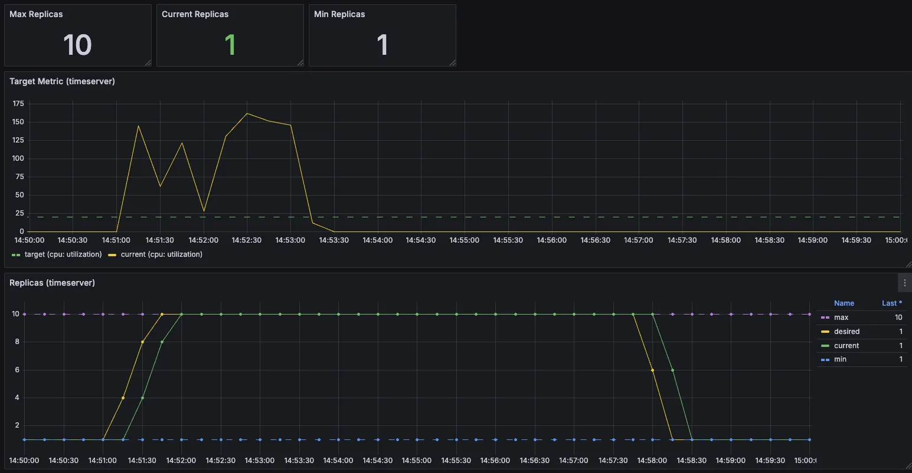

(옵션) 관리 편리성

krew 로 기타 플러그인 설치 및 사용 : df-pv get-all ktop neat oomd view-secret

```bash
설치
kubectl krew install df-pv get-all ktop neat oomd view-secret # mtail tree

# get-all 사용
kubectl get-all
kubectl get-all -n kube-system

# ktop 사용
kubectl ktop

# oomd 사용
kubectl oomd

# df-pv 사용
kubectl df-pv

# view-secret 사용 : 시크릿 복호화
kubectl view-secret
```

# 실습 따라하기 환경 구성 with Kind 
- kind , kube-ops-view, metrics-server 설치
```bash
# Prometheus Target connection refused bind-address 설정 : kube-controller-manager , kube-scheduler , etcd , kube-proxy
kind create cluster --name myk8s --image kindest/node:v1.32.5 --config - <<EOF
kind: Cluster
apiVersion: kind.x-k8s.io/v1alpha4
nodes:
- role: control-plane
  labels:
    ingress-ready: true
  extraPortMappings:
  - containerPort: 80
    hostPort: 80
    protocol: TCP
  - containerPort: 443
    hostPort: 443
  - containerPort: 30000
    hostPort: 30000
  - containerPort: 30001
    hostPort: 30001
  - containerPort: 30002
    hostPort: 30002
  - containerPort: 30003
    hostPort: 30003
  kubeadmConfigPatches: # Prometheus Target connection refused bind-address 설정
  - |
    kind: ClusterConfiguration
    controllerManager:
      extraArgs:
        bind-address: 0.0.0.0
    etcd:
      local:
        extraArgs:
          listen-metrics-urls: http://0.0.0.0:2381
    scheduler:
      extraArgs:
        bind-address: 0.0.0.0
  - |
    kind: KubeProxyConfiguration
    metricsBindAddress: 0.0.0.0
EOF

# 노드 라벨 확인
kubectl get nodes myk8s-control-plane -o jsonpath={.metadata.labels} | jq
...
  "ingress-ready": "true",
...

# NGINX ingress 배포
## The manifests contains kind specific patches to forward the hostPorts to the ingress controller, 
## set taint tolerations and schedule it to the custom labelled node.
kubectl apply -f https://raw.githubusercontent.com/kubernetes/ingress-nginx/main/deploy/static/provider/kind/deploy.yaml
-------------------------
## 호스트 포트 80,443 사용
ports:
- containerPort: 80
  hostPort: 80
  name: http
  protocol: TCP
- containerPort: 443
  hostPort: 443
  name: https
  protocol: TCP
...

## nodeSelector 로 배포 노드 지정
nodeSelector:
  ingress-ready: "true"
  kubernetes.io/os: linux

## taint 예외 tolerations 설정
tolerations:
- effect: NoSchedule
  key: node-role.kubernetes.io/master
	operator: Equal
- effect: NoSchedule
  key: node-role.kubernetes.io/control-plane
  operator: Equal
-------------------------

# ingress 배포 확인
kubectl get deploy,svc,ep ingress-nginx-controller -n ingress-nginx

# control-plane 노드(실제로는 컨테이너)에 IPTABLES에 80,443은 ingress-nginx 파드로 전달 규칙 확인 # 10.244.0.7은 ingress-nginx 파드의 IP
docker exec -it myk8s-control-plane iptables -t nat -L -n -v | grep 10.244.0.7
root@myk8s-control-plane:/# iptables -t nat -L -n -v | grep '10.244.0.7'
    0     0 DNAT       6    --  *      *       0.0.0.0/0            0.0.0.0/0            tcp dpt:80 to:10.244.0.7:80
    0     0 DNAT       6    --  *      *       0.0.0.0/0            0.0.0.0/0            tcp dpt:443 to:10.244.0.7:443


# kube-ops-view
helm repo add geek-cookbook https://geek-cookbook.github.io/charts/
helm install kube-ops-view geek-cookbook/kube-ops-view --version 1.2.2 --set service.main.type=NodePort,service.main.ports.http.nodePort=30003 --set env.TZ="Asia/Seoul" --namespace kube-system
kubectl get deploy,pod,svc,ep -n kube-system -l app.kubernetes.io/instance=kube-ops-view

# kube-ops-view 접속 URL 확인 (1.5 , 2 배율)
open "http://localhost:30003/#scale=1.5"
open "http://localhost:30003/#scale=2"

# metrics-server
helm repo add metrics-server https://kubernetes-sigs.github.io/metrics-server/
helm upgrade --install metrics-server metrics-server/metrics-server --set 'args[0]=--kubelet-insecure-tls' -n kube-system
kubectl get all -n kube-system -l app.kubernetes.io/instance=metrics-server

# 확인
kubectl top node
kubectl top pod -A --sort-by='cpu'
kubectl top pod -A --sort-by='memory'

```

- prometheus-stack 설치 by helm - [Link](https://artifacthub.io/packages/helm/prometheus-community/kube-prometheus-stack)
```bash
# 모니터링
watch kubectl get pod,pvc,svc,ingress -n monitoring

# repo 추가
helm repo add prometheus-community https://prometheus-community.github.io/helm-charts
helm repo update

# 파라미터 파일 생성
cat <<EOT > monitor-values.yaml
prometheus:
  service:
    type: NodePort
    nodePort: 30001
    
  prometheusSpec:
    scrapeInterval: "15s"
    evaluationInterval: "15s"
    podMonitorSelectorNilUsesHelmValues: false
    serviceMonitorSelectorNilUsesHelmValues: false
    retention: 5d
    retentionSize: "10GiB"

grafana:
  defaultDashboardsTimezone: Asia/Seoul
  adminPassword: prom-operator
  service:
    type: NodePort
    nodePort: 30002

defaultRules:
  create: false
prometheus-windows-exporter:
  prometheus:
    monitor:
      enabled: false
alertmanager:
  enabled: false
EOT
cat monitor-values.yaml

# 배포
helm install kube-prometheus-stack prometheus-community/kube-prometheus-stack --version 69.3.1 \
-f monitor-values.yaml --create-namespace --namespace monitoring

# 각각 웹 접속 실행
## Windows(WSL2) 사용자는 아래 주소를 자신의 웹 브라우저에서 기입 후 직접 접속, 이후에도 동일.
open http://127.0.0.1:30001 # macOS prometheus 웹 접속
open http://127.0.0.1:30002 # macOS grafana 웹 접속 ( admin , prom-operator )

# 확인
## grafana : 프로메테우스는 메트릭 정보를 저장하는 용도로 사용하며, 그라파나로 시각화 처리
## prometheus-0 : 모니터링 대상이 되는 파드는 ‘exporter’라는 별도의 사이드카 형식의 파드에서 모니터링 메트릭을 노출, pull 방식으로 가져와 내부의 시계열 데이터베이스에 저장
## node-exporter : 노드익스포터는 물리 노드에 대한 자원 사용량(네트워크, 스토리지 등 전체) 정보를 메트릭 형태로 변경하여 노출
## operator : 시스템 경고 메시지 정책(prometheus rule), 애플리케이션 모니터링 대상 추가 등의 작업을 편리하게 할수 있게 CRD 지원
## kube-state-metrics : 쿠버네티스의 클러스터의 상태(kube-state)를 메트릭으로 변환하는 파드
helm list -n monitoring
kubectl get pod,svc,ingress,pvc -n monitoring
kubectl get-all -n monitoring
kubectl get prometheus,servicemonitors -n monitoring
kubectl get crd | grep monitoring

# 삭제
helm uninstall -n monitoring kube-prometheus-stack
```

- 그라파나([22128](https://grafana.com/grafana/dashboards/22128-horizontal-pod-autoscaler-hpa/)) 대시보드 Import 설정


# 6. Scaling up

his chapter covers ⇒ **목표(자동 확장)** The goal is, ultimately, to operationalize our deployment using **automatic scaling.**

- **포드 및 노드 수동 확장** Scaling Pods and nodes manually
- **CPU 활용도 및 기타 지표를 사용하여 Pod 복제본 동적 확장** Using CPU utilization and other metrics to scale Pod replicas dynamically
- **관리형 플랫폼을 활용하여 포드에 필요한 리소스를 기반으로 노드를 추가하고 제거** Utilizing managed platforms to add and remove nodes based on the resources your Pods require
- **우선순위가 낮은 자리 표시자 포드를 사용하여 버스트 용량 제공** Using low-priority placeholder Pods to provision burst capacity
- **앱을 확장할 수 있도록 설계하기** Architecting apps so that they can be scaled


## 6.1 Scaling Pods and nodes**
    
    **들어가며**
    
    - 쿠버네티스에는 본질적으로 확장해야 할 두 가지 리소스가 있습니다. 애플리케이션(**파드**)과 그들이 실행하는 컴퓨팅 자원(**노드**).
    - 삶을 조금 더 복잡하게 만들 수 있는 것은 요구 사항(예: 더 많은 애플리케이션 용량)이 어느 정도 상관관계가 있음에도 불구하고 이러한 리소스를 확장하는 방식이 별개라는 점입니다.
    - 실행할 컴퓨팅 리소스가 부족하기 때문에 포드를 확장하는 것만으로는 충분하지 않으며, 빈 용량만 추가하는 노드만 확장하는 것도 충분하지 않습니다. 적절한 비율로 동시에 스케일링하는 것이 필요합니다.
    - 먼저, 애플리케이션에 더 많은 트래픽을 처리하려면 **Pod 복제본의 수를 늘려야** 합니다.
    - **수동** 접근 방식부터 시작하여 다음과 같이 원하는 복제본 수로 배포 구성을 업데이트하면 이를 달성할 수 있습니다.
    - 원문
        
        ```bash
        Getting your application containerized and deployed on Kubernetes is a great step toward building an application deployment that is capable of scaling and supporting your growth. 
        
        Let’s now go over how to actually scale things up when that moment of success arrives and the traffic increases (and scale things down to save some money in the quiet periods).
        
        In Kubernetes, there are essentially two resources that you need to scale:
        
        your application (Pods) and the compute resources they run on (nodes).
        
        What can make life a bit complicated is that the way you scale these resources is separate, even though the requirements (e.g., more application capacity) are somewhat correlated. 
        
        It’s not enough to just scale Pods as they’ll run out of compute resources to run on, nor is it enough to scale up nodes alone as that just adds empty capacity.
        
        Scaling both in unison and at the correct ratio is what’s needed.
        
        Fortunately, there are some tools to make your life easier (and some fully automated platforms that take care of everything for you), which I’ll cover in the following discussion. 
        
        Firstly, to handle more traffic to your application, you’ll need to increase the number of Pod replicas.
        
        Starting with the manual approach, you can achieve this by updating your Deployment configuration with the desired number of replicas as follows.
        ```
        
    
    (예시) Pod 복제본의 수를 증가 
    
    ```bash
    #
    apiVersion: apps/v1
    kind: **Deployment**
    metadata:
      name: timeserver
    spec:
      **replicas: 6**
      selector:
        matchLabels:
          pod: timeserver-pod
      template:
        metadata:
          labels:
            pod: timeserver-pod
        spec:
          containers:
          - name: timeserver-container
            image: docker.io/wdenniss/timeserver:3
            resources:
              requests:
                cpu: 200m
                memory: 250Mi
    **kubectl apply -f deploy.yaml**
    
    # 혹은 명령 입력 imperative command
    kubectl scale deployment timeserver **--replicas=6**
    ```
    
    **증가 수행 후 확인 사항**
    
    - 그러나 복제본을 너무 많이 추가하려고 하면 곧 클러스터에 해당 **포드를 예약할 공간이 부족**해집니다. 바로 여기서 **노드를 확장**할 수 있습니다.
    - kubectl을 실행하면 공간이 부족해지고, 많은 수가 **보류 중**으로 표시된다는 것을 알 수 있습니다.
    - **포드**는 여러 가지 이유로 **대기** 중일 수 있으며, 그 중 가장 일반적인 이유는 (포드가 해당 상태에 있었던 지 1분 정도 된 경우) 리소스 부족입니다.
    - 기본적으로 자원 부족은 충족되지 않은 상태이며, 포드는 조건이 충족될 때까지 대기 상태로 남아 있습니다.
    - 포드에 종속성이 있는 경우(예: 생성되지 않은 다른 포드와의 노드에 배포해야 하는 경우) 다른 불만족스러운 조건도 있을 수 있습니다.
    - 명확하게 설명하려면 Kubectl이 있는 포드를 설명(describe)하고 포드 $POD_NAME을 설명하고 이벤트를 살펴보세요.
    - CPU 부족과 같은 메시지가 표시되는 FailedScheduling과 같은 이벤트가 발생하면 노드를 더 추가해야 할 가능성이 높습니다.

    
    


## 6.2 Horizontal Pod autoscaling

**들어가며**

- Kubernetes에서 애플리케이션의 Pod 복제본 수를 확장하는 것을 **수평 Pod 자동 확장**이라고 합니다.
- **수평적**이기 때문에 트래픽 증가를 위해 복제본 수를 늘리것이고, **수직적**은 복제본에서 사용할 수 있는 리소스를 늘리는 것을 의미합니다.
- 일반적으로 시스템을 확장하려면 **수평 스케일링**을 사용해야 합니다.
- Kubernetes에는 수평 포드 오토스케일러(**HPA**)라는 기능이 포함되어 있습니다. 이 시스템은 CPU 사용량과 같은 포드 메트릭을 관찰하고 대상으로 지정할 수 있으며, 일부 스케일링 제한(최소 및 최대 복제본)도 포함되어 있습니다.
- 그런 다음 HPA는 포드를 생성하고 제거하여 사용자의 메트릭을 충족하려고 시도합니다.
- CPU의 경우, 예를 들어 20%의 CPU 사용률을 목표로 하는 경우, HPA는 평균 사용량(모든 포드에서)이 20%를 초과할 때 복제본을 추가하고(팟이 리소스 요청에서 요청한 것의) 20% 이하로 떨어지면 복제본을 제거합니다.
- 이러한 행동은 사용자가 제공하는 최소 및 최대 한도와 너무 많은 이탈을 피하기 위한 재사용 대기 시간의 영향을 받습니다.
- 다음 목록과 같이 배포를 위한 HPA를 생성할 수 있습니다.

- HPA
```bash
apiVersion: autoscaling/v2
kind: HorizontalPodAutoscaler
metadata:
  name: timeserver
spec:
  minReplicas: 1
  maxReplicas: 10
  metrics:
  - resource:
      name: cpu
      target:
        averageUtilization: 20 # The CPU utilization target.
        type: Utilization      # The HPA will create more replicas when the Pod CPU utilization is higher than this value
    type: Resource
  scaleTargetRef: # The Deployment that will be scaled
    apiVersion: apps/v1
    kind: Deployment
    name: timeserver

# 혹은 imperative command
kubectl autoscale deployment timeserver --cpu-percent=20 --min=1 --max=10
```

​
- 이를 테스트하려면 CPU를 정말 바쁘게 만들어야 합니다. 타임서버 애플리케이션에 CPU 집약적인 경로인 원주율(파이) 계산을 추가.
```bash
from decimal import *

# Calculate pi using the Gregory-Leibniz infinity series
def leibniz_pi(iterations):

  precision = 20
  getcontext().prec = 20
  piDiv4 = Decimal(1)
  odd = Decimal(3)

  for i in range(0, iterations):
    piDiv4 = piDiv4 - 1/odd
    odd = odd + 2
    piDiv4 = piDiv4 + 1/odd
    odd = odd + 2

  return piDiv4 * 4
```
- server.py 에 새로운 URL 경로를 추가
    
    ```bash
    from http.server import ThreadingHTTPServer, BaseHTTPRequestHandler
    from datetime import datetime, timedelta
    **from pi import ***
    
    last_ready_time = datetime.now()
    
    class RequestHandler(BaseHTTPRequestHandler):
    
        def do_GET(self):
            global last_ready_time
    
            match self.path:
                case '/':
                    now = datetime.now()
                    response_string = now.strftime("The time is %-I:%M %p, UTC.")
                    self.respond_with(200, response_string)
                **case '/pi':
                    pi = leibniz_pi(1000000)
                    self.respond_with(200, str(pi))**
                case '/healthz':
                    if (datetime.now() > last_ready_time + timedelta(minutes=5)):
                        self.respond_with(503, "Not Healthy")
                    else:
                        self.respond_with(200, "Healthy")
                case '/readyz':
                    dependencies_connected = True 
                    # TODO: actually verify any dependencies
                    if (dependencies_connected):
                        last_ready_time = datetime.now()
                        self.respond_with(200, "Ready")
                    else:
                        self.respond_with(503, "Not Ready")
                case _:
                    self.respond_with(404, "Not Found")
    ...
    ```
- 다음 목록은 **새로운 버전의 컨테이너**와 추가된 경로를 참조하는 수정된 배포를 제공합니다.
- **HPA**와 올바르게 작동하려면 5장에서 추가한 **리소스 요청을 설정**하는 것이 중요합니다.

```bash
apiVersion: apps/v1
kind: Deployment
metadata:
  name: timeserver
spec:
  **replicas: 1**
  selector:
    matchLabels:
      pod: timeserver-pod
  template:
    metadata:
      labels:
        pod: timeserver-pod
    spec:
      containers:
      - name: timeserver-container
        image: docker.io/wdenniss/**timeserver:4**
        **resources:
          requests:
            cpu: 250m
            memory: 250Mi**
```
- 이후 Apache Bench 로 웹 요청 시도 후 부하발생과 HPA 동작 확인


    - **HPA 실습 따라하기***
    - 실습 환경 배포
        
        ```bash
        #
        cd Chapter06/6.2_HPA
        
        # 디플로이먼트, HPA 배포
        kubectl apply -f deploy.yaml,hpa.yaml
        
        # Service(NodePort) 배포
        cat <<EOF | kubectl apply -f -
        apiVersion: v1
        kind: Service
        metadata:
          name: timeserver
        spec:
          selector:
            pod: timeserver-pod
          ports:
          - port: 80
            targetPort: 80
            protocol: TCP
            nodePort: 30000
          type: NodePort
        EOF
        
        # 확인
        kubectl get hpa,deploy,svc,pod,ep
        **kubectl top pods**
        *NAME                          CPU(cores)   MEMORY(bytes)   
        timeserver-569b5458cf-p5f25   1m           43Mi* 
        
        ```
        
    - 부하 발생 후 확인
        
        
        ```bash
        # 모니터링
        watch -d kubectl get hpa,deploy,pod
        kubectl get hpa
        while true; do kubectl top pods ; sleep 1; echo ; done
        
        # 부하 발생 확인
        **curl http://127.0.0.1:30000/pi**
        
        # 반복 접속으로 부하 발생 
        for i in {1..10};  do curl -s http://127.0.0.1:30000/pi ; date; sleep 1; done
        ab -n 1000 -c 5 http://127.0.0.1:30000/pi
        
        #
        **kubectl get hpa,deploy,pod**
        NAME                                             REFERENCE               TARGETS       MINPODS   MAXPODS   REPLICAS   AGE
        horizontalpodautoscaler.autoscaling/timeserver   Deployment/timeserver   cpu: 150%/20%   1         10        10         13m
        
        NAME                         READY   UP-TO-DATE   AVAILABLE   AGE
        deployment.apps/timeserver   10/10   10           10          13m
        
        NAME                              READY   STATUS    RESTARTS   AGE
        pod/timeserver-569b5458cf-6qkhj   1/1     Running   0          3m56s
        pod/timeserver-569b5458cf-7z2mr   1/1     Running   0          3m41s
        pod/timeserver-569b5458cf-825jw   1/1     Running   0          4m11s
        pod/timeserver-569b5458cf-9db2k   1/1     Running   0          3m56s
        pod/timeserver-569b5458cf-p5f25   1/1     Running   0          13m
        pod/timeserver-569b5458cf-pv7kq   1/1     Running   0          3m56s
        pod/timeserver-569b5458cf-rt9xr   1/1     Running   0          3m56s
        pod/timeserver-569b5458cf-vc45n   1/1     Running   0          3m41s
        pod/timeserver-569b5458cf-vkj9z   1/1     Running   0          4m11s
        pod/timeserver-569b5458cf-vtkz6   1/1     Running   0          4m11s
        
        #
        kubectl get hpa -o json
        
        #
        kubectl get --raw "/apis/metrics.k8s.io" | jq
        kubectl get --raw "/apis/metrics.k8s.io/v1beta1" | jq
        kubectl get --raw "/apis/metrics.k8s.io/v1beta1/nodes" | jq
        kubectl get --raw "/apis/metrics.k8s.io/v1beta1/pods" | jq
         
        # 실습 완료 후 삭제
        **kubectl delete hpa,deploy,svc timeserver**
        
        ```
        
        - 모든 것이 제대로 진행된다면, 쿠벡틀 상단 포드와 더 많은 포드 복제본이 생성될 때 보이는 것처럼 CPU 사용률이 증가하는 것을 관찰해야 합니다.
        - 엔드포인트로 로드 전송을 중단하면(예: ab를 중단하거나 완료될 때까지 기다립니다), 이러한 복제본이 점차 제거되는 것을 관찰해야 합니다.
        - 요청이 중지될 때 요청 부하가 큰 경우 요청을 제거하고 축소할 때보다 요청 부하가 큰 경우 복제본이 더 빨리 예약되는 것을 관찰할 수 있습니다.
        - 수요가 급증할 경우 이탈을 피하기 위해 용량을 제거할 때 시스템이 약간 신중할 뿐입니다
       
            
        
    - 고려사항 *: 부하가 CPU, Mem가 주 원인이 아닐 경우*
        - 여기에 표시된 HPA는 CPU 메트릭을 사용하여 꽤 잘 작동했지만, 단점이 있습니다: **작업 부하가 CPU가 아닐 경우**도 있습니다.
        - 데모에서 사용되는 CPU 집약적인 요청과 달리, 많은 **HTTP 서비스는 데이터베이스와 같은 외부 서비스를 기다리는 데 많은 시간**을 보냅니다.
        - 이러한 배포는 CPU 사용률보다는 서비스를 실행하는 **초당 요청 수(RPS)와 같은 다른 지표를 사용하여 확장**해야 할 수도 있습니다.
        - Kubernetes는 두 가지 **내장 메트릭**을 제공합니다: 이전 예제에서 시연된 **CPU**와 **메모리**입니다.
        - RPS와 같은 메트릭을 직접 지원하지는 않지만, 모니터링 서비스에서 노출된 **사용자 지정** 및 **외부 메트릭**을 사용하여 구성할 수 있습니다.
        
### 6.2.1 External metrics

- nginx 배포
    
    ```bash
    # NGINX 웹서버 **배포**
    helm repo add bitnami https://charts.bitnami.com/bitnami
    helm repo update
    
    # 파라미터 파일 생성
    cat <<EOT > nginx-values.yaml
    service:
      type: **NodePort**
      nodePorts:
        **http**: "30000"
    
    **metrics**:
      enabled: true
    
      service:
        port: 9113
    
      **serviceMonitor**:
        enabled: true
        namespace: monitoring
        interval: 10s
    
    networkPolicy:
      enabled: false
    
    resourcesPreset: "nano"
    EOT
    cat nginx-values.yaml
    
    # 배포 : HPA 실습 리소스 삭제하고 아래 명령 실행 할 것(nodeport 30000 중복)
    **helm install nginx bitnami/nginx --version 19.0.0 -f nginx-values.yaml**
    
    # 확인
    kubectl get deploy,svc,ep nginx
    kubectl describe deploy nginx # Resource - Limits/Requests 확인
    kubectl get servicemonitor -n monitoring nginx -o json | jq
    
    # 접속 주소 확인 및 접속
    curl -s http://127.0.0.1:30000
    kubectl stern deploy/nginx
    *혹은
    kubectl logs deploy/nginx -f*
    
    # 반복 접속
    while true; do curl -s http://127.0.0.1:30000 | grep title; date; sleep 1; done
    while true; do curl -s http://127.0.0.1:30000 -I | head -n 1; date; sleep 1; done
    
    # **프로메테우스** 웹에서 **nginx_** 쿼리 수집 확인 해보기
    
    ```

    - **prometheus-adapter** 설치 : Prometheus에서 수집한 데이터를 Custom Metrics API로 변환하여 제공 - [Helm](https://artifacthub.io/packages/helm/prometheus-community/prometheus-adapter)
    
    
    
    ```bash
    #
    helm repo add prometheus-community https://prometheus-community.github.io/helm-charts
    cat << EOT > padapter-values.yaml
    prometheus:
      url: http://**kube-prometheus-stack-prometheus.monitoring.svc**
    EOT
    helm install prometheus-adapter prometheus-community/prometheus-adapter -f padapter-values.yaml --version 4.13.0 --namespace monitoring
    
    #
    **kubectl get apiservices.apiregistration.k8s.io**
    ...
    **v1beta1.custom.metrics.k8s.io     monitoring/prometheus-adapter**   True        36s
    v1beta1.metrics.k8s.io            kube-system/metrics-server      True        175m
    ...
    
    # 
    kubectl get --raw /apis/custom.metrics.k8s.io | jq
    kubectl get --raw /apis/custom.metrics.k8s.io/v1beta1 | jq
    
    #
    kubectl get cm -n monitoring prometheus-adapter -o yaml
    kubectl edit cm -n monitoring prometheus-adapter -o yaml
    ---------------------------------------------------------
    data:
      config.yaml: |
        rules:
        - seriesQuery: '**nginx_http_requests_total**{namespace!="",pod!=""}'
          resources:
            overrides:
              namespace: {resource: "namespace"}
              pod: {resource: "pod"}
          name:
            matches: "^(.*)"
            as: "nginx_server_requests_per_second"
          metricsQuery: 'sum(rate(nginx_server_requests_total{<<.LabelMatchers>>}[1m])) by (pod)' # (<<.GroupBy>>)'
    ...
    
    #
    kubectl rollout restart deployment prometheus-adapter -n monitoring
    
    # 위 config.yaml 내용 문제 인지, 프로메테우스에스 nginx 요청 값 확인은 되지만, adapter가 custom 변환을 못해주고 있다..
    # 참고고, 기본 configmap 에 다른 프로메테우스 메트릭은 adapter가 custom 변해주는 것은 확인..
    kubectl get --raw "/apis/custom.metrics.k8s.io/v1beta1/namespaces/default/pods/*/nginx_server_requests_per_second" | jq
    *{
      "kind": "MetricValueList",
      "apiVersion": "custom.metrics.k8s.io/v1beta1",
      "metadata": {},
      "items": []
    }*
    
    ```
   - HPA
    
    ```bash
    #
    cat <<EOF | kubectl apply -f -
    apiVersion: autoscaling/v2
    kind: **HorizontalPodAutoscaler**
    metadata:
      name: **nginx-hpa**
      namespace: default
    spec:
      scaleTargetRef:
        apiVersion: apps/v1
        kind: Deployment
        name: **nginx**
      minReplicas: 2
      maxReplicas: 10
      **metrics**:
      - type: Pods
        pods:
          **metric**:
            name: **nginx_server_requests_per_second**
          target:
            type: AverageValue
            averageValue: 10
    EOF
    
    #
    ```

    - 삭제
    
    ```bash
    #
    kubectl delete hpa nginx-hpa
    helm uninstall -n monitoring prometheus-adapter
    helm uninstall nginx
    
    ```

    - **소개하기**
    - 인기 있는 스케일링 지표 중 하나는 **초당 요청(RPS)**입니다.
    - 확장을 위해 RPS 메트릭을 사용하는 기본은 애플리케이션 인스턴스가 매초 얼마나 많은 요청을 처리할 수 있는지(**복제본의 용량**)를 **측정**하는 것입니다.
    - 그런 다음 **현재 요청 수**를 이 금액으로 나누면 필요한 **복제본 수**가 됩니다:
        
        ```bash
        replica_count = RPS ÷ replica_capacity
        ```
        
    - **RPS 메트릭의 장점**은 **애플리케이션이 테스트한 RPS를 처리할 수 있다고 확신한다면 다음과 같이 확장**할 수 있다는 것입니다
    - 로드는 충분한 용량을 제공하기 위해 자동 스케일러가 해야 하는 일입니다.
    - 사실, 자동 스케일링을 하지 않더라도 이 지표는 여전히 용량을 계획하는 데 매우 좋은 방법입니다.
    - 복제본의 용량을 측정하고, 트래픽을 투사하며, 그에 따라 복제본을 늘릴 수 있습니다.
    - 하지만 Kubernetes를 사용하면 자동 확장을 위해 RPS 메트릭을 사용하여 HPA를 구성할 수도 있습니다.
    - 이제 이 경우에는 **HPA의 외부 메트릭 속성**을 사용할 것입니다. 이 문제의 한 가지는 메트릭의 이름에서 알 수 있듯이 **클러스터 외부**에서 가져온다는 것입니다.
    - 따라서 제가 예시에서 사용하는 모니터링 솔루션과 다른 모니터링 솔루션을 사용하는 경우 관련 RPS 지표가 무엇인지 확인해야 합니다.
    - 다행히도 RPS는 꽤 흔한 지표이며, 소금만큼 가치 있는 모니터링 솔루션이라면 누구나 이를 제공할 수 있습니다.
    - 이전 장에서는 TCP/IP 계층에서 작동하는 레이어 4 로드 밸런서와 HTTP 계층에서 작동하는 레이어 7 인그레스를 통해 클러스터로 트래픽을 유입하는 몇 가지 방법에 대해 논의했습니다.
    - 요청은 **HTTP** 개념이므로 이 메트릭을 얻으려면 **Ingress**를 사용해야 합니다.
    - 입력 내용은 다음 장에서 자세히 다룰 예정입니다. 현재로서는 이 객체가 HTTP 트래픽을 보고 검사하므로 요청 수에 대한 메트릭을 노출할 수 있다는 점만 알면 충분합니다.
    - 이 예에서는 다음 두 목록과 같이 동일한 배포를 사용하지만 이전 장에서 로드발란스를 입력하는 대신 NodePort 유형의 서비스를 통해 입력에 노출됩니다.
    
    - **책 실습 내용 정리, Skip**
    - service
        
        ```bash
        apiVersion: v1
        kind: **Service**
        metadata:
          name: **timeserver-internal**
        spec:
          selector:
            pod: timeserver-pod
          ports:
          - port: 80
            targetPort: 80
            protocol: TCP
          type: **NodePort**
        ```
        
    - ingress
        
        ```bash
        apiVersion: networking.k8s.io/v1
        kind: **Ingress**
        metadata:
          name: **timeserver-ingress**
        spec:
          rules:
          - http:
              paths:
              - path: /
                pathType: Prefix
                backend:
                  **service**:
                    name: **timeserver-internal**
                    port:
                      number: 80
        ```
        
    - Now if you’re using Google Cloud, the following **HPA** definition can pick up the **RPS metric** from the **Ingress** once you replace the forwarding rule name with your own.
        
        ```bash
        apiVersion: autoscaling/v2
        kind: **HorizontalPodAutoscaler**
        metadata:
          name: **timeserver-autoscaler**
        spec:
          minReplicas: 1
          maxReplicas: 6
          **metrics**:
          - type: **External**
            **external**:
              metric:
                name: **loadbalancing.googleapis.com|https|request_count**
                selector:
                  matchLabels:
                    *resource.labels.**forwarding_rule_name**: "k8s2-fr-21mgs2fl"*
              **target**:
                type: **AverageValue**
                averageValue: 5
          scaleTargetRef:
            apiVersion: apps/v1
            kind: **Deployment**
            name: timeserver
        ```
        
    - **forwarding_rule_name**은 메트릭 서버가 사용자가 말하는 **ingress** 객체를 아는 방법입니다.
    - **selector** 필드를 완전히 생략할 수는 있지만, 그러면 원하는 입력 객체가 아닌 모든 입력 객체에서 일치할 것입니다.
    - 문제를 복잡하게 만드는 이 전달 규칙 이름은 Kubernetes 객체 이름이 아니라 **플랫폼별** 리소스 이름입니다(이 예에서는 해당 이름이 **GKE**에 의해 자동으로 설정됩니다).
    - 플랫폼 리소스 이름을 검색하려면 Ingress가 구성될 때까지 몇 분을 기다린 후 Ingress 객체를 설명할 수 있습니다.
        
        ```bash
        $ **kubectl describe ingress timeserver-ingress**
        Name: timeserver-ingress
        Namespace: default
        Address: 203.0.113.16
        Default backend: default-http-backend:80 (10.22.0.202:8080)
        **Rules:**
        	Host Path Backends
        	---- ---- --------
        	*
        			 /    timeserver-internal:80
                		(10.22.0.130:80,10.22.0.131:80,10.22.0.196:80 + 1 more...)
        
        Annotations:ingress.kubernetes.io/backends:{"k8s -be-32730":"HEALTHY","k8s1-a5225067":"HEALTHY"}
         	   				ingress.kubernetes.io/forwarding-rule: k8s2-fr-21mgs2fl # The forwarding rule name
        						ingress.kubernetes.io/target-proxy: k8s2-tp-21mgs2fl
        						ingress.kubernetes.io/url-map: k8s2-um-21mgs2flEvents:
        						
        Type Reason Age From Message
        ---- ------ ---- ---- -------
        Normal Sync 6m28s (x31 over 5h6m) loadbalancer-controller Scheduled for sync
        ```
        
    - 원문
        
        ```bash
        The forwarding_rule_name is how the metric server knows which Ingress object you’re talking about.
        
        You can omit the selector field completely, but then it will match on all Ingress objects—probably not what you want.
        
        Complicating matters this forwarding rule name is a platform-specific resource name and not the Kubernetes object name (in this example, that name is set automatically by GKE).
        
        To discover the platform resource name, after waiting a few minutes for your Ingress to be configured, you can describe your Ingress object:
        ```
        
    
    - 객체가 준비되면 마지막 단계로 클러스터의 워크로드에 대해 클라우드 모니터링이 활성화되어 있는지 확인하고 HPA가 메트릭에 액세스할 수 있는 접착제를 설치하는 것입니다.
    - 지침에 따라 사용자 지정 메트릭 스택드라이버 어댑터를 설치합니다. **Custom Metrics Stackdriver Adapter.**
    - 배포, 서비스 오브 타입 NodePort, 입력, HPA 및 메트릭 어댑터가 모두 구성되어 이제 사용해 볼 수 있습니다!
    - Ingress에 대한 몇 가지 요청을 생성합니다(입력의 IP를 대체하여 Kubectl get ingress를 통해 획득):
        
        ```bash
        #
        ab -n 100000 -c 100 http://203.0.113.16/
        
        $ **kubectl get hpa,ingress,pods**
        NAME REFERENCE TARGETS MINPODS MAXPODS REPLICAS
        hpa/timeserver Deployment/timeserver 94%/30% 1 6 4
        
        NAME CLASS HOSTS ADDRESS PORTS
        ingress/timeserver-ingress <none> * 203.0.113.16 80
        
        NAME READY STATUS RESTARTS AGE
        pod/timeserver-b8789946f-8dpmg 1/1 Running 0 5h51m
        pod/timeserver-b8789946f-gsrt5 0/1 ContainerCreating 0 110s
        pod/timeserver-b8789946f-sjvqb 1/1 Running 0 110s
        pod/timeserver-b8789946f-vmhsw 0/1 ContainerCreating 0 110s
        ```
        
    - 한 가지 주목할 만한 점은 시스템이 예상대로 더 잘 작동하고 있는지 확인하는 것이 이미 더 쉬워졌다는 것입니다.
    - Apache Bench를 사용하면 동시 요청을 지정할 수 있습니다;
    - 그들이 얼마나 오래 걸리는지 (따라서 RPS를 계산하는지) 확인할 수 있고, 복제 수를 확인하여 그것이 맞는지 확인할 수 있습니다.
    - 이 프로세스는 CPU 메트릭을 사용할 때 조금 더 어렵습니다. 테스트를 위해 이전 예제에서와 같이 Pod를 최대한 바쁘게 만들어야 할 수도 있습니다.
    - 사용자 요청을 기반으로 확장하는 이 속성은 사용하기에 인기 있는 메트릭 중 하나입니다.
    
**Observing and Debugging**

- HPA가 무엇을 하고 있는지 확인하려면 kubectl 설명 hpa를 실행할 수 있습니다. 특히 **ScalingActive** **Condition** 에 주의하세요.
- **False**이면 메트릭이 활성화되지 않았음을 의미할 가능성이 높으며, 이는 여러 가지 이유로 발생할 수 있습니다:
- (1) **메트릭 어댑터**가 설치되지 않았거나 인증되지 않았습니다. (2) 메트릭 이름이나 선택기가 잘못되었거나 (3) 주어진 메트릭에 대한 모니터링 샘플이 아직 없습니다.
- 올바른 구성을 사용하더라도 모니터링 데이터 샘플이 없을 때(예: 요청이 없을 때) False가 표시되므로, 추가 조사를 하기 전에 엔드포인트에 몇 가지 요청을 보내고 데이터가 나올 때까지 1~2분 정도 기다려야 합니다.

**AverageValue vs. Value**

- 이전 예제에서는 **targetAverageValue**를 사용했습니다. targetAverageValue는 메트릭의 **포드당 목표 값**입니다.
- **targetValue**는 목표 절대값인 **대안**입니다. **RPS 용량**은 **포드 단위로 계산**되므로 **targetAverageValue** 원하는 목표 평균값입니다.

**Other Metrics**

- 백그라운드 작업을 처리할 때 사용되는 또 다른 인기 있는 외부 지표는 **Pub/Sub queue 길이**입니다(10장에서 다룹니다).
- Pub/Sub는 수행해야 할 작업 대기열을 가질 수 있게 해주는 대기열 시스템으로, **Kubernetes에서 작업량을 설정하여 해당 대기열을 처리**할 수 있습니다.
- 이러한 설정의 경우, 대기열 크기에 대응하기 위해 **Pod 복제본**(대기열을 처리할 수 있는 작업자)을 **추가하거나 제거**할 수 있습니다.
- 이를 위해 **GKE** docs2에서 완전히 작동한 예제를 찾을 수 있습니다. 기본적으로, 이 예제는 다른 메트릭을 사용하여 이전 예제와 유사한 HPA로 요약됩니다
    
    ```bash
    metric:
      name: pubsub.googleapis.com|subscription|num_undelivered_messages
      selector:
        matchLabels:
          resource.labels.subscription_id: echo-read
    ```

**Other Monitoring Solutions**

- 외부 메트릭은 모든 Kubernetes 모니터링 시스템에 대해 구성할 수 있어야 합니다.
- 이전에 제시된 작업 예제는 Google 클라우드에서 클라우드 모니터링을 사용했지만, Prometheus 또는 다른 클라우드 모니터링 시스템을 사용하는 경우에도 동일한 원칙이 적용되어야 합니다.
- 일을 진행하려면 (1) 모니터링 솔루션에 메트릭 어댑터를 설치하는 방법, (2) 해당 시스템에 메트릭 이름이 무엇인지, (3) 메트릭 리소스를 올바르게 선택하는 방법을 결정해야 합니다.


`[HPA 사용 시 주의사항/제약점]` [Blog1](https://frozenpond.tistory.com/231) , [Blog2](https://willseungh0.tistory.com/226) , [Blog3](https://stclab.tistory.com/619) , [Blog4](https://kingofbackend.tistory.com/285)* , [Youtube](https://www.youtube.com/watch?v=V-Ib-DdconY)

1. 평균의 함정 : 특정 파드만 100% 시 probe 실패 후 restart 발생 → 나머지 파드 부하 후 반복 ⇒ 다수 파드 종료로 과도한 증설 발생하여 기간 동안 장애
2. 증설까지의 시간(스파이크성 트래픽 대응 어려움)
3. 파드 App 초기화 동작 시 CPU/Mem 튀는 현상 대응 필요

- **VPA** - [Github](https://github.com/kubernetes/autoscaler/tree/master/vertical-pod-autoscaler) , [DevOcean](https://devocean.sk.com/blog/techBoardDetail.do?ID=164786&boardType=techBlog&searchData=&page=&subIndex=%EC%B5%9C%EC%8B%A0+%EA%B8%B0%EC%88%A0+%EB%B8%94%EB%A1%9C%EA%B7%B8) , [**악분일상](https://malwareanalysis.tistory.com/603)***
    
    

- K8S v1.33: **In-Place Pod Resize** Graduated ← Beta : **파드 CPU/Memory 수직 확장** - [Blog](https://kubernetes.io/blog/2025/05/16/kubernetes-v1-33-in-place-pod-resize-beta/) , [Task](https://kubernetes.io/docs/tasks/configure-pod-container/resize-container-resources/) , [KEP](https://github.com/kubernetes/enhancements/tree/master/keps/sig-node/1287-in-place-update-pod-resources) , [Blog2](https://dev.to/alexeiled/kubernetes-133-resizing-pods-without-the-drama-finally-3cm5)
    - 왜 Pod의 크기를 제자리에서 조정하는 것이 중요한가요? **수직적 확장에 대한 몇 가지 주요 이점**
        - **중단 감소:**
            
            상태 저장 애플리케이션, 장시간 실행되는 일괄 작업 및 민감한 워크로드는 Pod 재시작과 관련된 가동 중지 시간이나 상태 손실 없이 리소스를 조정할 수 있습니다.
            
        - **리소스 활용도 향상:**
            
            과도하게 프로비저닝된 Pod를 중단 없이 축소하여 클러스터의 리소스를 확보합니다. 반대로, 재시작 없이 과부하 상태인 Pod에 더 많은 리소스를 제공할 수 있습니다.
            
        - **더 빠른 확장:**
            
            일시적인 리소스 요구 사항을 더 빠르게 처리합니다. 예를 들어, Java 애플리케이션은 정상 상태 작업보다 시작 시 더 많은 CPU를 필요로 하는 경우가 많습니다. 높은 CPU 용량으로 시작해서 나중에 크기를 조정하세요.
            
        
    - **k8s 1.33.1 설치**
        
        ```bash
        #
        **kind create cluster --name myk8s --image kindest/node:v1.33.1**
        
        # 설치 확인
        docker ps
        **kubectl get node -owide**
        NAME                  STATUS   ROLES           AGE   VERSION   INTERNAL-IP   EXTERNAL-IP   OS-IMAGE                         KERNEL-VERSION     CONTAINER-RUNTIME
        myk8s-control-plane   Ready    control-plane   19m   **v1.33.1**   172.18.0.2    <none>        Debian GNU/Linux 12 (bookworm)   6.10.14-linuxkit   containerd://2.1.0
        
        # (옵션) metrics-server
        helm repo add metrics-server https://kubernetes-sigs.github.io/metrics-server/
        helm install metrics-server metrics-server/metrics-server --set 'args[0]=--kubelet-insecure-tls' -n kube-system
        kubectl get all -n kube-system -l app.kubernetes.io/instance=metrics-server
        
        ```
        
    - **예제 1 : 재시작 없이 CPU 크기 조정**
        
        ```bash
        # 파드 생성
        cat << EOF | kubectl apply -f -
        apiVersion: v1
        kind: **Pod**
        metadata:
          name: **resize-demo**
        spec:
          terminationGracePeriodSeconds: 0
          containers:
          - name: pause
            image: registry.k8s.io/**pause:3.8**
            **resizePolicy**:
            - resourceName: **cpu**
              **restartPolicy: NotRequired** # Default, but explicit here
            - resourceName: memory
              restartPolicy: RestartContainer
            **resources**:
              **limits**:
                memory: "200Mi"
                **cpu: "700m"**
              **requests**:
                memory: "200Mi"
                **cpu: "700m"**
        EOF
        
        # 현재 설정된 파드 상세 정보 확인
        **kubectl get pod resize-demo -o yaml**
        ...
        **spec**:
          **containers**:
          - image: registry.k8s.io/pause:3.8
            imagePullPolicy: IfNotPresent
            name: pause
            **resizePolicy**:
            - resourceName: cpu
              restartPolicy: NotRequired
            - resourceName: memory
              restartPolicy: RestartContainer
            **resources**:
              **limits**:
                **cpu: 700m**
                memory: 200Mi
              **requests**:
                **cpu: 700m**
                memory: 200Mi
        ...
        **status**:
          ...
          **containerStatuses**:
          - allocatedResources:
              cpu: 700m
              memory: 200Mi
            ...
            **resources**:
              **limits**:
                **cpu: 700m**
                memory: 200Mi
              **requests**:
                **cpu: 700m**
                memory: 200Mi
            **restartCount: 0**
          ...
          **qosClass: Guaranteed**
        
        # CPU requests, limits 늘리기 : 'kubectl ---subresource resize' 사용을 위해 kubectl v1.32.0 이상 필요
        kubectl **patch** pod resize-demo **--subresource resize** --patch \
          '{"spec":{"containers":[{"name":"pause", "resources":{"**requests**":{"**cpu**":"800m"}, "**limits**":{"**cpu**":"800m"}}}]}}'
        
        # 파드 상세 정보 확인
        **kubectl get pod resize-demo -o yaml**
        ...
        **spec**:
          **containers**:
          - image: registry.k8s.io/pause:3.8
            imagePullPolicy: IfNotPresent
            name: pause
            **resizePolicy**:
            - resourceName: cpu
              restartPolicy: NotRequired
            - resourceName: memory
              restartPolicy: RestartContainer
            **resources**:
              **limits**:
                **cpu: 800m**
                memory: 200Mi
              **requests**:
                **cpu: 800m**
                memory: 200Mi
        ...
        **status**:
          ...
          **containerStatuses**:
          - allocatedResources:
              cpu: 800m
              memory: 200Mi
            ...
            **resources**:
              **limits**:
                **cpu: 800m**
                memory: 200Mi
              **requests**:
                **cpu: 800m**
                memory: 200Mi
            **restartCount: 0**   # 해당 컨테이너가 재시작 없이, CPU requests/limits 적용 확인
          ...
        ```
        
    - **예제 2 : 재시작 시 메모리 크기 조정**
        
        ```bash
        # 메모리는 'resizePolicy: RestartContainer' 이므로, 메모리 크기 조정 시 해당 컨테이너가 재시작 될 것 입니다.
        kubectl **patch** pod resize-demo --subresource resize --patch \
          '{"spec":{"containers":[{"name":"pause", "**resources**":{"requests":{"**memory**":"**300Mi**"}, "limits":{"**memory**":"**300Mi**"}}}]}}'
        
        # 파드에 해당 컨테이너가 재시작 되었었음알 알 수 있다
        **kubectl get pod resize-demo**
        NAME          READY   STATUS    **RESTARTS**      AGE
        resize-demo   1/1     Running   **1** (98s ago)   17m
        
        # 파드 상세 정보 확인
        **kubectl get pod resize-demo -o yaml**
        ...
        **spec**:
          **containers**:
          - image: registry.k8s.io/pause:3.8
            imagePullPolicy: IfNotPresent
            name: pause
            **resizePolicy**:
            - resourceName: cpu
              restartPolicy: NotRequired
            - resourceName: memory
              restartPolicy: RestartContainer
            **resources**:
              **limits**:
                ****cpu**:** 800m
                **memory**: **300Mi**
              **requests**:
                cpu**:** 800m
                **memory**: **300Mi**
        ...
        **status**:
          ...
          **containerStatuses**:
          - allocatedResources:
              cpu: 800m
              memory: 300Mi
            ...
            **resources**:
              **limits**:
                cpu: 800m
                **memory**: **300Mi**
              **requests**:
                cpu: 800m
                **memory**: **300Mi**
            **restartCount: 1**   # 파드에 해당 컨테이너가 재시작 되면서, 메모리 requests/limits 적용 확인
          ...
        
        ```
        
    - **알파와 베타의 차이점은 무엇인가요?**
        - **주목할 만한 사용자 중심 변경 사항**
            - `resize`하위 리소스:
                - `resize` Pod 리소스를 수정하려면 이제 Pod의 하위 리소스를 통해 해야 합니다
                - `kubectl patch pod <name> --subresource resize ...`
                - `kubectl` 버전 v1.32+에서 이 인수를 지원합니다.
            - 조건을 통한 크기 조정 상태:
                - 이전 `status.resize` 필드는 더 이상 사용되지 않습니다. 이제 크기 조정 작업의 상태는 두 가지 Pod 조건을 통해 표시됩니다.
                - `PodResizePending` :
                    - Kubelet이 크기 조정을 즉시 허용할 수 없음을 나타냅니다. (예: `reason: Deferred` 일시적으로 불가능한 경우, `reason: Infeasible` 노드에서 불가능한 경우).
                - `PodResizeInProgress` :
                    - 크기 조정이 수락되어 적용 중임을 나타냅니다. 이 단계에서 발생한 오류는 이제 이 조건의 메시지에 함께 보고됩니다. `reason: Error`
            - 사이드카 지원 **:** [사이드카 컨테이너](https://kubernetes.io/docs/concepts/workloads/pods/sidecar-containers/)가 이제 in-place 크기 조정이 지원됩니다.
            
        - **안정성 및 신뢰성 향상**
            - **더욱 정교해진 할당 리소스 관리:**
                
                Kubelet의 할당 관리 로직이 대폭 개선되어 더욱 일관되고 강력해졌습니다. 이러한 변경을 통해 수많은 버그가 제거되었고, Pod 크기 조정의 안정성이 크게 향상되었습니다.
                
            - **개선된 체크포인팅 및 상태 추적:**`allocated_pods_stateactuated_pods_state`
                
                새로운 체크포인트 파일을 사용하여 "할당" 및 "활성화된" 리소스를 추적하는 더욱 강력한 시스템이 구현되었습니다.이를 통해 Kubelet 재시작 시 크기 조정 상태를 안정적으로 관리하고 런타임에 보고된 리소스와 요청된 리소스가 다른 극단적인 상황을 처리할 수 있습니다. 체크포인팅 및 상태 복원과 관련된 여러 버그가 수정되었으며, 체크포인팅 효율성도 향상되었습니다.
                
            - **더 빠른 크기 조정 감지:**
                
                Kubelet의 Pod 수명 주기 이벤트 생성기(PLEG)가 향상되어 Kubelet이 크기 조정에 훨씬 더 빠르게 대응하고 완료할 수 있습니다.
                
            - **향상된 CRI 통합:**`UpdatePodSandboxResources`
                
                Pod 수준 리소스 변경 사항에 대한 정보를 런타임과 플러그인(NRI 등)에 더 효과적으로 전달하기 위해 새로운 CRI 호출이 추가되었습니다.
                
            - **다양한 버그 수정:**
                
                systemd cgroup 드라이버, 제한 없는 컨테이너 처리, CPU 최소 공유 계산, 컨테이너 재시작 백오프, 오류 전파, 테스트 안정성 등과 관련된 문제가 해결되었습니다.
                
        - **다음은 무엇인가요?**
            - **안정성 및 프로덕션화:**
                
                기능 강화, 성능 개선, 프로덕션 환경에서의 견고성 보장에 지속적으로 집중합니다.
                
            - **제한 사항 해결:**
                
                문서에 명시된 현재 제한 사항 중 일부(예: 메모리 한도 감소 허용)를 완화하기 위해 노력하고 있습니다.
                
            - [**VerticalPodAutoscaler](https://kubernetes.io/docs/concepts/workloads/autoscaling/#scaling-workloads-vertically) (VPA) 통합:**`InPlaceOrRecreate`
                
                VPA가 기존 Pod 크기 조정 기능을 활용할 수 있도록 하는 작업이 이미 진행 중입니다. 새로운 업데이트 모드를 통해 VPA는 먼저 중단 없는 크기 조정을 시도하거나, 필요한 경우 재생성으로 돌아갈 수 있습니다. 이를 통해 사용자는 VPA의 권장 사항을 훨씬 더 적은 중단으로 활용할 수 있습니다.
    - **Kube Startup CPU Boost** : `InPlacePodVerticalScaling` 필요 - [Github](https://github.com/google/kube-startup-cpu-boost) , [Blog](https://dwdraju.medium.com/kube-startup-cpu-boost-for-containers-initiating-with-hunger-584bd990b4d4)
    
    !

- **KEDA AutoScaler** 소개 - [Docs](https://keda.sh/docs/2.16/) , [DevOcean](https://devocean.sk.com/blog/techBoardDetail.do?ID=164800)
    
    기존의 **HPA**(Horizontal Pod Autoscaler)는 리소스(CPU, Memory) 메트릭을 기반으로 스케일 여부를 결정하게 됩니다.
    
    반면에 **KEDA**는 **특정 이벤트를 기반으로 스케일 여부를 결정**할 수 있습니다.
    
    예를 들어 airflow는 metadb를 통해 현재 실행 중이거나 대기 중인 task가 얼마나 존재하는지 알 수 있습니다.
    
    이러한 이벤트를 활용하여 worker의 scale을 결정한다면 queue에 task가 많이 추가되는 시점에 더 빠르게 확장할 수 있습니다.
    
   
    
    https://keda.sh/docs/2.10/concepts/
    
    1. **Agent** — KEDA activates and deactivates Kubernetes [Deployments](https://kubernetes.io/docs/concepts/workloads/controllers/deployment) to scale to and from zero on no events. This is one of the primary roles of the **`keda-operator`** container that runs when you install KEDA.
    2. **Metrics** — KEDA acts as a [**Kubernetes metrics server**](https://kubernetes.io/docs/tasks/run-application/horizontal-pod-autoscale/#support-for-custom-metrics) that exposes rich event data like queue length or stream lag to the Horizontal Pod Autoscaler to drive scale out. It is up to the Deployment to consume the events directly from the source. This preserves rich event integration and enables gestures like completing or abandoning queue messages to work out of the box. The **metric serving** is the primary role of the **`keda-operator-metrics-apiserver`** container that runs when you install KEDA.
    3. **Admission Webhooks** - Automatically validate resource changes to **prevent misconfiguratio**n and enforce best practices by using an [admission controller](https://kubernetes.io/docs/reference/access-authn-authz/admission-controllers/). As an example, it will prevent multiple ScaledObjects to target the same scale target. **`keda-admission-webhooks`**
        
        ```bash
        **kubectl get pod -n keda**
        NAME                                               READY   STATUS    RESTARTS      AGE
        keda-operator-6bdffdc78-5rqnp                      1/1     Running   1 (11m ago)   11m
        keda-operator-metrics-apiserver-74d844d769-2vrcq   1/1     Running   0             11m
        keda-admission-webhooks-86cffccbf5-kmb7v           1/1     Running   0             11m
        ```
        
    
    **예) KEDA Scalers** : kafka **trigger** for an Apache **Kafka** **topic** - [Link](https://keda.sh/docs/2.16/scalers/apache-kafka/)
    
    ```yaml
    triggers:
    - type: kafka
      metadata:
        bootstrapServers: kafka.svc:9092
        consumerGroup: my-group
        topic: test-topic
        lagThreshold: '5' # Average target value to trigger scaling actions. (Default: 5, Optional)
        activationLagThreshold: '3' #  Target value for activating the scaler. Learn more about activation here.
        offsetResetPolicy: latest
        allowIdleConsumers: false
        scaleToZeroOnInvalidOffset: false
        excludePersistentLag: false
        limitToPartitionsWithLag: false
        version: 1.0.0
        partitionLimitation: '1,2,10-20,31'
        sasl: plaintext
        tls: enable
        unsafeSsl: 'false'
    ```

    - **6.3 Node autoscaling and capacity planning**
    - Using **HPA** is a great way to automatically **scale** your **Pods** based on demand. However, if you have to scale **nodes manually** to add and remove capacity, it still requires a **person** in the **loop**.
    - The common **Cluster Autoscaler** cluster functionality enables you to **scale nodes** on demand and **pairs** well with the **HPA** to scale Pods.
    
    - **6.3.1 Cluster Autoscaling**
        
        
        - **클러스터 자동 확장**은 기본 **Kubernetes API**의 일부가 아니라 **선택적인 구성 요소**입니다.
        - 다행히도 대부분의 클라우드 제공업체는 이 기능을 제공하고(또는 유사한 기능), 이를 플랫폼의 속성으로 구축하여 노드 수를 확장하여 애플리케이션과 복제본 수에만 집중할 수 있게 해줍니다. 이 기능은 플랫폼에 따라 달라지므로 정확한 구현 방식은 다를 수 있으며(모든 제공업체가 제공하는 것은 아닙니다).
        - "[제품명] 클러스터 오토스케일러"를 검색하여 관련 문서를 찾습니다.
        - **GKE**의 경우, **오토파일럿** 작동 모드를 사용하면 클러스터에 노드 프로비저닝 및 자동 확장 기능이 내장되어 있어 추가 구성이 필요하지 않습니다.
        - **노드 풀**이 있는 **GKE 클러스터의** 경우, **노드 풀**을 생성하거나 기존 노드 풀을 업데이트할 때 **자동 스케일링**을 구성할 수 있습니다.
        - 클러스터 자동 확장을 사용할 때는 클러스터가 자동으로 응답하도록 자신의 워크로드를 확장하는 데 집중할 수 있습니다(그림 6.1). 이는 기존 워크로드를 확장하거나 새로운 워크로드를 배포할 때 보류 중인 포드 문제를 해결할 수 있기 때문에 매우 편리합니다.
        - 하지만 제공업체의 구체적인 구현 세부 사항을 읽어보고, 다루지 않는 사례(예: 현재 노드 구성에 맞추기에는 너무 큰 포드가 어떻게 처리되는지)를 이해하세요.
        - **전통적인 클러스터 자동 확장**기는 **기존의 미리 정의된 구성의 새 노드만 추가**할 수 있으므로 사용하려는 각 가능한 노드 유형을 정의해야 하므로 문서를 반드시 읽어보시기 바랍니다.
        - **GKE**는 오토파일럿(구성이 필요 없으며, 기본적으로 그렇게 작동합니다) 또는 노드 자동 프로비저닝이 구성된 노드 기반 모드를 사용하면 모든 유형의 새로운 노드를 추가할 수 있습니다.
        - 클러스터 자동 확장 및 노드를 추가하고 제거할 수 있는 기타 제공자 도구를 사용하면 대부분 노드를 무시하고 자신의 포드에만 집중할 수 있어 삶이 더 쉬워집니다.
        - **HPA 오토스케일러와** 같은 포드 기반 확장과 함께 사용하면 비교적 쉽게 자동으로 배포할 수 있습니다.
        
        
    - **6.3.2 Spare capacity with cluster autoscaling**
        
        
        
        - 노드를 수동으로 추가하는 것에 비해 노드를 **자동으로 확장하는 것의 단점** 중 하나는 때때로 자동 확장기가 너무 잘 조정되어 **여분의 용량이 없을 수 있다**는 점입니다.
        - 이는 비용을 낮추는 데 도움이 될 수 있지만, **포드를 시작하기 전에 용량을 프로비저닝해야 하므로 새 포드를 시작하는 속도가 느려집**니다.
        - 새로운 노드를 추가한 후 포드를 시작하는 것은 기존 노드에 새로운 포드를 추가하는 것보다 느립니다.
        - 노드를 프로비저닝하고 부팅해야 하는 반면, 기존 노드로 예약된 포드는 컨테이너를 당겨 부팅하기만 하면 됩니다. 컨테이너가 이미 캐시에 있는 경우 바로 부팅을 시작할 수도 있습니다.
        - 그림 6.2에 표시된 바와 같이, 새로 예약된 Pod는 부팅을 시작하기 전에 용량이 프로비저닝될 때까지 기다려야 합니다.
        - 오토스케일러를 유지하면서 이 두 가지 문제를 해결하는 한 가지 방법은 **우선순위가 낮은 플레이스홀더 포드**를 사용하는 것입니다.
        - 이 포드는 예비 용량(추가 노드를 계속 대기 상태로 유지하고 실행하는 것) 외에는 아무것도 하지 않습니다.
        - 이 Pod의 우선순위가 낮기 때문에 워크로드가 확장되면 이 Pod를 선점하고 노드 용량을 사용할 수 있습니다(그림 6.3).
        
        
        
        
        - placeholder Pod deployment 를 만들려면 먼저 PriorityClass가 필요합니다.
        - 이 우선순위 클래스는 다음 목록과 같이 0보다 낮은 우선순위를 가져야 합니다(다른 모든 우선순위 클래스가 우선순위를 선점하기를 원합니다).
            
            ```bash
            apiVersion: scheduling.k8s.io/v1
            kind: **PriorityClass**
            metadata:
              name: placeholder-priority
            **value: -10**
            **preemptionPolicy: Never**
            globalDefault: false
            description: "Placeholder Pod priority."
            ```
            
        - 이제 다음 목록과 같이 **"아무것도 하지 않는" 컨테이너 배포**를 만들 수 있습니다.
            
            ```bash
            apiVersion: apps/v1
            kind: **Deployment**
            metadata:
              name: **placeholder**
            spec:
              **replicas: 10** # How many replicas do you want? This, with the CPU and memory requests, determines the size of the headroom capacity provided by the placeholder Pod.
              selector:    # 몇 개의 복제본을 원하십니까? 이는 CPU 및 메모리 요청을 통해 플레이스홀더 포드가 제공하는 헤드룸 용량의 크기를 결정합니다.
                matchLabels:
                  pod: placeholder-pod
              template:
                metadata:
                  labels:
                    pod: placeholder-pod
                spec:
                  **priorityClassName**: placeholder-priority # Uses the priority class we just created
                  **terminationGracePeriodSeconds**: 0 # We want this Pod to shut down immediately with no grace period.
                  containers: 
                  - name: ubuntu
                    image: **ubuntu**
                    command: ["sleep"]
                    args: ["infinity"]
                    resources:
                      **requests:** # The resources that will be reserved by the placeholder Pod. This should be equal to the largest Pod you wish to replace this Pod.
                        **cpu: 200m** # 플레이스홀더 포드가 예약할 리소스입니다. 이는 이 포드를 대체하려는 가장 큰 포드와 같아야 합니다.
                        **memory: 250Mi**
            
            ```
            
        - 직접 만들 때 필요한 복제본 수와 각 복제본의 크기(메모리 및 CPU 요청)를 고려하세요.
        - **크기는 가장 큰 일반 포드 크기 이상**이어야 하며, 그렇지 않으면 **플레이스홀더 포드가 선점될 때 작업량이 공간에 맞지 않을 수** 있습니다.
        - 동시에 크기를 너무 크게 늘리지 말고, 추가 용량을 예약하려면 표준 워크로드인 포드보다 훨씬 큰 복제본보다 더 많은 복제본을 사용하는 것이 좋습니다.
        - 이러한 자리 표시자 포드가 예약한 다른 포드에 의해 선점되기 위해서는 **해당 포드가 더 높은 값을 가지면서도 절대 선점 정책이 없는 우선순위 클래**스를 가져야 합니다.
        - 다행히도 기본 우선순위 클래스의 값은 0이고 선점 정책은 PrememptLowerPriority이므로 **기본적으로 다른 모든 포드가 자리 표시자 포드를 대체**합니다.
        - Kubernetes 기본값을 자체 우선순위 클래스로 나타내려면 6.11을 나열하는 것처럼 보입니다.
        - 기본값을 실제로 변경할 필요가 없으므로 설정할 필요가 없습니다.
        - 하지만 자신만의 우선순위 클래스를 만드는 경우 이 목록을 참조로 사용할 수 있습니다(실제 의도가 아니라면 globalDefault를 true로 설정하지 마세요).
        - 다시 한 번, 자리 표시자 포드 선점이 작동하려면 preemptionPolicy을 Never 로 설정하지 않도록 주의하세요.
            
            ```bash
            apiVersion: scheduling.k8s.io/v1
            kind: **PriorityClass**
            metadata:
              name: default-priority
            **value: 0** # Priority value higher than the placeholder Pods
            **preemptionPolicy: PreemptLowerPriority** # Will preempt other Pods
            **globalDefault: true** # Set as the default so other Pods will Will preempt other Pods preempt the placeholder Pods.
            description: "The global default priority. Will preempt the placeholder Pods."
            ```
            
        - 이와 같은 배포 환경에 캡슐화된 플레이스홀더 포드는 일정한 확장 공간을 제공하는 데 유용하며, 빠른 스케줄링을 위해 정해진 용량을 준비할 수 있습니다.
        - 또는 일회성 용량 프로비저닝을 위해 Job에 캡슐화하거나, 일정에 따라 용량을 프로비저닝하도록 CronJob에 캡슐화하거나, 독립형 포드로 실행할 수도 있습니다.
        
        - **6.4 Building your app to scale**
    
    **들어가기**
    
    - 애플리케이션을 확장하는 것은 방정식의 일부에 불과합니다. 애플리케이션 자체는 확장을 염두에 두고 구축해야 합니다.
    - 비록 이러한 문제들에 대해 걱정할 필요가 없는 성장 단계에 있지는 않더라도, 확장이 필요한 시기는 확장 방식을 설계할 때가 아니라고 생각합니다!
    - 애플리케이션이 예측할 수 없는 성장세를 보이는 스타트업(예: 무제한 사용자가 있는 스타트업)이라면 '성공 실패' 시나리오를 피하기 위해 미리 계획을 세우는 것이 좋습니다.
    - 성공의 돌파구에서 앱이 규모를 감당할 수 없어 실패하는 순간이 바로 여기에 있습니다. 이 돌파구의 순간이 언제일지 모르기 때문에 미리 이를 대비한 설계가 필요합니다.
    - 모든 스타트업이 획기적인 순간을 맞이하는 것은 아니지만, 여러분의 스타트업이 기회를 활용할 준비가 되어 있어야 합니다. 그렇지 않으면 모든 것이 헛수고가 될 수도 있습니다.
    - 다행히도 Kubernetes를 선택하여 컨테이너를 조정함으로써 확장 가능한 앱을 위한 정말 탄탄한 기반을 갖추게 되었습니다.
    - 애플리케이션을 설계할 때 Kubernetes와 크게 독립적인 몇 가지 다른 요소들을 염두에 두어야 합니다.
    - 대부분의 확장 가능한 설계 원칙은 Kubernetes 환경과 비Kubernetes 환경 모두에 적용되지만, Kubernetes에서 확장 가능한 앱을 구축할 때 염두에 두어야 할 몇 가지 모범 사례를 다루겠습니다.
    - 애플리케이션을 개발할 때 몇 가지 확장성 원칙을 준수하는 것이 중요할 수 있으며, 이를 달로 확장해야 할 때가 올 수 있습니다.
    
    
    - **6.4.1 Avoiding state** **기본적으로 컨테이너는 상태가 없는 것으로 간주**
        - 확장 가능성의 가장 중요한 측면 중 하나는 **애플리케이션**에서 **로컬 상태를 피하는 것**입니다.
        - **상태 비저장 디자인**은 실행 중인 애플리케이션의 각 복제본(인스턴스)이 다른 인스턴스에 **로컬로 저장된 데이터를 참조하지 않고 들어오는 요청을 처리**할 수 있는 곳입니다.
        - **로컬 임시 저장소**는 복제본 간에 **공유되지 않고** 다음 요청에 사용할 필요가 없는 한 **임시 데이터 처리**에 사용할 수 있습니다.
        
        <aside>
        👉🏻
        
        **애플리케이션의 상태 비저장 속성**은 인기 있는 **12요소 앱 설계 방법론**에서 가장 중요한 요소라고 생각합니다 - [Link](https://12factor.net/processes)
        
        상태 비저장 앱은 각 인스턴스가 독립적으로 모든 요청을 처리할 수 있기 때문에 확장 및 유지 관리가 더 쉽습니다.
        
        </aside>
        
        - 고전적인 호스트 머신과는 달리, **Kubernetes**에서는 기본적으로 컨테이너가 **디스크에 기록한 모든 데이터**가 일시적(컨테이너가 종료되거나 재시작될 때 **삭제**됨)입니다.
        - 지속적인 볼륨과 StatefulSet 구성(제9장 참조)을 사용하여 상태가 좋은 애플리케이션을 만들 수 있지만, **기본적으로 컨테이너는 상태가 없는 것으로 간주**되며 일반적으로 **확장할 수 있도록 이러한 방식으로 유지**해야 합니다.
        - Kubernetes에서 관리하는 디스크에 상태를 저장하는 대신 외부 데이터 저장소를 사용하여 구조화된 데이터의 경우 SQL 및 NoSQL 데이터베이스, 파일의 경우 객체 저장소, 세션 상태의 경우 Redis와 같은 메모리 데이터베이스와 같은 데이터를 저장합니다.
        - 확장 능력을 지원하려면 셀프 호스팅이 아닌 관리형 서비스를 선택하고 선택한 서비스가 잠재적인 성장을 처리할 수 있도록 해야 합니다.
        - 모든 상태가 나쁘다는 말은 아닙니다. 결국 상태를 저장할 곳이 필요하며, 때로는 이 애플리케이션이 자체 호스팅된 애플리케이션이어야 할 때도 있습니다.
        - 이러한 애플리케이션을 만들 때는 성공 기록이 있는 인기 있는 오픈 소스 솔루션(예: Redis)과 같이 확장성이 높은 솔루션을 선택해야 합니다.
       
            
        
    - **Relational database gotchas : 쿼리 최적화 ,  RDS 고려사항 - [Link1](https://dev.mysql.com/doc/refman/8.0/en/select-optimization.html) , [Link2](https://blog.twitter.com/engineering/en_us/a/2010/announcing-snowflake.html)**
        
        **Taming your queries 질문 길들이기**
        
        - 비효율적인 쿼리가 비효율적인 스케일링을 제공하여 데이터 양이 증가하고 요청 수가 증가함에 따라 속도가 느려지는 것은 말할 필요도 없습니다.
        - 상황을 통제하려면 쿼리를 로깅하고 분석한 후 개발 프로세스 초기에 시작하는 것이 좋습니다(앱이 인기를 끌 때까지 기다리지 않으셔도 됩니다)
        - 문의 사항이 있을 때!).
        - 측정하지 않는 것은 개선할 수 없으므로 각 요청 시 수행되는 SQL 쿼리의 성능을 기록하는 것이 가장 중요한 첫 번째 단계입니다.
        - 쿼리가 많이 생성되거나 쿼리가 느린 요청을 찾아서 시작하세요.
        - MYSQL과 PostgreSQL은 모두 EXPLE 명령어를 지원하여 성능에 대한 특정 쿼리를 분석하는 데 도움을 줄 수 있습니다.
        - 성능을 향상시키기 위한 일반적인 전략으로는 일반적으로 검색되는 열에 **인덱스를 추가**하고 수행해야 하는 **JOIN의 수를 줄이는 것**이 있습니다.
        - MySQL의 문서 "선택 문 최적화"는 다양한 최적화 전략에 대해 자세히 설명합니다.
        
            
        
        **Avoiding N+1 queries N+1 쿼리 피하기**
        
        - 비록 당신의 쿼리가 충분하더라도, 데이터베이스에 대한 **각 개별 쿼리에는 오버헤드**가 있습니다.
        - 이상적으로는 애플리케이션 프로세스의 각 요청이 표시되는 데이터의 양에 관계없이 일정한 수의 쿼리를 수행해야 합니다.
        - 객체 목록을 렌더링하는 요청이 있는 경우, 각 객체에 대해 **별도의 쿼리를 생성하지 않고 이 요청을 처리하는 것이 이상적**입니다.
        - 이를 일반적으로 **N+1 쿼리 문제**라고 합니다(문제가 발생하면 목록을 가져오는 쿼리가 하나 있고, 목록에 있는 각 항목 [N개 항목]마다 쿼리가 하나씩 있는 경우가 많습니다).
        - 이 **anti-pattern**은 객체-합리적 매핑(ORM)을 사용하고 부모 객체와 자식 객체 간의 게으른 로딩을 특징으로 하는 시스템에서 특히 흔합니다.
        - 자식 객체를 게으른 로딩으로 일대일 관계로 렌더링하면 일반적으로 N+1 쿼리(부모 쿼리는 하나, 자식 객체는 N개 쿼리)가 로그에 표시됩니다.
        - 다행히도 이러한 시스템에는 쿼리를 일괄 처리할 수 있도록 하위 개체에 액세스할 계획임을 미리 표시하는 방법이 일반적으로 있습니다.
        - 이러한 N+1 쿼리 상황은 일반적으로 목록 쿼리에서 자식 객체를 반환하는 JOIN을 사용하거나 두 개의 쿼리로 일정한 수의 쿼리로 최적화할 수 있습니다:
        - 하나는 레코드 세트를 가져오고, 다른 하나는 해당 세트의 하위 객체에 대한 세부 정보를 얻는 것입니다.
        - 기억하세요, **목표는 요청당 일정한 수의 쿼리를 갖는 것이며, 특히 쿼리의 수는 제시되는 레코드의 수에 비례하여 선형적으로 증가해서는 안 됩니다**.
        
            
        
        **Using read replicas for SELECT queries SELECT 쿼리에 읽기 복제본 사용**
        
        - 기본 데이터베이스의 부담을 줄이는 가장 좋은 방법 중 하나는 **읽기 복제본**을 만드는 것입니다. 클라우드 환경에서는 설정하기가 매우 사소한 경우가 많습니다.
        - 모든 읽기 쿼리를 읽기 복제본(또는 복제본!)으로 보내 기본 읽기/쓰기 인스턴스의 부하를 분산시킵니다.
        - 실제로 읽기 복제본이 필요하기 전에 이 패턴을 염두에 두고 애플리케이션을 설계하려면, 동일한 데이터베이스에 대해 두 개의 데이터베이스 연결을 설정하고, 두 번째 연결을 사용하여 읽기 복제본을 시뮬레이션할 수 있습니다.
        - 읽기 권한만 있는 자체 사용자와의 **읽기 전용 연결을 설정**합니다.
        - 나중에 실제 읽기 복제본을 배포해야 할 때 **두 번째 연결의 인스턴스 주소를 업데이트**하기만 하면 됩니다!
        
        
        **Incrementing primary keys 기본 키 증가하기**
        
        - 정말 크게 치면, 증가하는 기본 키를 사용한 것을 후회하게 될 수도 있습니다.
        - **단일 쓰기 가능한 데이터베이스 인스턴스**를 가정하고 삽입할 때 **잠금 장치가 필요**하여 성능에 영향을 미치기 때문에 확**장에 문제**가 됩니다(즉, 한 번에 두 개의 레코드를 삽입할 수 없습니다).
        - 이것은 매우 큰 규모의 문제일 뿐이지만, 갑자기 규모를 확장해야 할 때는 재구성하기가 더 어렵기 때문에 염두에 둘 필요가 있습니다.
        - 이 문제에 대한 일반적인 해결책은 글로벌 UUID(예: 8fe05a6e-e65d-11ea-b0da-00155d51dc33)입니다. 이 숫자는 일반적으로 16진수 문자열로 표시되며, 사용자 기기에서 실행되는 코드를 포함하여 모든 클라이언트가 고유하게 생성할 수 있는 128비트 숫자입니다.
        - 트위터가 확장이 필요할 때, 대신 정렬 가능한 속성(즉, 최신 트윗은 ID 번호가 더 높음)을 유지하기 위해 **자체 글로벌 증분 ID를 생성하**기로 결정했습니다. 이는 "Announcing Snowflake" 게시물에서 확인할 수 있습니다. 반면에, 기록 ID가 사용자에게 노출되는 경우(트윗 ID의 경우처럼)나 단순성을 위해 기본 키를 계속 증가시키는 것을 선호할 수 있습니다.
        - 증가하는 기본 키를 한동안 유지할 계획이 있더라도, 초기 단계에서는 자동 증가하는 기본 키를 사용하지 않는 것이 좋습니다. 예를 들어, 사용자 세션 객체와 같이 모든 테이블에 증가하는 기본 키가 필요한 것은 아닐 수도 있습니다.
        
            
        
    - **6.4.2 Microservice architectures**
        
        **들어가며**
        
        - 애플리케이션을 구축하는 한 가지 방법은 마이크로서비스 아키텍처를 사용하는 것으로 설명되는 **여러 서비스로 서비스를 분할**하는 것입니다.
        - 이 방법은 기본적으로 여러 내부 서비스를 생성하여 별도의 작업을 수행하고 **원격 프로시저 호출**(본질적으로 HTTP 요청)을 사용하여 **다른 서비스에서 해당 기능을 호출**하는 것입니다.
        - 이는 단일 컨테이너에 전체 프로그램 로직을 포함하는 **모노리스 서비스 설계 접근 방식과 대조**됩니다.
        - 모노리스를 여러 개의 작은 서비스로 나누면 몇 가지 이점이 있지만, 몇 가지 단점도 있으므로 마이크로서비스 아키텍처를 사용하는 것을 권장하지 않습니다.
        - **각 서비스마다 다른 프로그래밍 언어**를 사용할 수 있고, **독립적으로 개발**할 수 있으며(예: 별도의 팀에 의해) **독립적인 스케일링**을 사용할 수 있다는 장점이 있습니다.
        - 단점으로는 **더 복잡한 디버깅 및 통합 테스트가** 있습니다. 이제 더 많은 구성 요소가 있고 시스템을 통해 요청을 추적할 수 있는 방법이 필요하기 때문입니다.
        
        
        **Microservice vs. monolith - [Link1](https://m.signalvnoise.com/the-majestic-monolith/) , [Link2](http://martinfowler.com/articles/microservices.html)**
        
        - 마이크로서비스를 구축해야 할까요, 아니면 모노리스를 구축해야 할까요?
        - 이 책에서는 소송을 제기하지 않을 이 논쟁을 위해, 이 주제에 대해 두 가지 견해를 나누고 여러분이 직접 판단할 수 있도록 하겠습니다.
        - 데이비드 하이네마이어 핸슨(DHH)은 그의 게시물 "마제스틱 모노리스"에서 **마이크로서비스는 대형 기술 기업**을 위한 것이며, 대부분의 **소규모 팀은 모노리스가 더 잘 서비스한다**고 썼습니다.
        - 그의 주장은 마이크로서비스가 특정 상황에서 이점을 가질 수는 있지만, 항상 명확한 기준이 되는 것은 아니며, 특히 소규모 팀의 경우 오버헤드가 그만한 가치가 없다는 것입니다.
        - 제임스 루이스와 마틴 파울러는 에세이 "마이크로서비스"에서 마이크로서비스에 대한 신중하고 균형 잡힌 시각을 제시했습니다.
        - 한 가지 이점은 내부 팀이 자체 구성 요소를 구축하고 관리하는 데 집중하는 제품 사고방식으로, 팀이 스스로 아키텍처 결정을 내릴 수 있도록 하는 탈중앙화 접근 방식입니다.
        
            
        
        **서비스 구성**
        
        - 마이크로서비스에 올인하든 안 하든, 제가 여기서 집중하고 싶은 핵심은 **여러 서비스가 있는 경우 개별적으로 확장**할 수 있다는 것입니다.
        - 물론 메인 애플리케이션 외에 단일 내부 서비스만 가지고 있더라도 이 아키텍처의 이점을 누리기 위해 모든 엔드포인트를 자체 서비스로 만들 필요는 없습니다. 예를 들어 HTML 및 JSON 요청을 주로 처리하는 웹 애플리케이션이 있지만 한 엔드포인트는 평균 요청보다 더 많은 메모리를 사용하는 실시간 그래픽 작업을 수행합니다.
        - 그래픽 엔드포인트를 별도로 확장하고 분리할 수 있도록 별도의 배포(동일한 컨테이너를 사용하는 배포도 포함)를 생성하는 것이 가치가 있을 수 있습니다.
        - 이를 수행하는 몇 가지 방법이 있습니다. 그림 6.4와 같이 내**부 서비스를 호출하는 단일 프론트엔드**를 가질 수도 있고, 그림 6.5와 같이 **최종 사용자가 이 새로운 서비스에 직접 연결**하도록 할 수도 있습니다.
        
        
        - 마이크로서비스에 올인하든, 단일 서비스를 개별적으로 확장 가능한 배포로 분리하든, 여러 프로그래밍 언어를 사용하든, 내부적으로 개발되고 오픈 소스 소프트웨어를 실행하여 애플리케이션을 제공하든, **결국 쿠버네티스에서 내부 서비스**를 만들게 될 것입니다.
        - 내부 서비스는 **프라이빗 클러스터 IP 주소**로 프로비저닝되며, 클러스터 내의 다른 서비스들이 이 아키텍처를 제공하기 위해 호출합니다.
        - 다음 장에서는 이러한 **내부 서비스를 구성하는 방법**에 대해 다룹니다.
        
        
    - **6.4.3 Background tasks**
        - 확장에 도움이 되는 또 다른 중요한 요소는 **과중한 인라인 처리를 피하는 것**입니다.
        - 예를 들어, 이미지의 썸네일을 반환하고 캐시에 없는 경우 **썸네일을 생성하는 엔드포인트**가 있다고 가정해 보겠습니다.
        - 사용자가 썸네일을 요청하면 서비스가 캐시에서 썸네일을 반환하거나 캐시가 비어 있는 경우 **썸네일을 생성하여 응답하는 이 로직을 인라인으로 배치**할 수 있습니다.
        - 이러한 디자인의 문제점은 캐시에서 썸네일을 제공하는 속도는 매우 빨라야 하지만 **썸네일을 생성하는 속도는 매우 느리다는 점**입니다.
        - 썸네일을 만들어야 하는 요청이 많이 들어오면 서버 속도가 느려지거나 다운될 수 있습니다.
        - 게다가, 어떤 요청은 가볍고 어떤 요청은 정말 무겁기 때문에 확장하기가 어렵습니다
        - 이 서비스를 확장할 수는 있지만 여전히 운이 나쁘고 로드 밸런서가 한 번에 모든 무거운 요청을 지시할 수 있습니다.
        - 해결책은 10장에서 자세히 다룬 **background task patter**n 을 사용하는 것입니다.
        - 기본적으로, **대량의 처리가 필요**할 때는 줄을 서는 대신 **작업을 예약하고 클라이언트에게 요청을 다시 시도**해야 한다는 상태 코드를 반환합니다.
        - 이 **작업 대기열을 처리하도록 구성된 컨테이너**가 있으며, 현재 대기열 길이를 기준으로 정확하게 확장할 수 있습니다.
        - 그래서 요청이 들어와서 캐시 미스와 대기 중인 작업이 발생합니다.
        - 일이 잘 풀리면 클라이언트가 짧은 시간 후에 요청을 자동으로 재시도하면 썸네일이 백그라운드 대기열에 의해 처리되어 서비스 준비가 완료됩니다. 이는 사용자에게 비슷한 최종 결과이며, 백그라운드 대기열을 구축하기 위한 약간의 추가 작업과 재시도 논리를 가진 클라이언트이지만 훨씬 더 나은 확장성을 제공합니다.
       

- 클라우드 네이티브 개발 원칙 : **`The Twelve-Factor App`** 12요소와 확장  - [Link](https://12factor.net/) ([KR](https://12factor.net/ko/))
    
    다음과 같은 특성을 갖는 웹 애플리케이션을 구축하기 위한 모범 사례로 제시했다.
    
    - 클라우드 플랫폼에 배포하기에 적합
    - 확장을 염두에 둔 설계
    - 다양한 시스템에 적용 가능
    - 지속적 배포 및 민첩성을 지원
    - 나중에 세개가 추가되어서 `15요소 방법론` 으로 지칭한다.
    
    1. **하나의 코드베이스, 하나의 애플리케이션** - [Docs](https://12factor.net/ko/codebase)
        - **애플리케이션은 하나의 코드베이스 사이의 일대일 관계**를 설정한다.
        - 공유 코드는 별도의 코드베이스로 유지되면서 의존성 라이브러리로 포함되든지 아니면 독자적으로 실행 할 수 있는 서비스로 다른 애플리케이션을 지원해야 한다.
        
        
    2. **API 우선**
        - API First 접근 방식을 사용하면 분산 시스템에 적합하도록 시스템을 고려하고 서로 다른 팀 간의 업무를 배분 할 수 있다.
        - API를 먼저 설계함으로써 해당 애플리케이션을 백엔드 서비스로 사용하는 다른 팀은 해당 API를 가지고 자신들의 시스템 개발을 진행 할 수 있다.
        
    3. **의존성 관리**
        - 모든 라이브러리는 명시적인 방식으로 선언되어야 하며, 이를 통해 의존 라이브러리 관리 툴이 중앙 저장소에서 다운로드 할 수 있어야 한다.
        - gradle,maven을 사용하면 잘 따를수 있다.
        
    4. **설계 , 빌드 ,릴리스 ,실행**
        - **설계** 단계 : 특정 애플리케이션 기능에 필요한 기술, 의존성 및 툴이 결정
        - **빌드** 단계 : 코드베이스를 컴파일 하고 라이브러리와 함께 패키지로 만들어 빌드라고 부르는 아티팩트를 생성한다.
        - **릴리스** 단계 : 배포하기 위해 빌드를 특정 설정과 결합한다. 버전 관리를 한다.
        - **실행** 단계 : 애플리케이션의 특정 릴리스가 실행 환경에서작동한다.
        
    5. **설정 ,크리덴셜 및 코드**
        - 설정 : 배포 사이에 변경 될 가능성이 있는 모든 것
        - 설정을 변경해야 한다면, 코드의 변경이나 애플리케이션의 재빌드 없이도 그렇게 할 수 있어야 한다.
        - **설정이 코드에 포함되어 있거나 코드베이스에서 발견되면 안된다.**
        
    6. **로그** 
        - 애플리케이션은 로그를 시간 순서대로 생성되는 로그를 저장한다.
        
    7. **일회성**
        - 전통적인 환경에서는 애플리케이션이 계속 작동하고 종료되지 않도록 하기 위해 많은 노력을 기울인다.
        - **애플리케이션은 삭제될 수 있다**. 인스턴스가 필요할 때마다 신속하게 시작하고, 필요 없을 때는 정상적으로 종료하도록 설계해야 한다.
        
    8. **지원 서비스**
        - 애플리케이션이 자신의 기능을 제공하기 위해 사용하는 웹 리소스
        - 데이터베이스 ,메시지 브로커 , 캐싱 시스템, SMTP , FTP 등이 있다.
        
    9. **환경 동일성**
        - 모든 환경을 가능한 한 비슷하게 유지하는 것이다. 차이가 세가지 존재한다.
        - **시간** 차이 : 15요소 방법론은 자동화 및 지속적 배포를 활용해서 개발자가 코드를 작성한 이후부터 프로덕션에 배포할 때까지의 기간을 줄이기 위해 노력한다.
        - **사람** 차이 : 개발자는 애플리케이션을 만들고 운영자는 프로덕션에서 배포를 관리한다.
        - **도구** 차이 : 일반적으로 모든 환경에서 동일한 유형과 동일한 버전의 지원 서비스를 이용해야 한다.
        
    10. **관리 프로세스**
        - 데이터베이스 마이그레이션, 배치 작업 또는 점검 보수와 같은 작업은 일회성 프로세스로 처리해야 한다.
        
    11. **포트 바인딩**
        - 15요소 방법론을 따르는 **애플리케이션**은 **독립적**이어야하고 **포트 바인딩**을 통해 서비스를 제공해야 한다.
        - 프로덕션에는 외부로 공개된 엔드포인트로 들어온 요청을 특정 포트에 바인딩 된 내부 서비스로 변환하는 라우팅 서비스가 가능하다.
        
    12. **상태를 갖지 않는 프로세스** 
        - 확장성을 보장하기 위해 **애플리케이션**이 **상태를 갖지 않는 프로세스**가 되도록 설계하고 아무것도 공유하지 않는 아키텍처를 채택해야 한다.
        - 애플리케이션은 상태를 갖지 않도록 설계하고 대신 **상태는 데이터베이스와 같은 상태를 갖는 서비스를 통해 처리**해야 한다.
        
    13. **동시성**
        - 15요소 방법론에서 프로세스는 제약 없이 다룰 수 있어야 한다.
        - 애플리케이션이 상태를 갖지 않을 때만 동시 처리가 가능해진다.
        - JVM 애플리케이션에서는 스레드 풀 내의 사용 가능한 스레드를 사용해 동시성을 처리한다.
        
    14. **원격 측정**
        - 원격 측정 데이터의 예로는 로그, 메트릭 , 추적  , 상태 , 이벤트가 있다.
        
    15. **인증 및 승인**
        - 제로 트러스트 접근법에 따라 시스템 내 상호작용의 안전성은 모든 설계적 , 인프라적 수준에서 확보되어야 한다.

- **Summary**
    - Kubernetes는 확장에 적합하며, 가장 큰 애플리케이션 중 일부는 Kubernetes에서 실행됩니다.
    - 이 아키텍처를 최대한 활용하려면 **애플리케이션**을 처음부터 **수평으로 확장**할 수 있도록 설계하세요.
    - 수평 포드오토스케일러를 사용하여 필요에 따라 새로운 포드를 프로비저닝하고 **클러스터 오토스케일링**과 함께 완벽한 오토스케일링 솔루션을 제공할 수 있습니다.
    - CPU 메트릭에만 국한되지 않으며 모니터링 솔루션에서 내보낸 **모든 메트릭을 기반**으로 포드를 확장할 수 있습니다.
    - 클러스터 자동 확장 기능(제공자가 지원하는 경우)을 사용하여 필요에 따라 **새 노드를 프로비저닝**할 수 있습니다.
    - **플레이스홀더 포드**는 자동 확장 중에도 용량 헤드룸을 추가하는 데 사용할 수 있습니다.
    - 애플리케이션을 **마이크로서비스로 분할하**거나 동일한 애플리케이션의 여러 배포를 호스팅하여 별도의 확장 그룹을 허용하는 것을 고려해 보세요.


# 7. Internal services and load balancing

This chapter covers ⇒ **Service 동작 소개**

- **내부 서비스 생성** Creating internal services
    - 내부 서비스는 애플리케이션을 여러 소규모 서비스로 나누어 개발하고 서비스하는 방식을 확장하는 방법
    - Internal services are a way to scale how you develop and serve your application by splitting your application into multiple smaller services.
- Routing packets in Kubernetes between **virtual IP addresses** of Pods and **Services**
- **내부 서비스의 IP 주소 검색** Discovering the IP address of internal services
- **Ingress HTTP 로드 밸런서 구성** Configuring HTTP load balancers with Ingress
- Provisioning **TLS certificates** to create **HTTPS endpoints**

- **7.1 Internal services**
    - **들어가며**
        - 클러스터 내부 통신을 위한 **Service** 를 만들어야 하는 이유는 여러 가지가 있습니다.
        - 마이크로서비스 아키텍처를 채택했거나 오픈 소스 서비스를 통합하고 있거나 서로 다른 언어로 작성된 **두 애플리케이션을 연결**하고 싶을 수도 있습니다.
        - 3장에서 저는 공공 IP에서 외부 트래픽을 얻는 방법으로 LoadBalancer 유형의 서비스를 소개했습니다.
        - 서비스는 내부 서비스를 연결하는 데에도 사용되지만 클러스터 IP 주소를 사용합니다.
        - Kubernetes는 몇 가지 다양한 서비스 유형을 지원합니다. 내부 서비스에 사용되는 두 가지는 **ClusterIP**와 **NodePort**입니다.
        - **ClusterIP** 유형은 Kubernetes 클러스터에서 **가상 IP 주소**를 제공합니다.
        - 이 IP는 메인 애플리케이션과 마찬가지로 클러스터 내의 모든 Pod에서 주소 지정이 가능합니다.
        - **NodePort** 유형은 클러스터 내 각 노드에 높은 포트 번호를 추가로 예약하므로, 네트워크에서 직접 주소 지정이 가능하므로 **클러스터 외부에서 액세스**할 수 있습니다.
        - **내부 클러스터 통신**은 일반적으로 **ClusterIP**를 사용하여 수행되며, **NodePort**는 **Ingress를 포함한 외부 트래픽 라우팅**에 사용됩니다.
        - 두 경우 모두 Kubernetes는 서비스를 지원하는 포드에 대한 프록시 요청을 처리하도록 네트워크를 구성합니다.
        - [메모] 사실, 클러스터 IP 유형뿐만 아니라 세 가지 서비스 유형이 클러스터 IP를 가집니다.
        - NodePort 및 LoadBalancer 유형은 ClusterIP 유형 외에도 추가적인 접근 방식을 제공하고 있으며, 클러스터 IP를 통해서도 접근할 수 있습니다.
        
        
    - **7.1.1 K8S cluster networking**
        - 지금이 쿠버네티스 네트워킹에 대한 간단한 입문서를 작성하기에 좋은 시기일지도 모릅니다.
        - 각 **포드**는 **고유한 IP 주소**를 가지며, **NAT(네트워크 주소 변환) 없이 클러스터 내의 다른 모든 포드와 직접 통신**할 수 있습니다.
        - **포드 내의 컨테이너**는 **동일한 IP를 공유**합니다.
        - Kubernetes의 이 속성은 Pods를 VM처럼 작동하게 하며, **노드에서 Pods 간의 포트 충돌**(즉, 여러 Pods가 포트 80에서 컨테이너를 실행할 수 있음)에 대해 **걱정할 필요가 없기 때문에 편리**합니다.
        - 노드는 고유한 IP를 가지고 있으며, 이 IP는 VM의 네트워크 인터페이스에 할당됩니다. 반면, **Pod IP**는 트래픽이 **노드의 인터페이스를 통해 라우팅**되는 **가상 네트워크 인터페이스**를 사용합니다.
        - **서비스**(헤드리스 서비스 제외, 챕터 9에서 다루는)는 **가상 IP**가 할당됩니다. 가상 IP는 단일 Pod 또는 노드로 라우팅되지 않고, 서비스를 지원하는 Pod로의 트래픽 균형을 맞추기 위해 노드의 네트워킹 접착제를 사용합니다.
        - 이 네트워킹 접착제는 Kubernetes(**IPtables** 또는 IP Virtual Service [**IPVS**]를 사용하여)에서 제공하며 트래픽 라우팅을 처리합니다.
        - 서비스와 IP를 지원하는 포드 목록은 노드에서 유지 관리되며 이 라우팅에 사용됩니다.
        - 클러스터 IP 또는 노드 포트를 통해 Pod에서 서비스로 요청이 이루어질 때, 해당 요청은 먼저 해당 서비스에 속한 모든 Pod(그리고 해당 Pod가 속한 노드)의 Kubernetes 제어 평면에서 업데이트된 목록을 가진 노드의 **IPtables/IPVS** 에 의해 처리됩니다.
        - 랜덤으로 Pod IP 중 하나를 선택하고 노드를 통해 해당 Pod로 요청을 라우팅합니다(그림 7.1).
        - 다행히도 이 모든 일은 매우 원활하게 이루어집니다. 귀하의 앱은 서비스의 IP를 사용하여 HTTP GET와 같은 요청을 할 수 있으며, 모든 것이 예상대로 작동합니다.
            
           
            
            - 그림 7.1 Robohash라는 내부 서비스의 IP 라우팅. 프론트엔드-1 포드는 서비스에 내부 요청을 합니다. 노드에 있는 iptables의 라우팅 접착제는 Kubernetes 제어 평면에서 제공하는 서비스용 포드 목록을 가지고 있으며, 무작위로 Robohash-2라는 이름의 포드를 선택합니다. 요청은 노드를 통해 해당 포드로 라우팅됩니다.
            
        - 이 모든 것이 의미하는 바는 내부 서비스를 배포할 때가 되면 클러스터 IP 유형의 서비스를 생성하여 클러스터의 다른 포드(예: 앱의 프론트엔드)와 원활하게 통신할 수 있는 IP 주소를 얻을 수 있다는 것입니다.
        - 이 IP 주소는 내부 서비스의 모든 **Pod 복제본 간의 부하를 자동으로 균형 있게 조정**합니다.
        - 개발자로서 이를 가능하게 하는 모든 네트워킹 접착제에 대해 일반적으로 걱정할 필요는 없지만, 이 섹션을 통해 최소한 그 작동 방식에 대한 기본적인 이해를 얻을 수 있기를 바랍니다.
        - 원문
            
            ```bash
            지금이 쿠버네티스 네트워킹에 대한 간단한 입문서를 작성하기에 좋은 시기일지도 모릅니다.
            
            각 포드는 고유한 IP 주소를 가지며, NAT(네트워크 주소 변환) 없이 클러스터 내의 다른 모든 포드와 직접 통신할 수 있습니다.
            
            포드 내의 컨테이너는 동일한 IP를 공유합니다.
            
            Kubernetes의 이 속성은 Pods를 VM처럼 작동하게 하며, 노드에서 Pods 간의 포트 충돌(즉, 여러 Pods가 포트 80에서 컨테이너를 실행할 수 있음)에 대해 걱정할 필요가 없기 때문에 편리합니다.
            
            노드는 고유한 IP를 가지고 있으며, 이 IP는 VM의 네트워크 인터페이스에 할당됩니다. 반면, Pod IP는 트래픽이 노드의 인터페이스를 통해 라우팅되는 가상 네트워크 인터페이스를 사용합니다.
            
            서비스(헤드리스 서비스 제외, 챕터 9에서 다루는)는 가상 IP가 할당됩니다. 가상 IP는 단일 Pod 또는 노드로 라우팅되지 않고, 서비스를 지원하는 Pod로의 트래픽 균형을 맞추기 위해 노드의 네트워킹 접착제를 사용합니다.
            
            이 네트워킹 접착제는 Kubernetes(IPtables 또는 IP Virtual Service [IPVS]를 사용하여)에서 제공하며 트래픽 라우팅을 처리합니다.
            
            서비스와 IP를 지원하는 포드 목록은 노드에서 유지 관리되며 이 라우팅에 사용됩니다.
            
            클러스터 IP 또는 노드 포트를 통해 Pod에서 서비스로 요청이 이루어질 때, 해당 요청은 먼저 해당 서비스에 속한 모든 Pod(그리고 해당 Pod가 속한 노드)의 Kubernetes 제어 평면에서 업데이트된 목록을 가진 노드의 네트워킹 글루에 의해 처리됩니다.
            
            랜덤으로 Pod IP 중 하나를 선택하고 노드를 통해 해당 Pod로 요청을 라우팅합니다(그림 7.1).
            
            다행히도 이 모든 일은 매우 원활하게 이루어집니다. 귀하의 앱은 서비스의 IP를 사용하여 HTTP GET와 같은 요청을 할 수 있으며, 모든 것이 예상대로 작동합니다.
            
            그림 7.1 Robohash라는 내부 서비스의 IP 라우팅.
            
            프론트엔드-1 포드는 서비스에 내부 요청을 합니다.
            
            노드에 있는 iptables의 라우팅 접착제는 Kubernetes 제어 평면에서 제공하는 서비스용 포드 목록을 가지고 있으며, 무작위로 Robohash-2라는 이름의 포드를 선택합니다.
            
            요청은 노드를 통해 해당 포드로 라우팅됩니다.
            
            이 모든 것이 의미하는 바는 내부 서비스를 배포할 때가 되면 클러스터 IP 유형의 서비스를 생성하여 클러스터의 다른 포드(예: 앱의 프론트엔드)와 원활하게 통신할 수 있는 IP 주소를 얻을 수 있다는 것입니다.
            
            이 IP 주소는 내부 서비스의 모든 Pod 복제본 간의 부하를 자동으로 균형 있게 조정합니다.
            
            개발자로서 이를 가능하게 하는 모든 네트워킹 접착제에 대해 일반적으로 걱정할 필요는 없지만, 이 섹션을 통해 최소한 그 작동 방식에 대한 기본적인 이해를 얻을 수 있기를 바랍니다.
            ```
            
        
    - **7.1.2 Creating an internal servcie**
        - 이제 Kubernetes 네트워킹이 어떻게 작동하는지 어느 정도 이해하셨기를 바라며, 클러스터 내 다른 포드에서 사용할 수 있는 내부 서비스를 구축해 보겠습니다.
        - 예를 들어, 우리 앱에 새로운 내부 서비스를 배포해 보겠습니다.
        - 이를 위해 사용자의 IP 해시와 같은 해시를 기반으로 귀**여운 로봇 아바타를 생성**할 수 있는 **Robohash**라는 깔끔한 **오픈 소스 라이브러리**를 사용하려고 합니다.
        - 내부 서비스는 아바타 생성기, 애플리케이션의 다른 부분, 또는 전체 데이터베이스 배포와 같은 간단한 작업일 수 있습니다.
        - 다음 목록은 이 새 컨테이너의 배포를 보여줍니다.
            
            ```bash
            cat << EOF | kubectl apply -f -
            apiVersion: apps/v1
            kind: **Deployment**
            metadata:
              name: **robohash**
            spec:
              replicas: 1
              selector:
                matchLabels:
                  app: robohash
              template:
                metadata:
                  labels:
                    app: robohash
                spec:
                  containers:
                  - name: robohash-container
                    image: docker.io/**wdenniss/robohash:1** # The Robohash container
            EOF
            ```
            
        - 이번에는 이 서비스를 LoadBalancer 유형의 서비스로 전 세계에 공개하는 대신 **ClusterIP** 유형의 서비스로 내부에 유지하겠습니다.
        - 다음 목록은 로보해시 배포에 대한 내부 서비스 정의를 제공합니다.
            
            ```bash
            cat << EOF | kubectl apply -f -
            apiVersion: v1
            kind: **Service**
            metadata:
              name: robohash-internal
            spec:
              selector:
                app: robohash
              ports:
              - port: 80
                targetPort: 80
                protocol: TCP
              type: **ClusterIP**
            EOF
            
            # 이것은 우리가 3장에서 사용했던 것처럼 로드밸런서 유형의 서비스가 아니기 때문에 외부 IP가 없습니다.
            # 두 리소스를 모두 생성한 후 시도해 보려면 kubectl 포트 포워딩을 사용할 수 있습니다
            kubectl port-forward service/robohash-internal 8080:80 &
            
            # 이제 로컬 컴퓨터에서 http:/ /localhost:8080으로 이동하여 서비스를 확인할 수 있습니다.
            # 테스트 아바타를 생성하려면 http:/ /localhost:8080/example과 같은 방법을 시도해 보세요.
            # 그림 7.2와 같은 자동 생성 로봇 아바타 이미지를 볼 수 있습니다.
            # 웹 접속
            open http://localhost:8080
            
            ```
            
           
            
        - 다음으로, 다른 서비스의 내부 서비스인 프론트엔드를 사용하여 마이크로서비스 아키텍처를 구축해 보겠습니다(그림 7.3)!
            
          
            
        - 다른 포드에서 이 내부 서비스에 액세스하려면 클러스터 IP를 참조할 수 있습니다
        - 할당된 클러스터 IP를 보려면 서비스에 문의하세요:
            
            ```bash
            **kubectl get svc**,ep **robohash-internal**
            NAME                        TYPE        CLUSTER-IP     EXTERNAL-IP   PORT(S)   AGE
            service/**robohash-internal**   **ClusterIP**   **10.96.77.132**   <none>        80/TCP    8m28s
            
            NAME                          ENDPOINTS       AGE
            endpoints/robohash-internal   10.244.0.6:80   8m28s
            ```
            
        - 이 경우, HTTP GET 요청을 http:/**10.96.77.132**/example로 하는 등 주어진 클러스터 IP의 다른 Pods에서 서비스에 액세스할 수 있습니다.
        - 이 주소는 클러스터 내의 다른 포드에서만 도달할 수 있습니다.
        
            
        
    - **7.1.3 Service discovery**
        - 이전 예제에서는 kubectl get 서비스를 사용하여 서비스에 할당된 내부 클러스터 IP 주소를 조회했습니다.
        - 해당 I**P 주소**를 **애플리케이션**에 **하드코딩**하기만 하면 되지만, 이렇게 하면 **휴대성에 좋지 않습니다**.
        - 동일한 애플리케이션을 개발 기기의 로컬, 스테이징 환경, 프로덕션 환경 등 몇 가지 다른 장소에 배포하고 싶을 수 있습니다(이러한 다양한 환경을 설정하는 방법은 11장에서 설명합니다).
        - IP를 직접 참조하면 매번 코드를 업데이트해야 합니다.
        - Kubectl을 사용하여 IP 주소를 발견한 것처럼, 서비스를 호출해야 하는 Pod에서 **IP 주소를 동적으로 발견**하는 것이 더 좋습니다.
        - Kubernetes는 서비스 검색을 수행하는 두 가지 방법을 제공합니다: **DNS 조회** 또는 **환경 변수**를 사용하는 방법입니다.
        - **DNS 조회**는 **클러스터 전체에서 작동**하며, **환경 변수**는 **동일한 네임스페이스 내의 포드**에만 해당됩니다.
       
            
        
        **SERVICE DISCOVERY USING ENVIRONMENT VARIABLES** → 비권장 방법
        
        - Kubernetes는 각 서비스에 대한 환경 변수를 자동으로 생성하고, 이를 클러스터 IP로 채우고, 서비스가 생성된 후 생성된 모든 Pod에서 IP를 사용할 수 있도록 합니다.
        - 이 변수는 예제 로보해시 내부 서비스가 환경 변수 ROBOHASH_INAL_SERVICE_HOST를 가져오는 명명 변환을 따릅니다.
        - 올바른 변환을 파악하는 대신, 실행 명령어를 사용하여 Pod에서 사용 가능한 모든 환경 변수 목록을 확인할 수 있습니다(출력이 잘린 경우):
            
            ```bash
            #
            **kubectl get deploy**
            NAME       READY   UP-TO-DATE   AVAILABLE   AGE
            **robohash**   1/1     1            1           23m
            
            #
            kubectl exec -it deploy/robohash -- env | grep ROBOHASH_INTERNAL
            kubectl rollout restart deployment robohash
            
            #
            **kubectl exec -it deploy/robohash -- env | grep ROBOHASH_INTERNAL**
            ROBOHASH_INTERNAL**_SERVICE_HOST=10.96.77.132**
            ROBOHASH_INTERNAL_SERVICE_PORT=80
            ROBOHASH_INTERNAL_PORT=tcp://10.96.77.132:80
            ROBOHASH_INTERNAL_PORT_80_TCP=tcp://10.96.77.132:80
            ROBOHASH_INTERNAL_PORT_80_TCP_PROTO=tcp
            ROBOHASH_INTERNAL_PORT_80_TCP_PORT=80
            ROBOHASH_INTERNAL_PORT_80_TCP_ADDR=10.96.77.132
            ```
            
        - 이 접근 방식의 **장점은 매우 빠르다**는 것입니다. 환경 변수는 단지 문자열 상수일 뿐이며, 포드 자체와는 무관합니다.
        - 또한 Pod의 다른 요청(예: 8.8.8.8)을 처리할 DNS 서버를 지정할 수 있습니다.
        - 단점은 포드의 동일한 네임스페이스에 있는 서비스만 환경 변수에 채워지고 **순서가 중요**하다는 것입니다:
        - **서비스의 환경 변수를 얻으려면 Pod for the Pod 이전에 서비스를 생성**해야 합니다.
        - 배포의 포드를 재시작하여 서비스 변경 사항을 확인해야 하는 상황에 처했다면 다음 명령을 사용하여 변경할 수 있습니다(포드 변경은 필요하지 않습니다)
            
            ```bash
            kubectl rollout restart deployment robohash
            ```
            
        - 이러한 변수를 참조하는 일반적인 방법 중 하나는 배포에 정의된 **자체 환경 변수**에 **내부 서비스의 전체 HTTP 엔드포인트를 제공**하는 것입니다.
        - 이를 통해 컨테이너는 더욱 휴대성이 뛰어나고 쿠버네티스 외부(예: 도커 컴포지트)에서도 실행할 수 있습니다.
        - 다음 목록은 자**동으로 생성된 환경 변수**(**ROBOHASH_INAL_SERVICE_HOST**)의 값을 **사용자 지정 환경 변수**(AVATA_ENDPOINT)에 포함시키는 방법을 보여줍니다.
            
            ```bash
            #
            **cat 7.1_InternalServices/timeserver-deploy-env.yaml**
            apiVersion: apps/v1
            kind: Deployment
            metadata:
              name: timeserver
            spec:
              replicas: 1
              selector:
                matchLabels:
                  pod: timeserver-pod
              template:
                metadata:
                  labels:
                    pod: timeserver-pod
                spec:
                  containers:
                  - name: timeserver-container
                    image: docker.io/wdenniss/timeserver:5
                    env:
                    - name: AVATAR_ENDPOINT
                      value: http://$(**ROBOHASH_INTERNAL_SERVICE_HOST**) # Service discovery using environment variables
            
            #
            **kubectl apply -f 7.1_InternalServices/timeserver-deploy-env.yaml**
            
            # 확인
            **kubectl exec -it deploy/timeserver -- env**
            ...
            **AVATAR_ENDPOINT**=http://10.96.77.132
            **ROBOHASH_INTERNAL_SERVICE_HOST**=10.96.77.132
            ...
            
            **kubectl** exec -it deploy/timeserver -- bash
            ------------------------------------------
            root@timeserver-654df986f4-lhzhq:/app# **echo $AVATAR_ENDPOINT**
            *http://10.96.77.132*
            ------------------------------------------
            
            **kubectl get svc robohash-internal**
            
            ```
            
        - 커스텀 환경 변수가 Kubernetes 변수를 참조하는 이 추가 인다이렉션 레이어를 사용하는 것이 유용합니다. 이제 우리는 이 컨테이너를 Docker에서 독립적으로 실행할 수 있습니다(내부 서비스가 실행되는 모든 곳에서 내부 서비스의 끝점을 채우기만 하면 됩니다). 또는 DNS 기반 조회로 전환할 수 있습니다.
        - 요약하자면, **환경 변수 발견**에는 몇 가지 **장점**이 있습니다:
            - Superfast performance (they are string constants) 성능
            - **No dependency** on other DNS Kubernetes components 다른 DNS Kubernetes 구성 요소에 대한 의존성 없음
        - 그리고 몇 가지 단점이 있습니다:
            - Only available to Pods in the same namespace **동일한 네임스페이스**에 있는 포드에서만 사용 가능
            - Pods must be created after the Service is created **서비스가 생성된 후 포드를 만들어야 합**니다
       
            
        
        **SERVICE DISCOVERY USING DNS → 권장 방법**
        
        - 서비스를 발견하는 또 다른 방법은 클러스터의 **내부 DNS 서비스**를 통해서입니다.
        - Pod와 **다른 네임스페이스에서 실행되는 서비스**의 경우, 이것이 도메인 검색을 위한 **유일한 옵션**입니다.
        - 서비스 이름이 **DNS 호스트**로 노출되므로 robohash-internal(또는 HTTP 경로로 http:/ /robohash-internal을 사용하여)에서 **DNS 조회를 수행**하면 문제가 해결됩니다.
        - 다른 네임스페이스에서 서비스를 호출할 때는 **네임스페이스를 추가**하세요. 예를 들어, robohash-internal.default를 사용하여 기본 네임스페이스에서 서비스 robohash를 내부로 호출합니다.
        - 이 접근 방식의 **유일한 단점**은 **DNS 조회가 필요**하기 때문에 해당 **IP 주소를 해결하는 속도가 조금 느리다**는 점입니다.
        - 많은 Kubernetes 클러스터에서 이 DNS 서비스는 **동일한 노드에서 실행되므로 매우 빠릅**니다. 다른 경우에는 다른 노드에서 실행되는 DNS 서비스에 홉을 걸거나 관리형 DNS 서비스를 사용해야 할 수도 있으므로 **결과를 캐시**해야 합니다.
        - 이전에 엔드포인트 URL을 배포의 환경 변수로 설정했기 때문에 변수를 쉽게 업데이트할 수 있으며, 이번에는 서비스 이름(http:/ /robohash-internal)을 부여합니다. 전체 배포는 다음 목록과 같이 표시됩니다.
            
            ```bash
            #
            cat << EOF | kubectl apply -f -
            apiVersion: apps/v1
            kind: **Deployment**
            metadata:
              name: **timeserver**
            spec:
              replicas: 1
              selector:
                matchLabels:
                  pod: timeserver-pod
              template:
                metadata:
                  labels:
                    pod: timeserver-pod
                spec:
                  containers:
                  - name: timeserver-container
                    image: docker.io/wdenniss/timeserver:5
                    **env**:
                    - name: **AVATAR_ENDPOINT**
                      value: **http://robohash-internal**
            EOF
            
            #
            kubectl exec -it deploy/timeserver -- **curl robohash-internal**
            ...
            
            kubectl exec -it deploy/timeserver -- **sh -c 'curl $AVATAR_ENDPOINT'**
            ...
            
            **kubectl** exec -it deploy/timeserver -- bash
            ------------------------------------------
            # **echo $AVATAR_ENDPOINT**
            *http://robohash-internal*
            
            # **curl $AVATAR_ENDPOINT
            ...**
            ------------------------------------------
            
            ```
            
        - 요약하자면, **DNS 기반 서비스 검색**에는 몇 가지 **장점**이 있습니다:
            - Can be called from any namespace in the cluster 클러스터 내의 모든 네임스페이스에서 호출할 수 있습니다
            - No ordering dependencies 순서 종속성 없음
        - 그리고 몇 가지 **단점**이 있습니다:
            - Slightly slower than using an environment variable (which is a constant) 환경 변수(상수)를 사용하는 것보다 약간 느립니다
            - Dependency on the internal DNS service 내부 DNS 서비스에 대한 의존성
        - 따라서 환경 변수와 DNS 조회를 사용하는 것은 프론트엔드 서비스가 내부 서비스의 내부 Pod IP 주소를 하드코딩하지 않고 검색할 수 있는 두 가지 방법입니다.
        - 이 발견 방법들은 Kubernetes에 특화되어 있으므로, 예제에서와 같이 컨테이너에 환경 변수로 경로를 제공하는 것이 좋습니다.
        - 그러면 Kubernetes 외부에서 컨테이너를 실행할 때 완전히 다른 경로를 쉽게 제공할 수 있습니다.
        
            
        
        **PUTTING IT ALL TOGETHER**
        
        - 타임서버 앱에서 새로운 엔드포인트인 /avatar의 내부 로보해시 서비스로 전화해 보겠습니다.
        - 이 새로운 엔드포인트가 하는 일은 내부 서비스에서 이미지를 읽고 반환하는 것뿐입니다.
            
            ```bash
            from http.server import ThreadingHTTPServer, BaseHTTPRequestHandler
            from datetime import datetime, timedelta
            **import urllib.request
            import os
            import random**
            
            last_ready_time = datetime.now()
            
            class RequestHandler(BaseHTTPRequestHandler):
            
                def do_GET(self):
                    global last_ready_time
            
                    match self.path:
                        case '/':
                            now = datetime.now()
                            response_string = now.strftime("The time is %-I:%M %p, UTC.")
                            self.respond_with(200, response_string)
                        **case '/avatar':
                            url = os.environ['AVATAR_ENDPOINT'] + "/" + str(random.randint(0, 100))
                            try:
                                with urllib.request.urlopen(url) as f:
                                    data = f.read()
                                    self.send_response(200)
                                    self.send_header('Content-type', 'image/png')
                                    self.end_headers()
                                    self.wfile.write(data) 
                            except urllib.error.URLError as e:
                                self.respond_with(500, e.reason)**
                        case '/healthz':
            ...
            ```
            
        - timeserver(Service : NodePort) → robohash(Service : ClusterIP/DNS)
            
            ```bash
            #
            cat << EOF | kubectl apply -f -
            apiVersion: v1
            kind: Service
            metadata:
              name: **timeserver-internal**
            spec:
              selector:
                pod: timeserver-pod
              ports:
              - port: 80
                targetPort: 80
                protocol: TCP
                nodePort: **30000**
              type: **NodePort**
            EOF
            
            #
            **kubectl get deploy,svc,ep**
            NAME                         READY   UP-TO-DATE   AVAILABLE   AGE
            deployment.apps/**robohash**     1/1     1            1           73m
            deployment.apps/**timeserver**   1/1     1            1           38m
            
            NAME                          TYPE        CLUSTER-IP     EXTERNAL-IP   PORT(S)        AGE
            service/**robohash-internal**     ClusterIP   10.96.77.132   <none>        80/TCP         71m
            service/**timeserver-internal**   NodePort    10.96.61.97    <none>        80:**30000**/TCP   6s
            
            NAME                            ENDPOINTS         AGE
            endpoints/**robohash-internal**     10.244.0.7:80     71m
            endpoints/**timeserver-internal**   10.244.0.12:80    6s
            
            # 아래 접속 후 새로고침 해보자!
            open http://127.0.0.1:30000/avatar
            
            ```
            
        - 외부 IP가 프로비저닝될 때까지 기다렸다가 /avatar URL을 시도해 보세요.
        - 로봇 아바타를 환영해야 합니다. 타임서버-배포-dns.yaml을 타임서버-배포-env.yaml로 전환하여 동일한 최종 결과를 가진 대체 검색 방법을 사용합니다.
        - 저희는 현재 마이크로서비스 아키텍처를 사용하고 있습니다! 이 기술을 사용하면 여러 내부 서비스를 개별적으로 배포하고 관리할 수 있습니다(아마도 팀마다 다를 수 있습니다).
        - 오픈 소스 툴링을 사용하여 별도의 서비스를 추가하거나 다양한 언어로 작성된 애플리케이션의 다양한 구성 요소를 간단히 결합할 수 있습니다.
        

- **7.2 Ingress: HTTP(S) load balancing**
    - **들어가며**
        - 지금까지 책에서는 Service of **LoadBalancer** 유형을 사용하여 **외부 IP를 생성**해 왔습니다.
        - 이것은 네트워크 계층에서 요청을 균형 있게 처리하고 다양한 프로토콜(예: TCP, UDP, SCTP)과 함께 작동할 수 있는 이른바 레이어-4(L4) 로드 밸런서를 제공합니다.
        - 원하는 프로토콜과 포트로 서비스를 구성하면 포드 간 트래픽 균형을 맞출 수 있는 IP를 얻을 수 있습니다.
        - **로드 밸런서**를 통해 HTTP 서비스를 노출하는 경우, **인증서**를 구성하고 H**TTPS 엔드포인트**를 실행하는 등 자체 **TLS 종료 처리를 구현해**야 하며, 해당 엔드포인트로 가는 모든 트래픽은 **matchLabels 규칙에 따라 하나의 포드 세트로 라우팅**됩니다.
        - **동일한 로드 밸런서**에서 **두 개 이상의 별도 서비스를 직접 노출하는 옵션은 없습니다(**하나는 내부적으로 다른 서비스에 요청을 프록시할 수 있지만).
        - HTTP 앱을 구체적으로 게시할 때, HTTP 요청 계층에서 균형을 맞추고 HTTPS 연결을 종료하는 등 더 멋진 작업을 수행할 수 있는 이른바 **Layer-7 (L7) 로드 밸런**서를 통해 더 많은 유용성을 얻을 수 있습니다. 이를 통해 **여러 서비스를 통해 단일 도메인 호스트에 서비스를 제공**할 수 있습니다.
        - Kubernetes에서는 **Ingress 객체**를 사용하여 **HTTP 로드 밸런서**를 생성합니다.
        - 입력을 통해 로드 밸런싱을 통해 **하나의 외부 IP 뒤**에 **여러 내부 서비스를 배치**할 수 있습니다.
        - HTTP 요청은 URI 경로(/foo, /bar), 호스트 이름(foo.example.com , bar.example.com ) 또는 둘 다에 따라 **서로 다른 백엔드 서비스로 전송**할 수 있습니다(그림 7.4).
        - **하나의 IP에서 여러 서비스를 실행**하고, 잠재적으로 **단일 도메인 이름으로 다양한 경로를 제공할 수 있는 기능은** Ingress만의 고유한 기능입니다. 왜냐하면 이전 장에서와 같이 개별 LoadBalancer 유형의 서비스를 통해 서비스를 노출했다면, 서비스는 별도의 IP 주소를 가지게 되어 별도의 도메인(예: 하나의 주소를 지정하려면 foo.example.com , 다른 하나의 주소를 지정하려면 bar.example.com )이 필요하기 때문입니다.
        - 하나의 호스트 아래에 여러 서비스를 배치할 수 있는 Ingress 속성은 애플리케이션을 확장할 때 유용합니다.
        - 개발자 효율성을 위해 서비스를 여러 서비스로 나누어야 할 때(예: 팀이 자체 배포 수명 주기를 관리하고자 할 때), 애플리케이션의 측면을 개별적으로 확장할 수 있을 때(예: 애플리케이션의 일부를 별도로 확장할 수 있을 때), Ingress를 사용하여 공개 URL을 변경하지 않으면서 요청을 라우팅할 수 있습니다.
        - 예를 들어, 애플리케이션에 특히 CPU 집약적인 요청 경로가 있다고 가정해 보겠습니다.
        - 별도로 확장할 수 있도록 자체 서비스로 이동하는 것이 좋습니다.
        - 입력을 통해 최종 사용자에게 이러한 변경 사항을 원활하게 적용할 수 있습니다.
        - 목록 7.6은 **경로가 서로 다른 백엔드에 의해 제공되는 입력 예시**를 제공합니다.
        - 이 예제에서는 **루트 경로(/)에 있는 내부 타임서버 서비스**와 **/robohash에 있는 내부 로보해시 서비스를 노출**할 것입니다.
            
            
            
        - 원문
            
            ```bash
            So far in the book, we’ve been creating external IPs using Services of type LoadBalancer.
            
            This provides you with a so-called layer-4 (L4) load balancer, which balances requests at the network layer and can work with a variety of protocols (e.g., TCP, UDP, SCTP).
            
            You configure the Service with your desired protocol and port, and you get an IP that will balance traffic over your Pods.
            
            If you expose an HTTP service over a load balancer, you need to implement your own TLS termination handling (i.e., configuring certificates and running an HTTPS endpoint), and all traffic to that endpoint will get routed to one set of Pods (based on the matchLabels rules).
            
            There is no option for exposing two or more separate services directly on the same load balancer (although one can proxy requests to the other internally).
            
            When you are publishing an HTTP app specifically, you may get more utility from a so-called layer-7 (L7) load balancer, which balances at the HTTP request layer and can do more fancy things, like terminate HTTPS connections (meaning it will handle the HTTPS details for you), and perform path-based routing so that you can serve a single domain host with multiple services.
            
            In Kubernetes, an HTTP load balancer is created with an Ingress object. 
            
            Ingress lets you place multiple internal services behind a single external IP with load balancing.
            
            You can direct HTTP requests to different backend services based on their URI path (/foo, /bar), hostname (foo.example.com, bar.example.com), or both (figure 7.4).
            
            The ability to have multiple services running on a single IP, and potentially serving different paths under a single domain name, is unique to Ingress, because if you’d exposed them with individual Services of type LoadBalancer like in the earlier chapters, the services would have separate IP addresses, necessitating separate domains (e.g., foo.example.com to address one, and bar.example.com to address the other).
            
            The property of Ingress being able to place multiple services under one host is useful when scaling up your application.
            
            When you need to break up your services into multiple services for developer efficiency (e.g., teams wanting to manage their own deployment lifecycle) or scaling (e.g., being able to scale aspects of the application separately), you can use Ingress to route the requests while not altering any public-facing URLs.
            
            For example, let’s say that your application has a path that is a particularly CPU-intensive request.
            
            You might wish to move it to its own service to allow it to be scaled separately.
            
            Ingress allows you to make such changes seamlessly to end users.
            
            Listing 7.6 provides an example Ingress where the routes are served by different backends.
            
            In this example, we’ll expose an internal Timeserver Service on the root path (/), and an internal Robohash Service on /robohash.
            ```
            
        
        - Ingress : IP 접속
            
            ```bash
            #
            cat << EOF | kubectl apply -f -
            apiVersion: networking.k8s.io/v1
            kind: **Ingress**
            metadata:
              name: timeserver-ingress
            spec:
              rules:
              - http:
                  paths:
                  **- path: /**          # First path, handled by the timeserver-internal Service
                    pathType: Prefix
                    backend:
                      service:
                        name: **timeserver-internal**
                        port:
                          number: 80
                  **- path: /robohash**  # Second path, handled by the robohash-internal Service
                    pathType: Prefix
                    backend:
                      service:
                        name: **robohash-internal**
                        port:
                          number: 80
            EOF
            
            #
            **kubectl describe ingress timeserver-ingress**
            Name:             timeserver-ingress
            Labels:           <none>
            Namespace:        default
            Address:          
            Ingress Class:    <none>
            Default backend:  <default>
            Rules:
              Host        Path  Backends
              ----        ----  --------
              *           
                          **/           timeserver-internal:80** (10.244.0.12:80)
                          **/robohash   robohash-internal:80** (10.244.0.7:80)
            Annotations:  <none>
            Events:       <none>
            
            # 각각 path 별 접속 확인
            open http://127.0.0.1
            open http://127.0.0.1/robohash
            
            # 로그 모니터링
            kubectl stern -n ingress-nginx deploy/ingress-nginx-controller
            혹은
            kubectl logs -n ingress-nginx deploy/ingress-nginx-controller -f
            
            ```
            
        - Ingress : 도메인 접속
            
            ```bash
            #
            cat << EOF | kubectl apply -f -
            apiVersion: networking.k8s.io/v1
            kind: Ingress
            metadata:
              name: **timeserver-ingress**
            spec:
              rules:
              - host: **timeserver.example.com**
                http:
                  paths:
                  - **path: /**
                    pathType: Prefix
                    backend:
                      service:
                        name: timeserver-internal
                        port:
                          number: 80
              - host: **robohash.example.com**
                http:
                  paths:
                  - **path: /**
                    pathType: Prefix
                    backend:
                      service:
                        name: **robohash-internal**
                        port:
                          number: 80
            EOF
            
            #
            kubectl get ingress
            **kubectl describe ingress timeserver-ingress**
            ...
            Rules:
              Host                    Path  Backends
              ----                    ----  --------
              timeserver.example.com  
                                      /   timeserver-internal:80 (10.244.0.11:80)
              robohash.example.com    
                                      /   robohash-internal:80 (10.244.0.9:80)
            
            # 각각 path 별 접속 확인
            curl -H "Host: timeserver.example.com" http://127.0.0.1   
            *The time is 12:15 PM, UTC.*
            
            curl -H "Host: robohash.example.com" http://127.0.0.1
            ...
            
            # 로그 모니터링
            kubectl stern -n ingress-nginx deploy/ingress-nginx-controller
            혹은
            kubectl logs -n ingress-nginx deploy/ingress-nginx-controller -f
            
            ```
            
        
        - Cost-saving tip: Saving IPs with Ingress ← Service(Loadbalancer Type) 여러개 대신 Ingress 사용 시 비용 절감 장점 소개
            - Ingress의 장점은 호스트 기반 라우팅을 사용하여 동일한 외부 IP 주소를 가진 여러 서비스를 호스팅할 수 있다는 것입니다.
            - Ingress는 HTTP 요청에서 호스트 헤더를 검사하고 그에 따라 트래픽을 라우팅합니다.
            - 이는 각각 고유한 IP 주소를 할당받고 HTTP 요청 기반 라우팅을 수행하지 않는 LoadBalancer 유형의 서비스와 대조됩니다.
            - 클라우드 제공업체는 종종 로드 밸런싱 규칙에 따라 요금을 부과하는데, 이는 대략 로드 밸런싱 외부 IP 주소가 할당된 수를 의미합니다.
            - 입력을 사용하여 여러 서비스를 하나로 결합하면 각각의 IP가 노출되는 대신 비용을 절감할 수 있습니다.
            - 클라우드 제공업체가 HTTP 로드 밸런서(Ingress)와 네트워크 로드 밸런서(Services of Type LoadBalancer)를 별도로 그룹화하고 최소 규칙 수수료가 있는 경우(작성 시점의 Google Cloud처럼), 최소 규칙 수수료 이상이 필요할 때까지 둘 중 하나만 사용하는 것이 좋습니다.
            - 또 다른 요령은, 제가 추천하지 않는 것이지만, 당신만의 입력 컨트롤러를 실행하는 것입니다.
            - 이 기술(이 책에서는 다루지 않음)은 오픈 소스 구성 요소를 로드 밸런서로 배포하여 Kubernetes Ingress 기능을 구현함으로써 클라우드 제공업체의 기본 구현을 우선시하는 것을 의미합니다.
            - 이 접근 방식은 LoadBalancer 유형의 입력 객체와 서비스 객체가 동일한 규칙 유형으로 취급되어 두 가지가 모두 필요할 경우 비용을 절약할 수 있지만 희생이 있다는 것을 의미합니다:
            - 이제 이 구성 요소를 직접 관리해야 합니다. Kubernetes Ingress 컨트롤러 디버깅 전문가이신가요?
            - 제 경험상, 비용을 절약하려면 표준 입력 객체를 사용하여 올인하거나 순수 로드 밸런서를 사용하는 것이 더 좋습니다.
            - 원문
                
                ```bash
                Cost-saving tip: Saving IPs with Ingress
                
                A benefit of Ingress is that by using host-based routing, you can host several services, all with the same external IP address.
                
                The Ingress inspects the Host header in the HTTP request and routes traffic accordingly.
                
                This contrasts with Services of type LoadBalancer, where each gets its own IP address assigned and performs no HTTP request-based routing.
                
                Cloud providers often charge based on load-balancing rules, which roughly translates into how many load-balancing external IP addresses are assigned.
                
                By using an Ingress to combine several services into one, rather than each being exposed with its own IP, you can likely save money.
                
                If your cloud provider groups HTTP load balancers (Ingress) and network load balancers (Services of type LoadBalancer) separately and has a minimum rule fee (like Google Cloud does at the time of writing), you may want to use one or the other exclusively until you need more than the minimum.
                
                Another trick, but one I don’t recommend, is running your own Ingress controller.
                
                This technique (not covered in this book) means deploying an open source component as a load balancer to implement the Kubernetes Ingress functionality, overriding the default implementation of your cloud provider.
                
                This approach means that the Ingress objects and Services objects with type LoadBalancer get treated as the same rule types for billing, which can save money if you need both, but there’s a sacrifice:
                
                you now need to manage this component yourself. Are you an expert at debugging Kubernetes Ingress controllers?
                
                In my experience, better to go all-in using standard Ingress objects or stick with pure load balancers if you need to save money.
                ```
                
        
    - **7.2.1 Securing connections with TLS**
        - Ingress의 또 다른 유용한 속성은 TLS 암호화를 수행한다는 점입니다.
        - 최신 웹 애플리케이션은 일반적으로 보안을 위해 중요하지만 애플리케이션 서버에 약간의 오버헤드가 있는 TLS를 사용하는 보안 HTTPS 애플리케이션으로 호스팅됩니다.
        - 사용 중인 서버 미들웨어에 따라 입력 로드 밸런서가 TLS 연결(소위 TLS 종단기 역할)을 처리하고 클라우드 제공업체와 같은 보안 네트워크를 통해 HTTP를 통해서만 백엔드와 통신할 수 있어 성능 향상을 확인할 수 있습니다(그림 7.5).
        - 원하는 경우, Ingress는 HTTPS를 통해 트래픽을 재암호화하고 서비스에 연결할 수 있지만, 수정되지 않은 암호화된 트래픽을 클라이언트에서 백엔드로 직접 전달하는 옵션은 없습니다. 이를 위해서는 3장에서 설명한 것처럼 LoadBalancer 유형의 서비스를 사용해야 합니다.
            
            
            
        - 이제 Ingress가 TLS 연결을 종료하므로 인증서로 설정해야 합니다.
        - 저처럼 여러 시스템에서 이 작업을 몇 번 해본 적이 있다면 이 단계가 두렵을 수도 있습니다.
        - 다행히도 쿠버네티스 덕분에 쉽게 할 수 있습니다!
        - 인증서와 키를 Kubernetes Secret으로 가져온 다음 Ingress 구성에서 해당 비밀을 참조하기만 하면 됩니다.
        - Kubernetes **Secret**은 단순히 **TLS 키**와 같은 것들을 포함하는 클러스터 내의 **데이터 객체**입니다.
        - 이 작업을 수행하려면 일반적으로 인증 기관의 지침에 따라 **인증서를 생성**해야 하며, 최종 결과물에는 필요한 두 개의 파일이 포함됩니다:
        - 생성한 **개인 키**와 인증 기관에서 **발급한 인증서**.
        - 시연을 위해 신뢰할 수 있는 인증서 대신 **자체 서명 인증서**를 만들 수 있습니다.
        - 이것은 연결에 동일한 암호화를 제공하지만, 신원 확인은 없으며 브라우저에서 무서운 메시지를 볼 수 있다는 점에 유의하세요.
        - 다음 명령어는 이러한 인증서를 생성합니다:
            
            ```bash
            # create a private key
            **openssl genrsa -out example.key 2048**
            
            **ls *.key**
            example.key
            
            # create a certificate request for 'example.com'
            **openssl req -new -key example.key -out example.csr -subj "/CN=example.com"**
            
            **ls *.csr**
            example.csr
            
            # self-issue an untrusted certificate
            **openssl x509 -req -days 365 -in example.csr -signkey example.key -out example.crt**
            
            #
            **ls *.crt**
            example.crt
            
            #
            **openssl x509 -in example.crt -noout -text**
            ...
                    Issuer: **CN=example.com**
                    Validity
                        Not Before: Mar 12 12:27:09 2025 GMT
                        Not After : Mar 12 12:27:09 2026 GMT
                    Subject: **CN=example.com**
            ...
            
            # 
            kubectl create **secret tls** my-tls-cert --cert example.crt --key example.key
            **kubectl get secret**
            NAME          TYPE                DATA   AGE
            my-tls-cert   kubernetes.io/tls   2      4s
            ```
            
        - The final step is to reference this secret in our Ingress, as in the following listing.
            
            ```bash
            #
            **cat << EOF | kubectl apply -f -**
            apiVersion: networking.k8s.io/v1
            kind: Ingress
            metadata:
              name: **timeserver-tls**
            spec:
              **tls**:
              - secretName: **my-tls-cert**
              rules:
              - host: **example.com**
                http:
                  paths:
                  - path: /
                    pathType: Prefix
                    backend:
                      service:
                        name: **timeserver-internal**
                        port:
                          number: 80
              - http:
                  paths:
                  - path: /
                    pathType: Prefix
                    backend:
                      service:
                        name: **robohash-internal**
                        port:
                          number: 80
            **EOF**
            
            #
            **kubectl get ingress**
            NAME                 CLASS    HOSTS                                         ADDRESS     PORTS     AGE
            timeserver-ingress   <none>   timeserver.example.com,robohash.example.com   localhost   80        122m
            **timeserver-tls**       <none>   **example.com**                                               80, 443   2s
            
            # https 도메인 접속 확인
            **curl -H "Host: example.com" -k https://127.0.0.1**
            The time is 12:34 PM, UTC.
            
            # http IP 접속
            open http://127.0.0.1
            
            ```
    
    - [추가 정보] **Gateway API**
    - `Gateway API의 주요 기능`
        1. **개선된 리소스 모델**
            
            : API는 GatewayClass, Gateway 및 Route(HTTPRoute, TCPRoute 등)와 같은 새로운 사용자 정의 리소스를 도입하여 라우팅 규칙을 정의하는 보다 세부적이고 표현력 있는 방법을 제공합니다.
            
        2. **프로토콜 독립적**
            
            : 주로 HTTP용으로 설계된 Ingress와 달리 Gateway API는 TCP, UDP, TLS를 포함한 여러 프로토콜을 지원합니다.
            
        3. **강화된 보안**
            
            : TLS 구성 및 보다 세부적인 액세스 제어에 대한 기본 제공 지원.
            
        4. **교차 네임스페이스 지원**
            
            : 서로 다른 네임스페이스의 서비스로 트래픽을 라우팅하여 보다 유연한 아키텍처를 구축할 수 있는 기능을 제공합니다.
            
        5. **확장성**
            
            : API는 사용자 정의 리소스 및 정책으로 쉽게 확장할 수 있도록 설계되었습니다.
            
        6. **역할 지향**
            
            : 클러스터 운영자, 애플리케이션 개발자, 보안 팀 간의 우려를 명확하게 분리합니다.
            
            이것은 제 겸손한 의견으로는 Gateway API의 가장 흥미로운 기능 중 하나일 것입니다.
            
        
    - `Gateway API 소개` : 기존의 Ingress 에 좀 더 기능을 추가, 역할 분리(role-oriented) - [Docs](https://kubernetes.io/docs/concepts/services-networking/gateway/)
        - 서비스 메시(istio)에서 제공하는 Rich 한 기능 중 일부 기능들과 혹은 운영 관리에 필요한 기능들을 추가
        - 추가 기능 : 헤더 기반 라우팅, 헤더 변조, 트래픽 미러링(쉽게 트래픽 복제), 역할 기반
        
        

        
        https://youtu.be/GiFQNevrxYA?t=172
        
        - **Gateway API** is a family of API kinds that provide dynamic infrastructure provisioning and advanced **traffic routing.**
        - Make network services available by using an extensible, **role-oriented**, protocol-aware configuration mechanism.
        - [Gateway API](https://gateway-api.sigs.k8s.io/) is an [add-on](https://kubernetes.io/docs/concepts/cluster-administration/addons/) containing API [kinds](https://gateway-api.sigs.k8s.io/references/spec/) that provide dynamic infrastructure provisioning and advanced traffic routing.
        
    - `구성 요소` (Resource)
        - `GatewayClass`,`Gateway`, `HTTPRoute`, `TCPRoute`, `Service`
            
            
            
            https://kubernetes.io/docs/concepts/services-networking/gateway/
            
            - **GatewayClass:** Defines a set of gateways with common configuration and managed by a controller that implements the class.
            - **Gateway:** Defines an instance of traffic handling infrastructure, such as cloud load balancer.
            - **HTTPRoute:** Defines HTTP-specific rules for mapping traffic from a Gateway listener to a representation of backend network endpoints. These endpoints are often represented as a [Service](https://kubernetes.io/docs/concepts/services-networking/service/).
        
       
        
        https://gateway-api.sigs.k8s.io/
        
        
        
        
        
        [AWS Seoul Summit 2024] Amazon EKS를 활용한 플랫폼 엔지니어링 적용하기
        
        - Kubernetes Traffic Management: Combining Gateway API with Service Mesh for North-South and East-West Use Cases - [Blog](https://medium.com/@disha.20.10/kubernetes-traffic-management-combining-gateway-api-with-service-mesh-for-north-south-and-63e39ad95dcc)
        
        - Request flow
            
            
            
        
    - Why does a `role-oriented API` matter?
        - 담당 업무의 역할에 따라서 동작/권한을 유연하게 제공할 수 있음
        - 아래 그림 처럼 '스토어 개발자'는 Store 네임스페이스내에서 해당 store PATH 라우팅 관련 정책을 스스로 관리 할 수 있음
        
       
        https://gateway-api.sigs.k8s.io/
        
        - **Infrastructure Provider:** Manages infrastructure that allows multiple isolated clusters to serve multiple tenants, e.g. a cloud provider.
        - **Cluster Operator:** Manages clusters and is typically concerned with policies, network access, application permissions, etc.
        - **Application Developer:** Manages an application running in a cluster and is typically concerned with application-level configuration and [Service](https://kubernetes.io/docs/concepts/services-networking/service/) composition.
    
    `추천 글`
    
    https://www.anyflow.net/sw-engineer/kubernetes-gateway-api-1
    
    https://www.anyflow.net/sw-engineer/kubernetes-gateway-api-2
            
- **Summary**
    - **Kubernetes**는 요구 사항이 단일 컨테이너로 호스팅할 수 있는 것보다 많을 때 **여러 서비스를 생성, 검색, 연결 및 노출**할 수 있는 여러 도구를 제공합니다.
    - **내부 서비스**는 다양한 워크로드를 연결하는 방법으로, 다른 언어로 작성할 수 있거나, 다른 릴리스 일정에 있거나, 독립적으로 확장해야 합니다.
    - 내부 서비스는 **클러스터 IP**에서 노출될 수 있으며, 이를 통해 클러스터 내 다른 포드에서 호출할 수 있습니다.
    - Kubernetes는 이러한 내부 서비스 IP를 찾기 위한 두 가지 형태의 서비스 검색을 제공합니다: **환경 변수**와 **DNS입**니다.
    - **Ingress**은 **단일 IP**를 사용하여 여러 내부 서비스를 인터넷에 노출시키는 데 사용할 수 있으며, **경로**나 **호스트 이름**에 따라 라우팅이 수행됩니다.
    - **Ingress**은 **HTTP(S) 로드 밸런서**로, **여러 개의 TLS 인증서**로 구성하여 **TLS 종료**를 수행할 수 있습니다.
    - **로드 밸런서 계층**에서 **TLS 종료**를 수행하면 애플리케이션의 구성 작업을 절약하고 CPU 오버헤드를 줄일 수 있습니다.
    


# 멤버 토론
`[멤버 토론 1]` **HPA**를 사용하고 계신다면, **사용 경험**에 대해서?  [HPA 사용 시 주의사항/제약점] [Blog1](https://frozenpond.tistory.com/231) , [Blog2](https://willseungh0.tistory.com/226) , [Blog3](https://stclab.tistory.com/619) , [Blog4](https://kingofbackend.tistory.com/285)* , [Youtube](https://www.youtube.com/watch?v=V-Ib-DdconY)

1. 평균의 함정 : 특정 파드만 100% 시 probe 실패 후 restart 발생 → 나머지 파드 부하 후 반복 ⇒ 다수 파드 종료로 과도한 증설 발생하여 기간 동안 장애
2. 증설까지의 시간(스파이크성 트래픽 대응 어려움) : 이벤트 발생 시 순간 사용자 요청을 처리 못하고, 사용자 이탈 이후에 파드가 증설됨…
3. 파드 App 초기화 동작 시 CPU/Mem 튀는 현상 대응 필요 : stabilization window(안정화 시간)를 scaleUp에도 설정 가능. 
    
    
    
    https://kingofbackend.tistory.com/285

`[멤버 토론 2]` **VPA**를 사용하고 계신다면, **사용 경험**에 대해서 공유 부탁드립니다.
`[멤버 토론 3]` **Node autoscaling** 사용 경험(사용 툴)과, **placeholder** Pod(PriorityClass) 와 같은 파드 배포 전략을 사용하고 계신가요?
`[멤버 토론 4]` 클라우드 네이티브 개발 원칙 **The Twelve-Factor App** 처럼 **내부 기준이** 있고 **준수**를 하고 계신가요?

1. 일회성 : **애플리케이션은 삭제될 수 있다**. 인스턴스가 필요할 때마다 신속하게 시작하고, 필요 없을 때는 정상적으로 종료하도록 설계해야 한다.
2. **상태를 갖지 않는 프로세스**
    - 확장성을 보장하기 위해 **애플리케이션**이 **상태를 갖지 않는 프로세스**가 되도록 설계하고 아무것도 공유하지 않는 아키텍처를 채택해야 한다.
    - 애플리케이션은 상태를 갖지 않도록 설계하고 대신 **상태는 데이터베이스와 같은 상태를 갖는 서비스를 통해 처리**해야 한다.
3. **설정, 크리덴셜 및 코드**
    - 설정 : 배포 사이에 변경 될 가능성이 있는 모든 것
    - 설정을 변경해야 한다면, 코드의 변경이나 **애플리케이션의 재빌드** 없이도 그렇게 할 수 있어야 한다.
    - 설정이 코드에 포함되어 있거나 코드베이스에서 발견되면 안된다.
`[멤버 토론 5]` **Service(LoadBalancer Type**)은 어떤 **솔루션/장비**를 사용하고 계신가요? 사용 경험 공유나 최적화 내용이 있다면?
`[멤버 토론 6]` **Ingress**은 어떤 **솔루션/장비**를 사용하고 계신가요? 사용 경험 공유나 최적화 내용이 있다면? (혹은 **GatewayAPI** 를 적용 검토 하고 계신가요?)
`[멤버 토론 7]` **CoreDNS** 운영 시 발생했던 **이슈** 경험이나, 최적화 경험(’**NodeLocalDNS** 나 **ndots**’)이 있다면? - [Blog](https://popappend.tistory.com/142)


https://kubernetes.io/docs/tasks/administer-cluster/nodelocaldns/#architecture-diagram